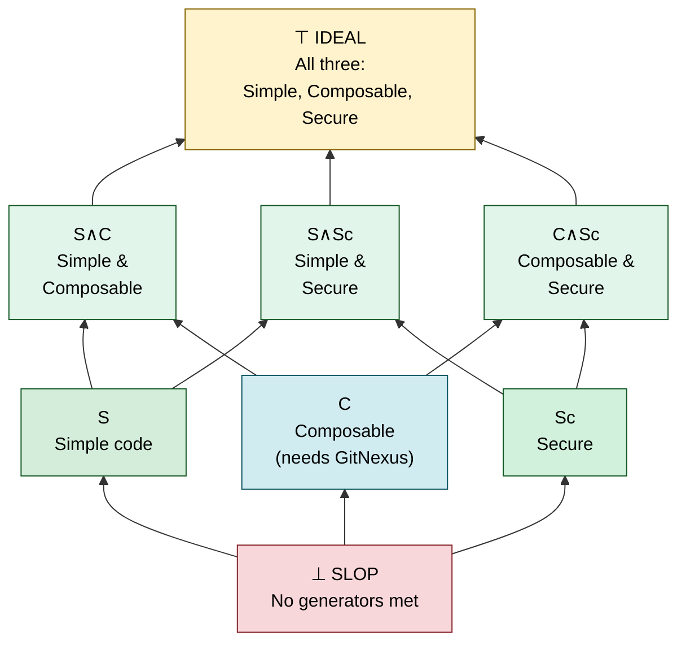

# Topos

> **Structural code quality metrics your agents can act on.**

Topos lets you set and manage the quality target while coding agents handle the iteration. Pick a priority and Topos measures program structure (not just syntax), giving agents concrete metrics to optimize toward on every pass.

Three independent quality generators:

- **SIMPLE:** CFG cyclomatic complexity, nesting depth, and AST entropy. Always evaluated.
- **COMPOSABLE:** Martin coupling and instability over the module dependency graph. Requires GitNexus.
- **SECURE:** Dangerous-API reachability and source→sink taint over the Code Property Graph. Always evaluated.

Set a priority (`simple`, `composable`, or `secure`) to guide the agent's iteration strategy.

> [!NOTE]
> We model programs as maps (morphisms) on graphs. This lets us evaluate design properties that go beyond preserving inputs and outputs.

---

### The Verdict

Topos maps every file to an **eight-valued Heyting algebra** — a free lattice on three independent generators. Agents always know exactly where they are:



**SIMPLE**, **COMPOSABLE**, and **SECURE** are **pairwise incomparable** — code can achieve any subset independently. **IDEAL** is the join of all three.

> [!TIP]
> Perfect code reaches **IDEAL** — but agents operate under token and time budgets. A concrete priority gives them a formula to execute. Set `--priority simple` to focus on complexity, `--priority composable` for clean interfaces, or `--priority secure` for data flow safety.

---

### Quick Start

#### Install

```bash
curl -sSL https://raw.githubusercontent.com/Krv-Labs/topos/main/install.sh | sh
```

#### CLI

```bash
topos evaluate src/ -r --priority simple           # classify a directory
topos evaluate src/ -r --gitnexus-dir .gitnexus --priority composable  # with coupling & security
topos inspect module.py                             # detailed metrics
topos structural-test-coverage src/ --language python  # measure test code coverage
topos compare before.py after.py                    # AST edit distance
```

#### In an agent loop

```
Agent iteration 1: SLOP [simple: 41%, composable: -, secure: -]
  → Reduce cyclomatic complexity and normalize entropy toward 0.5

Agent iteration 2: SIMPLE [simple: 72%, composable: -, secure: -]
  → ✓ SIMPLE achieved.

Agent iteration 3: SIMPLE_COMPOSABLE [simple: 72%, composable: 65%, secure: -]
  → ✓ Both SIMPLE and COMPOSABLE achieved. (With GitNexus enabled)
```

---

### MCP Server

Give any MCP-compatible agent — Claude Code, Cursor, Gemini CLI, Windsurf — a live feed of Topos verdicts so it can evaluate and iterate on its own output.

<details>
<summary><b>Set up <code>topos-mcp</code> in your agent</b></summary>

&nbsp;

#### Step 1 — Build the dependency graph (optional but recommended)

> [!IMPORTANT]
> **Recommended.** Without a dependency graph, Topos cannot score COMPOSABLE — any verdict containing it (including `IDEAL`) is unreachable.  `SIMPLE` and `SECURE` always run.
>
> ```bash
> npm install -g gitnexus        # one-time per machine
> cd /path/to/your/repo
> topos depgraph generate        # one-time per repo; writes .gitnexus/
> ```
>
> Re-run when imports change (new modules, renames, restructures). The cache keys on `.gitnexus/` mtime and invalidates itself.

> [!TIP]
> Verify the binary before wiring it into editors:
>
> ```bash
> topos-mcp   # prints the FastMCP banner and waits on stdin. Ctrl-C to exit.
> ```

#### Step 2 — Register with your agent

Run from your project root — Topos auto-detects its file-access root by walking up for `.git` or `pyproject.toml`.

##### Claude Code

```bash
claude mcp add topos topos-mcp
```

##### Gemini CLI

```bash
gemini mcp add topos topos-mcp
```

##### Cursor

<a href="cursor://anysphere.cursor-deeplink/mcp/install?name=topos&config=eyJjb21tYW5kIjogInRvcG9zLW1jcCJ9">**➕ Install `topos` in Cursor**</a>

Or edit `.cursor/mcp.json`:

```json
{ "mcpServers": { "topos": { "command": "topos-mcp" } } }
```

##### Windsurf and everything else

```json
{ "mcpServers": { "topos": { "command": "topos-mcp" } } }
```

#### Step 3 — Launch from the project root

> [!IMPORTANT]
> Topos refuses to read files outside a trusted root. If you must launch from elsewhere, set it explicitly:
>
> ```json
> {
>   "command": "topos-mcp",
>   "env": { "TOPOS_MCP_FILE_ROOT": "/absolute/path/to/repo" }
> }
> ```

> [!TIP]
> On the agent's first turn, point it at the workflow doc:
>
> > "Fetch `topos://docs/workflows` and follow the Topos refactor loop."
>
> Or invoke the prompt directly: `topos_refactor_until_ideal(filepath="path/to/file.py")`.

#### Smoke test

> "Use topos to find the worst-scoring file in `src/`, propose a refactor, and verify with `topos_assess_improvement`."

A healthy response shows `{simple: 72%, composable: 65%, secure: 95%}` when GitNexus is configured. If the response is missing `composable`, go back to Step 1.

</details>

---

### Contributing

Topos is used internally at [Krv Labs](https://krv.ai) to manage AI agent code output. We welcome bugs, ideas, and contributions.

- **Bug?** Open an [Issue](https://github.com/Krv-Labs/topos/issues)
- **Idea?** Start a [Discussion](https://github.com/Krv-Labs/topos/discussions) or open a PR
- **Collaborate?** [team@krv.ai](mailto:team@krv.ai)

---

[Full Documentation](docs/) · [Measures & Metrics](docs/source/measures.rst) · [Category Theory Concepts](docs/source/concepts.rst)

_Built with ❤️ by [Krv Labs](https://krv.ai)_
