# Topos

> **Structured evaluations for programs written by agents.**

Topos translates your quality priorities into measurable targets for AI coding agents. It provides a structured evaluation layer for managing generated code, giving agents the actionable metrics they need to iteratively reach your architectural goals.

---

### Why Topos?

In an era of cheap code, **ideas are the currency.** Topos acts as the (subobject) classifier for project managers: it finds your version of success without you having to balance a raw scorecard of hard metrics. You pick a direction — a **priority template** — and let your models optimize toward it.

> [!IMPORTANT]
> **Our secret sauce:** We view programs as maps (morphisms) and describe them as such, probing properties of program design that go beyond preserving inputs and outputs.

### The Two Pillars (more incoming)

Every program is evaluated along two orthogonal dimensions:

- **Complexity (AST):** Internal structure, cyclomatic complexity, and entropy.
- **Coupling (Graph):** External relations, dependency distances, and fan metrics.

### The Evaluation Lattice

Code quality maps to a four-valued diamond lattice (a Heyting algebra) — a partial order that captures degrees of structural quality rather than a binary pass/fail:

```mermaid
graph BT
    BROKEN["&perp; BROKEN<br/>Fails targets"]
    COMPOSABLE["&#9681; COMPOSABLE<br/>Good coupling"]
    SELF_CONTAINED["&#9680; SELF_CONTAINED<br/>Good structure"]
    SOUND["&top; SOUND<br/>Both targets met"]

    BROKEN --> COMPOSABLE
    BROKEN --> SELF_CONTAINED
    COMPOSABLE --> SOUND
    SELF_CONTAINED --> SOUND

    style BROKEN         fill:#f8d7da,stroke:#842029,color:#000
    style COMPOSABLE     fill:#d1ecf1,stroke:#0c5460,color:#000
    style SELF_CONTAINED fill:#d4edda,stroke:#155724,color:#000
    style SOUND          fill:#fff3cd,stroke:#856404,color:#000
```



> [!TIP]
> **Non-Total Order:** `COMPOSABLE` and `SELF_CONTAINED` are _incomparable_. A function can meet one target without meeting the other. `SOUND` is the join of both.

---

### How It Works

You give the agent a **Priority** (Self-Contained, Composable, or Balanced). The agent evaluates its own code against a lattice target and iterates until it hits it.

**PM Directive:** _"Write a data pipeline module. Priority: self-contained."_

1.  **Agent iteration 1:** `structural: ⊥ BROKEN [41%]`
    - _Guidance: Reduce cyclomatic complexity and normalize entropy toward 0.5_
2.  **Agent iteration 2:** `structural: ◐ SELF_CONTAINED [72%]`
    - _✓ Target achieved._

---

### Quick Start

#### 1. Install

```bash
curl -sSL https://raw.githubusercontent.com/Krv-Labs/topos/main/install.sh | sh
```

#### 2. CLI Usage

```bash
topos evaluate src/ -r --priority self_contained   # classify directory
topos inspect module.py                             # detailed metrics
topos compare before.py after.py                    # AST edit distance
```

#### 3. MCP Server

Give any MCP-compatible coding agent — Claude Code, Cursor, Gemini CLI, Windsurf — a live feed of Topos verdicts so it can evaluate, compare, and iterate on its own output instead of guessing whether it's helping.

<details>
<summary><b>Set up <code>topos-mcp</code> in your coding agent</b></summary>

&nbsp;

#### Step 1 — Build the dependency graph

> [!IMPORTANT]
> **Do this first. Not later, not "when you get around to it."** Without a dependency graph, Topos scores the structural dimension only; `COMPOSABLE` and `SOUND` become unreachable; your agent optimizes half a function and calls it a day. One-time setup per repo, and the cache handles itself afterwards.
>
> ```bash
> npm install -g gitnexus        # one-time per machine (requires Node.js)
> cd /path/to/your/repo
> topos depgraph generate        # one-time per repo; writes .gitnexus/ at project root
> ```
>
> Re-run `topos depgraph generate` when imports actually change — new modules, renames, package restructures. Editing function bodies is not that. The cache keys on `.gitnexus/` mtime and invalidates itself; you don't need to restart anything.

> [!TIP]
> **Confirm the binary works before you go wiring it into editors.**
>
> ```bash
> topos-mcp   # prints the FastMCP banner and waits on stdin. Ctrl-C to exit.
> ```
>
> If that banner doesn't appear, the rest of this guide will not help you. Start with `pip install -e .[dev]` (or check your PATH) and come back.

#### Step 2 — Register with your agent

Run these from your project root. Topos auto-detects its file-access root by walking up for `.git` or `pyproject.toml`, so cwd matters.

##### 🟣 Claude Code

```bash
claude mcp add topos topos-mcp
```

##### 🔵 Gemini CLI

```bash
gemini mcp add topos topos-mcp
```

##### ⚫ Cursor

One click, assuming Cursor is running:

<a href="cursor://anysphere.cursor-deeplink/mcp/install?name=topos&config=eyJjb21tYW5kIjogInRvcG9zLW1jcCJ9">**➕ Install `topos` in Cursor**</a>

Or edit `.cursor/mcp.json` (project) / `~/.cursor/mcp.json` (global) yourself:

```json
{ "mcpServers": { "topos": { "command": "topos-mcp" } } }
```

##### 🟢 Windsurf and everything else

Same JSON. Put it wherever that client reads MCP servers from. The spec is standard; the config file's name is not.

```json
{ "mcpServers": { "topos": { "command": "topos-mcp" } } }
```

#### Step 3 — Launch your agent from the project root

> [!IMPORTANT]
> Topos refuses to read files outside a trusted root. It finds that root by walking up from cwd looking for `.git` or `pyproject.toml`, so launching your agent from anywhere sensible just works. If you insist on launching from elsewhere, tell it explicitly:
>
> ```json
> {
>   "command": "topos-mcp",
>   "env": { "TOPOS_MCP_FILE_ROOT": "/absolute/path/to/repo" }
> }
> ```
>
> The server fails closed when this can't be resolved. That's on purpose — an evaluator with unconstrained read access is a different product.

> [!TIP]
> **Point the agent at the workflow doc on its first turn.** Topos works best when the agent has read its own instructions before deciding what "better" means.
>
> > "Fetch `topos://docs/workflows` — or call `topos_get_doc(topic='workflows')` if your client doesn't expose MCP resources — and follow the Topos refactor loop."
>
> Or just invoke the prompt directly: `topos_refactor_until_sound(filepath="path/to/file.py")`.

#### Smoke test

A concrete task to run once everything is wired up:

> "Use topos to find the worst-scoring file in `src/`, propose a refactor, and verify with `topos_assess_improvement`."

A healthy response has `coupling_available: true`, picks a real target, and loops until `SOUND` or the iteration budget runs out.

> [!WARNING]
> If every response comes back with `coupling_available: false`, you skipped Step 1. Go back and read it this time. Re-run `topos depgraph generate` from the project root and try again.

</details>

---

### Contributing

Topos is currently used as an internal tool at Krv Labs to manage and regulate our AI agents' code outputs. We welcome new ideas, architectural critiques, and contributions from the community.

- **Found a bug?** Open an [Issue](https://github.com/Krv-Labs/topos/issues).
- **Have a feature idea?** Start a [Discussion](https://github.com/Krv-Labs/topos/discussions) or open a Pull Request.
- **Want to collaborate?** Write to us directly at [team@krv.ai](mailto:team@krv.ai).

---

### Resources

- [Full Documentation](docs/)
- [Measures & Metrics](docs/source/measures.rst)
- [Category Theory Concepts](docs/source/concepts.rst)

_Built with ❤️ by [Krv Labs](https://krv.ai)_
