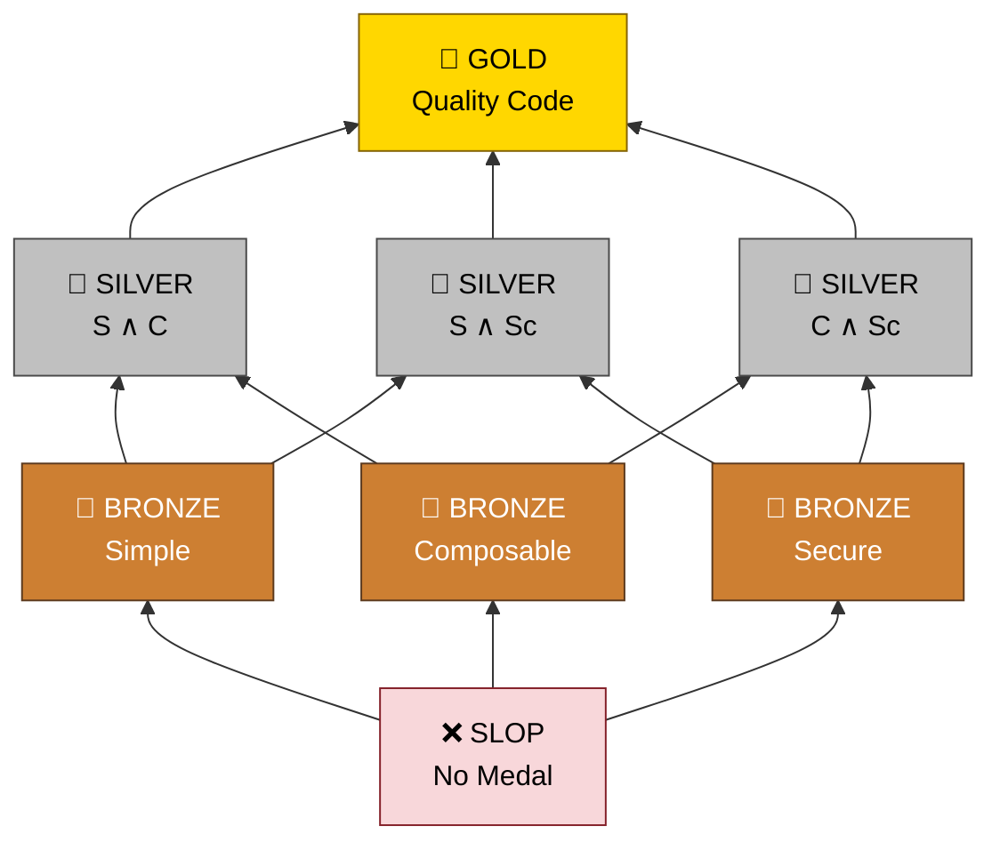

<p align="center">
  <picture>
    <source media="(prefers-color-scheme: dark)" srcset="https://raw.githubusercontent.com/Krv-Labs/topos/main/docs/source/_static/topos-logo-dark.svg">
    <source media="(prefers-color-scheme: light)" srcset="https://raw.githubusercontent.com/Krv-Labs/topos/main/docs/source/_static/topos-logo.svg">
    
  </picture>
</p>

<p align="center">
  <a href="https://github.com/Krv-Labs/topos/actions/workflows/ci.yml"></a>
  <a href="https://pypi.org/project/topos-mcp/"></a>
  <a href="https://pypi.org/project/topos-mcp/"></a>
  <a href="https://github.com/Krv-Labs/topos/blob/main/LICENSE"></a>
  <a href="https://glama.ai/mcp/servers/Krv-Labs/topos"></a>
</p>

<p align="center">
  <b>Agent harness for tree-sitter and graph-based coding tools — so agents write clean, composable, secure code.</b><br>
  <a href="https://docs.krv.ai/topos/">Docs</a> ·
  <a href="#quick-start">Quick Start</a> ·
  <a href="#mcp-server-for-agents">MCP Server</a> ·
  <a href="https://github.com/Krv-Labs/topos/issues">Issues</a>
</p>
<!-- mcp-name: io.github.Krv-Labs/topos -->

Topos is a category theory–inspired framework, built in Rust, that sits on top of tree-sitter, [GitNexus](https://github.com/abhigyanpatwari/GitNexus), [Graphify](https://github.com/Graphify-Labs/graphify), and [Sighthound](https://github.com/Corgea/Sighthound) — one scored target for structural code quality instead of four disconnected tools. Passing unit tests proves your code works; **Topos** proves it's built to last, scoring complexity, coupling, and data-flow risk so agents have something concrete to optimize toward, instead of a vague "clean it up."

v0.4.0 is a pure Rust binary — `topos evaluate`/`inspect`/`compare`/`coverage`/`graphify`/`mcp` — no Python runtime involved. See [Distribution](#distribution) below.

---

## Quick Start

Install:

```bash
curl -fsSL https://docs.krv.ai/topos/install.sh | sh
```

From your repo root (or `cd /path/to/your/repo` first):

```bash
topos evaluate . -r
```

`evaluate . -r` scores every file under the current directory and prints a ranked digest: which pillars pass, the worst-scoring files, and the cheapest fixes to flip a failing pillar. Add `-h` to any command for help, or `--json` for CI.

Other install paths and the full command tour live at **[docs.krv.ai/topos/installation](https://docs.krv.ai/topos/installation.html)**. Note: `pip install topos-mcp` / `uvx topos-mcp` installs only the MCP server binary (as the `topos-mcp` command) — the `topos` CLI itself ships via the install script above, a GitHub release binary, or `cargo build --release -p topos` from source.

## Built on

Topos doesn't reinvent graph analysis for code — it orchestrates three specialist tools most agents would otherwise have to run separately, and scores their combined output as one medal:

| Tool | Integration | What it gives Topos |
| :--- | :--- | :--- |
| [GitNexus](https://github.com/abhigyanpatwari/GitNexus) | wired in (subprocess) | the module dependency graph that **COMPOSABLE** scores |
| [Graphify](https://github.com/Graphify-Labs/graphify) | wired in (subprocess) | a tree-sitter knowledge graph powering advisory dead-code and fragile-edge detection |
| [Sighthound](https://github.com/Corgea/Sighthound) | embedded (compiled in) | supplementary SAST detail alongside the **SECURE** verdict |

Full credit and integration details: **[docs.krv.ai/topos/architecture](https://docs.krv.ai/topos/architecture.html)**.

## What you get

Three independent pillars, computed natively in `topos-engine` from tree-sitter ASTs, roll up into one **Code Quality Medal**:

- **SIMPLE** — avoids unnecessary complexity (AST entropy & CFG cyclomatic complexity)
- **COMPOSABLE** — cleanly decoupled from other modules (MDG Martin instability, over GitNexus's dependency graph)
- **SECURE** — free of dangerous API reachability and taint paths (CPG analysis)

| Medal | Criteria |
| :--- | :--- |
| 🥇 **GOLD** | Passes all 3 (SIMPLE + COMPOSABLE + SECURE) |
| 🥈 **SILVER** | Passes 2 of 3 |
| 🥉 **BRONZE** | Passes 1 of 3 |
| ❌ **SLOP** | Passes 0 (or fails to parse) |

`COMPOSABLE` needs a cross-file dependency graph. Install GitNexus and `topos evaluate` will detect it, generate `.gitnexus` if it's missing or stale, and score COMPOSABLE alongside SIMPLE/SECURE automatically:

```bash
pnpm add -g gitnexus  # or: npm install -g gitnexus
topos evaluate src/ -r   # generates/refreshes .gitnexus as needed, then scores COMPOSABLE/GOLD
```

Pass `--no-composable` to skip GitNexus entirely and evaluate SIMPLE/SECURE only, or `--gitnexus-dir <dir>` to point at a `.gitnexus` build elsewhere. The **MCP server**'s `topos_evaluate_file`/`topos_evaluate_project` tools standardize on the same default: they detect and generate/refresh `.gitnexus` too (pass `no_composable: true` to opt out), so agent-driven workflows get all three pillars without an extra round trip through `topos_generate_depgraph`.

Other commands: `topos inspect` for per-file metrics, `topos compare` for AST edit distance between two versions, `topos coverage` for structural test coverage, `topos graphify` for Graphify knowledge-graph generation and orphan/dead-code detection (advisory, see [below](#the-refactoring-layer)), and `--preferences simple,composable,secure` to tell agents which pillar to protect first when 🥇 GOLD isn't reachable. Full reference: **[docs.krv.ai/topos/cli](https://docs.krv.ai/topos/cli.html)**.

## The refactoring layer

GitNexus, Graphify, and Sighthound each answer one narrow question well. Used standalone, an agent juggles separate tool schemas and no shared sense of "good enough." Topos collapses all of it into one surface — this is what Topos adds on top of the tools it credits above:

- One **MCP tool**, `topos_refactor`, instead of four separate tool schemas — a deliberate wire-size call, not laziness (see [`docs/decisions/refactor-suite.md`](docs/decisions/refactor-suite.md)).
- One **scored medal** agents can optimize toward, instead of four uncorrelated reports.
- One **preference-driven iteration loop** (`topos_preference_walk`) telling an agent which pillar to protect when GOLD isn't reachable under budget.

`topos_refactor` surfaces ranked, actionable hotspots from four independent structural-analysis engines — advisory, never feeding the scored medal:

- **`cycles`** — CFG cycle-basis extraction, pointing at the loop/branch bodies driving cyclomatic complexity.
- **`dependencies`** — Forman curvature over the MDG (via GitNexus), naming load-bearing import edges (bottlenecks).
- **`process`** — directed Forman-Ricci curvature over GitNexus process graphs, flagging execution-path choke points.
- **`graphify`** — orphan nodes and low-confidence (`INFERRED`/`AMBIGUOUS`) edges in a Graphify knowledge graph, flagging likely dead code and fragile relationships. Generate with `topos graphify generate` or `topos_generate_graphify_graph`, inspect with `topos graphify orphans <file>` or `topos_refactor(target="graphify")`.

Sighthound is embedded directly into `topos-mcp` — a compiled-in Rust dependency, not a subprocess — and supplies supplementary `security_findings` detail alongside the SECURE verdict: advisory detail, never a second scoring input. See [`docs/decisions/refactor-suite.md`](docs/decisions/refactor-suite.md) for the full design.

## MCP server (for agents)

Give any MCP-compatible agent — Claude Code, Cursor, Gemini CLI, Windsurf — a live feed of Topos verdicts so it can evaluate and iterate on its own output.

```bash
claude mcp add --transport stdio topos -- topos mcp
```

Setup for Cursor, VS Code, Gemini CLI, Codex, and Windsurf, plus troubleshooting and the full MCP tool list: **[docs.krv.ai/topos/agents](https://docs.krv.ai/topos/agents.html)**.

> [!TIP]
> **OpenClaw:** `openclaw skills install @Krv-Labs/topos`  
> **Hermes:** `hermes skills tap add Krv-Labs/topos` then `hermes skills install Krv-Labs/topos/topos`

---

## How it works

Topos measures code along the three pillars above and maps the result to an 8-element evaluation lattice — the three pillars are pairwise incomparable, and 🥇 GOLD is their intersection.

<details>
<summary>Evaluation lattice diagram</summary>



</details>

Set your **Preferences** (e.g. `simple,composable,secure`) to tell your coding agent which pillars to prioritize when aiming for GOLD under token and time budgets, and how to relax that goal when GOLD isn't reachable. Details: [docs.krv.ai/topos/preferences](https://docs.krv.ai/topos/preferences.html) · [docs.krv.ai/topos/measures](https://docs.krv.ai/topos/measures.html) · [docs.krv.ai/topos/concepts](https://docs.krv.ai/topos/concepts.html).

## Distribution

Topos ships four ways — no crates.io, no Homebrew yet:

- **GitHub Releases** — the `topos` CLI binary (macOS/Linux), via `install.sh` above or a direct release download.
- **PyPI** — `topos-mcp`, a thin `bin`-wheel bundling just the MCP server binary (`pip install topos-mcp` / `uvx topos-mcp`), zero Python runtime.
- **VS Code Marketplace** — the Topos extension, bundling platform binaries.
- **Docker** — a container image for Glama and other MCP-registry hosting.

Crate layout, and how GitNexus/Graphify/Sighthound plug into the Rust workspace: **[docs.krv.ai/topos/architecture](https://docs.krv.ai/topos/architecture.html)**.

## Contributing

Topos is used internally at [Krv Labs](https://krv.ai) to manage AI agent code output. We welcome bugs, ideas, and contributions.

- **Bug?** Open an [Issue](https://github.com/Krv-Labs/topos/issues)
- **Idea?** Start a [Discussion](https://github.com/Krv-Labs/topos/discussions) or open a PR
- **Collaborate?** [team@krv.ai](mailto:team@krv.ai)

---

[Full Documentation](https://docs.krv.ai/topos/) · [Measures & Metrics](https://docs.krv.ai/topos/measures.html) · [Category Theory Concepts](https://docs.krv.ai/topos/concepts.html) · [Engineering notes](docs/)

_Built with ❤️ by [Krv Labs](https://krv.ai)_
