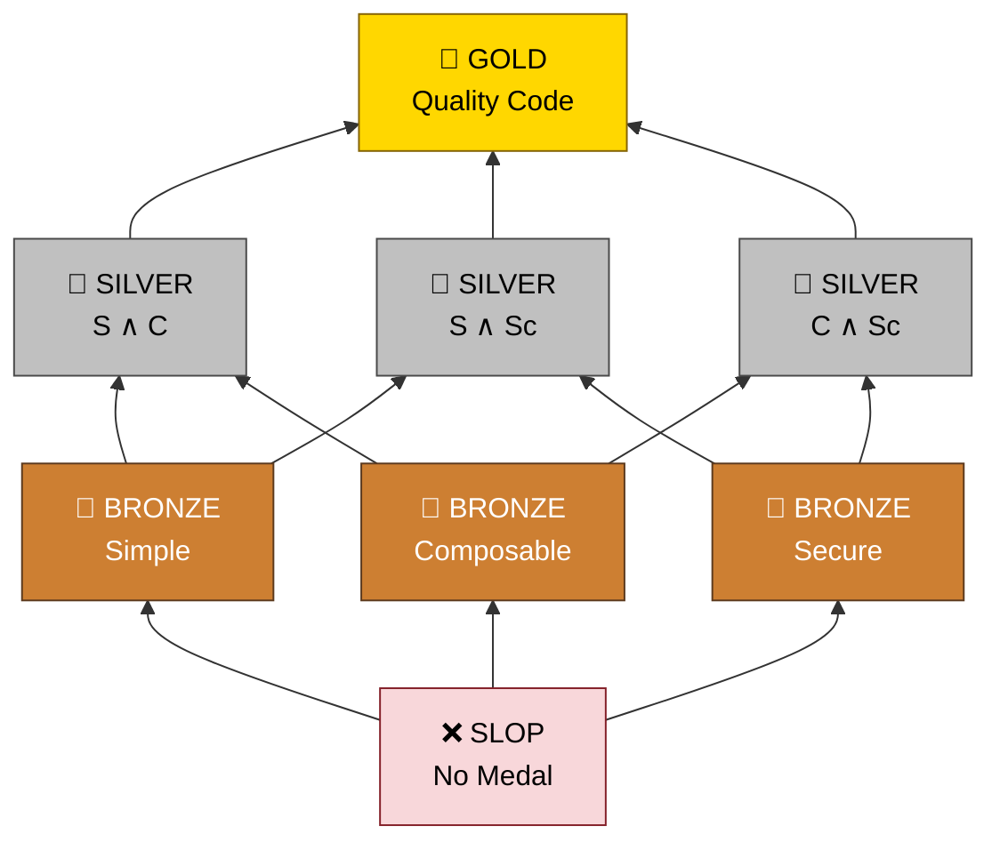

<p align="center">
  <picture>
    <source media="(prefers-color-scheme: dark)" srcset="https://raw.githubusercontent.com/Krv-Labs/topos/main/docs/source/_static/topos-logo-dark.svg">
    <source media="(prefers-color-scheme: light)" srcset="https://raw.githubusercontent.com/Krv-Labs/topos/main/docs/source/_static/topos-logo.svg">
    
  </picture>
</p>

<p align="center">
  <a href="https://github.com/Krv-Labs/topos/actions/workflows/ci.yml"></a>
  <a href="https://pypi.org/project/topos-mcp/"></a>
  <a href="https://pypi.org/project/topos-mcp/"></a>
  <a href="https://github.com/Krv-Labs/topos/blob/main/LICENSE"></a>
  <a href="https://glama.ai/mcp/servers/Krv-Labs/topos"></a>
</p>

<p align="center">
  <b>Agent harness for tree-sitter based methods to promote writing clean, composable, secure code.</b><br>
  <a href="https://docs.krv.ai/topos/">Docs</a> ·
  <a href="#quick-start">Quick Start</a> ·
  <a href="#mcp-server-for-agents">MCP Server</a> ·
  <a href="https://github.com/Krv-Labs/topos/issues">Issues</a>
</p>
<!-- mcp-name: io.github.Krv-Labs/topos -->

Topos is a fast Rust CLI and Model Context Protocol (MCP) server that serves as an agent harness for tree-sitter based methods. Passing unit tests proves your code works. **Topos** proves it's built to last. By measuring program structure—complexity, coupling, and data-flow risk—not just syntax, it gives agents a concrete target to optimize toward on every pass instead of a vague "clean it up."

As of v0.4.0, Topos is a Rust-native binary: `topos evaluate`/`inspect`/`compare`/`coverage`/`graphify`/`mcp` are all compiled Rust, with no Python runtime involved. See [Project structure](#project-structure) below.

---

## Quick Start

```bash
curl -fsSL https://docs.krv.ai/topos/install.sh | sh
topos evaluate src/ -r
```

`evaluate -r` scores every file in `src/` and prints a ranked digest: which pillars pass, the worst-scoring files, and the cheapest fixes to flip a failing pillar. Add `-h` to any command for help, or `--json` for CI.

Other install paths and the full command tour live at **[docs.krv.ai/topos/installation](https://docs.krv.ai/topos/installation.html)**. Note: `pip install topos-mcp` / `uvx topos-mcp` installs only the MCP server binary (as the `topos-mcp` command) — the `topos` CLI itself ships via the install script above, a GitHub release binary, or `cargo build --release -p topos-cli` from source.

## What you get

Topos checks three independent pillars, computed natively in `topos-core` from tree-sitter ASTs, and awards a **Code Quality Medal** for how many pass:

- **SIMPLE** — avoids unnecessary complexity (AST entropy & CFG cyclomatic complexity)
- **COMPOSABLE** — cleanly decoupled from other modules (MDG Martin instability, over a dependency graph built by [GitNexus](https://github.com/abhigyanpatwari/GitNexus))
- **SECURE** — free of dangerous API reachability and taint paths (CPG analysis)

Topos is the **operator** over those graphs — not another one-off [tree-sitter](https://tree-sitter.github.io/tree-sitter/) script. GitNexus feeds the module graph behind COMPOSABLE; the [refactoring suite](#refactoring-suite-advisory-not-scored) below layers Graphify and Sighthound on top as advisory tools, all pointed at one medal lattice agents can optimize toward.

| Medal | Criteria |
| :--- | :--- |
| 🥇 **GOLD** | Passes all 3 (SIMPLE + COMPOSABLE + SECURE) |
| 🥈 **SILVER** | Passes 2 of 3 |
| 🥉 **BRONZE** | Passes 1 of 3 |
| ❌ **SLOP** | Passes 0 (or fails to parse) |

`COMPOSABLE` needs a cross-file dependency graph. As of v0.4.0 that graph is only wired up through the **MCP server** — the `topos` CLI doesn't build or read `.gitnexus` yet (`depgraph`/`--gitnexus-dir` are Python-era commands not ported to the Rust CLI; SIMPLE/SECURE-only evaluation is what `topos evaluate` gives you today):

```bash
pnpm add -g gitnexus  # or: npm install -g gitnexus
claude mcp add --transport stdio topos -- topos mcp
# then, from an agent: topos_generate_depgraph, followed by
# topos_evaluate_file(..., gitnexus_dir=".gitnexus") to score COMPOSABLE/GOLD
```

Other commands: `topos inspect` for per-file metrics, `topos compare` for AST edit distance between two versions, `topos coverage` for structural test coverage, `topos graphify` for Graphify knowledge-graph generation and orphan/dead-code detection (advisory, see below), and `--preferences simple,composable,secure` to tell agents which pillar to protect first when 🥇 GOLD isn't reachable. Full reference: **[docs.krv.ai/topos/cli](https://docs.krv.ai/topos/cli.html)**.

## Refactoring suite (advisory, not scored)

Beyond the scored medal, `topos_refactor` (MCP) surfaces ranked, actionable hotspots from four independent structural-analysis engines — **none of these feed SIMPLE/COMPOSABLE/SECURE**, they're refactoring guidance layered on top:

- **`cycles`** — CFG cycle-basis extraction, pointing at the loop/branch bodies driving cyclomatic complexity.
- **`dependencies`** — Forman curvature over the MDG, naming load-bearing import edges (bottlenecks).
- **`process`** — directed Forman-Ricci curvature over GitNexus process graphs, flagging execution-path choke points.
- **`graphify`** — orphan nodes and low-confidence (`INFERRED`/`AMBIGUOUS`) edges in a [Graphify](https://github.com/Graphify-Labs/graphify) knowledge graph, flagging likely dead code and fragile relationships. Generate the graph with `topos graphify generate` or the `topos_generate_graphify_graph` MCP tool, then inspect with `topos graphify orphans <file>` or `topos_refactor(target="graphify")`.

Topos also runs the embedded [Sighthound](https://github.com/Corgea/Sighthound) SAST engine to surface supplementary, per-finding security detail (`security_findings`) alongside the SECURE verdict — advisory detail, not a second scoring input (a deliberate change from an earlier, since-superseded Python integration where Sighthound's counts could replace the CPG probes for the SECURE gate itself). See [`docs/refactor-suite.md`](docs/refactor-suite.md) for the full design.

## MCP server (for agents)

Give any MCP-compatible agent — Claude Code, Cursor, Gemini CLI, Windsurf — a live feed of Topos verdicts so it can evaluate and iterate on its own output.

```bash
claude mcp add --transport stdio topos -- topos mcp
```

Setup for Cursor, VS Code, Gemini CLI, Codex, and Windsurf, plus troubleshooting and the full MCP tool list: **[docs.krv.ai/topos/agents](https://docs.krv.ai/topos/agents.html)**.

---

## How it works

Topos measures code along the three pillars above and maps the result to an 8-element evaluation lattice — the three pillars are pairwise incomparable, and 🥇 GOLD is their intersection.

<details>
<summary>Evaluation lattice diagram</summary>



</details>

Set your **Preferences** (e.g. `simple,composable,secure`) to tell your coding agent which pillars to prioritize when aiming for GOLD under token and time budgets, and how to relax that goal when GOLD isn't reachable. Details: [docs.krv.ai/topos/preferences](https://docs.krv.ai/topos/preferences.html) · [docs.krv.ai/topos/measures](https://docs.krv.ai/topos/measures.html) · [docs.krv.ai/topos/concepts](https://docs.krv.ai/topos/concepts.html).

## Project structure

Topos is an all-Rust Cargo workspace of three crates (v0.4.0, [PR #159](https://github.com/Krv-Labs/topos/pull/159)):

```
crates/
├── topos-core/   # Pure compute engine: tree-sitter AST parsing, CFG/MDG/CPG/PDG/UAST
│                 # representations, the characteristic morphism χ_S : P → Ω,
│                 # SIMPLE/COMPOSABLE/SECURE scoring policies, and all refactor-suite
│                 # probes (cycles, curvature, Graphify orphans). No I/O beyond reading
│                 # source files; external tools (GitNexus, Graphify) are reached only
│                 # through `adapters::` subprocess wrappers.
├── topos-mcp/    # The MCP server (`topos-mcp` binary / `topos mcp`), one #[tool_router]
│                 # module per tool family (evaluate, assess, compare, coverage,
│                 # depgraph, docs, graphify, inspect, preferences, refactor).
│                 # Embeds the Sighthound SAST engine as a compiled-in dependency
│                 # (not a subprocess) for supplementary security findings.
└── topos-cli/    # The `topos` binary — evaluate/inspect/compare/coverage/graphify/mcp.
                  # Calls straight into topos-core; no logic duplicated with topos-mcp.
```

`pyproject.toml` publishes `topos-mcp` to PyPI as a thin `bin`-wheel (maturin `bindings = "bin"`) — it bundles the compiled `topos-mcp` binary with zero Python runtime or import surface. There is no Python implementation anywhere in this repository anymore; see [`docs/parity.md`](docs/parity.md) for the parity/benchmark harness that verified the Rust rewrite is a drop-in, faster replacement for the last Python release.

## Contributing

Topos is used internally at [Krv Labs](https://krv.ai) to manage AI agent code output. We welcome bugs, ideas, and contributions.

- **Bug?** Open an [Issue](https://github.com/Krv-Labs/topos/issues)
- **Idea?** Start a [Discussion](https://github.com/Krv-Labs/topos/discussions) or open a PR
- **Collaborate?** [team@krv.ai](mailto:team@krv.ai)

---

[Full Documentation](https://docs.krv.ai/topos/) · [Measures & Metrics](https://docs.krv.ai/topos/measures.html) · [Category Theory Concepts](https://docs.krv.ai/topos/concepts.html) · [Engineering notes](docs/)

_Built with ❤️ by [Krv Labs](https://krv.ai)_
