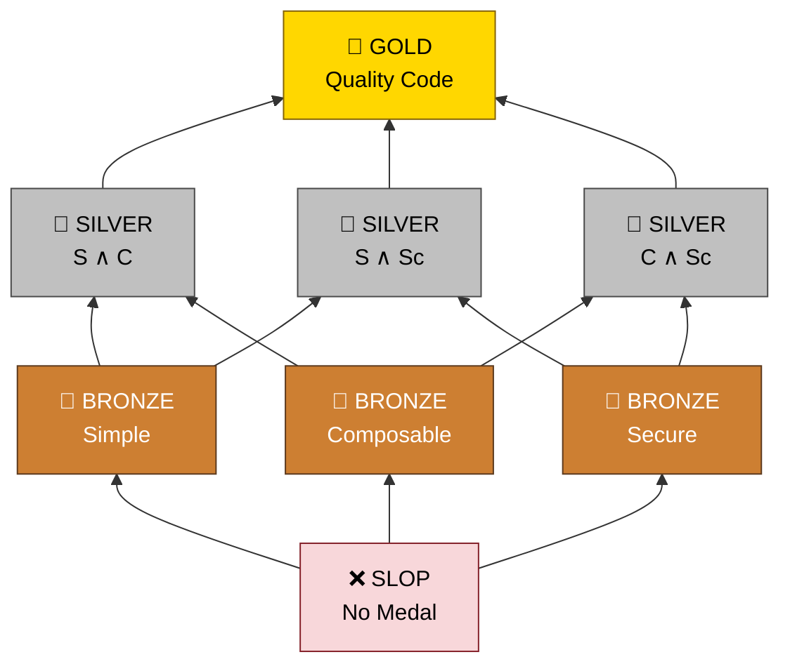

<p align="center">
  <picture>
    <source media="(prefers-color-scheme: dark)" srcset="https://raw.githubusercontent.com/Krv-Labs/topos/main/docs/source/_static/topos-logo-dark.svg">
    <source media="(prefers-color-scheme: light)" srcset="https://raw.githubusercontent.com/Krv-Labs/topos/main/docs/source/_static/topos-logo.svg">
    
  </picture>
</p>

<p align="center">
  <a href="https://github.com/Krv-Labs/topos/actions/workflows/ci.yml"></a>
  <a href="https://pypi.org/project/topos-mcp/"></a>
  <a href="https://pypi.org/project/topos-mcp/"></a>
  <a href="https://github.com/Krv-Labs/topos/blob/main/LICENSE"></a>
  <a href="https://registry.modelcontextprotocol.io/v0.1/servers?search=io.github.Krv-Labs/topos"></a>
  <a href="https://glama.ai/mcp/servers/Krv-Labs/topos"></a>
  <a href="https://clawhub.ai/krv-labs/skills/topos"></a>
</p>

<p align="center">
  <b>Harness for graph-based coding tools, designed to make agents write clean, composable, secure code.</b><br>
  <a href="https://docs.krv.ai/topos/">Docs</a> ·
  <a href="#quick-start">Quick Start</a> ·
  <a href="#mcp-server-for-agents">MCP Server</a> ·
  <a href="https://github.com/Krv-Labs/topos/issues">Issues</a>
</p>
<!-- mcp-name: io.github.Krv-Labs/topos -->

Topos scores code quality from the geometric and topological structure of program graphs — structural debt conventional linters can't compute — and gives agents a medal-scored (SLOP → GOLD) feedback loop to optimize for quality. Inspired by concepts from category, Topos combines the power of [tree-sitter](https://tree-sitter.github.io/tree-sitter/), [GitNexus](https://github.com/abhigyanpatwari/GitNexus), and [Sighthound](https://github.com/Corgea/Sighthound) into a well-principled evaluation schema, giving your agents
one scored target for code quality instead of disconnected tools.

---

## Quick Start

Install:

```bash
curl -fsSL https://docs.krv.ai/topos/install.sh | sh
```

From your repo root (or `cd /path/to/your/repo` first):

```bash
topos evaluate src/ -r
```

`evaluate -r` scores every file in `src/` and prints a ranked digest: which pillars pass, the worst-scoring files, and the cheapest fixes to flip a failing pillar. Add `-h` to any command for help, or `--json` for CI.

Prefer Homebrew?

```bash
brew install krv-labs/tap/topos
```

On Homebrew 6+, that one-liner auto-taps and trusts only this formula. If you
`brew tap krv-labs/tap` first, run `brew trust --formula krv-labs/tap/topos`
before `brew install topos`.

Other install paths (PyPI, source checkout) and the full command tour live at **[docs.krv.ai/topos/installation](https://docs.krv.ai/topos/installation.html)**.

## Built on

Topos doesn't reinvent graph analysis for code — it orchestrates specialist tools most agents would otherwise have to run separately, and scores their combined output as one medal:

| Tool | Integration | What it gives Topos |
| :--- | :--- | :--- |
| [tree-sitter](https://tree-sitter.github.io/tree-sitter/) | wired in | ASTs / CFGs that power **SIMPLE** and structural coverage |
| [GitNexus](https://github.com/abhigyanpatwari/GitNexus) | wired in (subprocess) | the module dependency graph that **COMPOSABLE** scores |
| [Sighthound](https://github.com/Corgea/Sighthound) | optional (`PATH`) | supplementary SAST detail alongside the **SECURE** verdict |

## What you get

Three independent pillars roll up into one **Code Quality Medal**:

- **SIMPLE** — avoids unnecessary complexity (AST entropy & CFG cyclomatic complexity)
- **COMPOSABLE** — cleanly decoupled from other modules (MDG Martin instability via GitNexus)
- **SECURE** — free of dangerous API reachability and taint paths (CPG analysis)

| Medal         | Criteria                                    |
| :------------ | :------------------------------------------ |
| 🥇 **GOLD**   | Passes all 3 (SIMPLE + COMPOSABLE + SECURE) |
| 🥈 **SILVER** | Passes 2 of 3                               |
| 🥉 **BRONZE** | Passes 1 of 3                               |
| ❌ **SLOP**   | Passes 0 (or fails to parse)                |

`COMPOSABLE` needs a cross-file dependency graph, which the CLI does not build automatically:

```bash
pnpm add -g gitnexus  # or: npm install -g gitnexus
topos depgraph generate
topos evaluate src/ -r --gitnexus-dir .gitnexus
```

Put [Sighthound](https://github.com/Corgea/Sighthound) on `PATH` to deepen `SECURE` with Corgea's ruleset (auto-detected; local CPG probes still run without it).

Other commands: `topos inspect` for per-file metrics, `topos compare` for AST edit distance between two versions, `topos coverage` for structural test coverage, and `--preferences simple,composable,secure` to tell agents which pillar to protect first when 🥇 GOLD isn't reachable. Full reference: **[docs.krv.ai/topos/cli](https://docs.krv.ai/topos/cli.html)**.

## MCP server (for agents)

Give any MCP-compatible agent — Claude Code, Cursor, Gemini CLI, Windsurf — a live feed of Topos verdicts so it can evaluate and iterate on its own output.

```bash
claude mcp add --transport stdio topos -- topos mcp
```

Topos is published on the [official MCP Registry](https://registry.modelcontextprotocol.io/v0.1/servers?search=io.github.Krv-Labs/topos) (`io.github.Krv-Labs/topos`) and listed on [Glama](https://glama.ai/mcp/servers/Krv-Labs/topos).

Setup for Cursor, VS Code, Gemini CLI, Codex, and Windsurf, plus troubleshooting and the full MCP tool list: **[docs.krv.ai/topos/agents](https://docs.krv.ai/topos/agents.html)**.

> [!TIP]
> **OpenClaw / ClawHub:** [`openclaw skills install @Krv-Labs/topos`](https://clawhub.ai/krv-labs/skills/topos)  
> **Hermes:** `hermes skills tap add Krv-Labs/topos` then `hermes skills install Krv-Labs/topos/topos`

---

## How it works

Topos measures code along the three pillars above and maps the result to an 8-element evaluation lattice — the three pillars are pairwise incomparable, and 🥇 GOLD is their intersection.

<details>
<summary>Evaluation lattice diagram</summary>



</details>

Set your **Preferences** (e.g. `simple,composable,secure`) to tell your coding agent which pillars to prioritize when aiming for GOLD under token and time budgets, and how to relax that goal when GOLD isn't reachable. Details: [docs.krv.ai/topos/preferences](https://docs.krv.ai/topos/preferences.html) · [docs.krv.ai/topos/measures](https://docs.krv.ai/topos/measures.html) · [docs.krv.ai/topos/concepts](https://docs.krv.ai/topos/concepts.html).

## Contributing

Topos is used internally at [Krv Labs](https://krv.ai) to manage AI agent code output. We welcome bugs, ideas, and contributions.

- **Bug?** Open an [Issue](https://github.com/Krv-Labs/topos/issues)
- **Idea?** Start a [Discussion](https://github.com/Krv-Labs/topos/discussions) or open a PR
- **Collaborate?** [team@krv.ai](mailto:team@krv.ai)

---

[Full Documentation](https://docs.krv.ai/topos/) · [Measures & Metrics](https://docs.krv.ai/topos/measures.html) · [Category Theory Concepts](https://docs.krv.ai/topos/concepts.html) · [Engineering notes](docs/)

_Built with ❤️ by [Krv Labs](https://krv.ai)_
