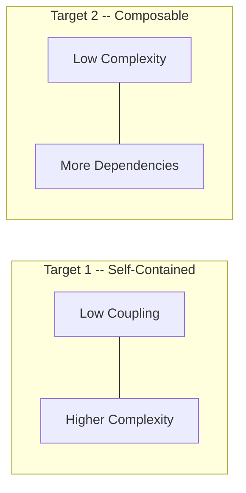

# Topos

> Treating programs as morphisms in a world of commodity code.

Code has become a commodity -- cheap to produce, universally accessible. The Karpathian take: **ideas are now the currency.** Each of us is becoming more project manager than developer. The power lies in representing ideas in ways that models can effectively execute.

But moving from a weekend prototype to robust, long-lived code is an entirely different task. We are not yet equipped to understand, measure, and regulate the quality of generated code.

Code quality is not universal. It is contextual, subjective, and stylized. In the presence of perfect underlying metrics you shouldn't have to fine-tune N different quantitative thresholds on code output. You should pick a direction -- a style template -- and let your models optimize toward it. When you look at the outputs you assess how well they matched your goals.

**Topos captures the translation between qualitative, subjective assessments and clear optimizations that help your agents iteratively improve.**

## Why Topos?

A [topos](https://ncatlab.org/nlab/show/topos) is a mathematical structure that only a small subset of mathematicians ever encounter. It is extremely abstract -- but it elegantly captures the ideal relationship between user and coding agent.

An elementary topos has a **subobject classifier**: you describe objects (programs) by how they map into a classification hierarchy. The simplest example is the category of Sets, where set membership is defined by a map into {0, 1}.

For code quality we need more flexibility and nuance. A program is not simply well-written or not -- quality is entirely contextual. Topos builds the subobject classifier for project managers: find your version of success without balancing a raw scorecard of hard metrics.

## The Two Pillars

Every program is evaluated along two independent dimensions:

| Pillar | Source | Measures |
|---|---|---|
| **Complexity** | Abstract Syntax Tree | Cyclomatic complexity and entropy |
| **Coupling** | Dependency graph | Coupling distances and fan metrics |

These dimensions are orthogonal. A file can be internally clean but dangerously coupled, or self-contained but internally chaotic. Topos never collapses them into a single number -- you always see which axis is the problem.

## The Evaluation Lattice

Code quality maps to a six-valued lattice -- a partial order that captures degrees of structural quality rather than a binary pass/fail:

```mermaid
graph BT
    BROKEN["&perp; BROKEN -- Bad Code"]
    ENTANGLED["&#9675; ENTANGLED -- Extreme pathology"]
    COUPLED["&#9681; COUPLED -- Significant anomaly"]
    COMPLEX["&#9682; COMPLEX -- Elevated complexity"]
    STABLE["&#9680; STABLE -- Working code"]
    SOUND["&top; SOUND -- Great Code"]

    BROKEN --> ENTANGLED
    BROKEN --> COUPLED
    BROKEN --> COMPLEX
    BROKEN --> STABLE
    ENTANGLED --> SOUND
    COUPLED --> STABLE
    COMPLEX --> STABLE
    STABLE --> SOUND
```



> **Reading the lattice:** Arrows point from worse to better. COUPLED and COMPLEX are *incomparable* -- a function can have coupling issues without complexity issues, or vice versa. The lattice preserves this distinction rather than collapsing different failure modes.

### Lattice Targets

Different projects make different tradeoffs between the two pillars:

1. **Self-Contained** -- Low dependency, added complexity. You write everything from scratch; the code may be intricate but it doesn't break when a library updates.

2. **Composable** -- Low complexity, many dependencies. You lean on libraries and keep your own code paths simple and readable.



These targets are starting points. As Topos evolves you will define custom lattice configurations that encode your team's specific quality philosophy.

## Setup

### Install

```bash
pip install topos
# or with uv
uv pip install topos
```

Optionally install [GitNexus](https://github.com/abhigyanpatwari/GitNexus) for coupling metrics:

```bash
npm install -g gitnexus
gitnexus analyze            # generates .gitnexus/ in the repo root
```

### CLI

```bash
topos evaluate src/ -r                        # classify a directory
topos inspect module.py                       # detailed metrics + verdict
topos compare before.py after.py              # AST edit distance
topos evaluate src/ -r --gitnexus-dir .gitnexus  # include coupling metrics
```

### MCP Server

Connect Topos to your AI coding tool so it can evaluate and improve its own output in a loop:

```bash
topos-mcp
```

Point your MCP client at the `topos-mcp` command. See the [docs](docs/) for Claude Desktop, Claude Code, Cursor, and other configurations.

## Architecture

```
topos/
├── core/
│   ├── morphism.py        # Programs as arrows between states
│   └── object.py          # AST as a categorical object
├── graphs/
│   ├── base.py            # Representation protocol
│   ├── ast/
│   │   └── object.py      # ASTRepresentation (complexity pillar)
│   └── depgraph/
│       └── graph.py       # DependencyGraph (coupling pillar)
├── logic/
│   ├── lattice.py         # Heyting Algebra (meet, join, implies, neg)
│   ├── policies/          # Metric-to-lattice rules per pillar
│   │   ├── base.py
│   │   ├── structural.py
│   │   └── coupling.py
│   └── omega.py           # The Subobject Classifier
├── metrics/
│   ├── ast/
│   │   ├── complexity.py  # Cyclomatic complexity
│   │   └── entropy.py     # Kolmogorov proxy via compression
│   ├── depgraph/
│   │   ├── coupling.py    # Afferent/efferent coupling + instability
│   │   └── fan.py         # Fan-in / fan-out via CALLS edges
│   └── distance.py        # AST edit distance
└── utils/
    └── tree_sitter.py     # AST parsing
```
