# Topos

> **Treating programs as morphisms in a world of commodity code.**

Topos translates your quality priorities into measurable targets for AI coding agents. It provides a structured evaluation layer for managing generated code, giving agents the actionable metrics they need to iteratively reach your architectural goals.

---

### Why Topos?

In an era of cheap code, **ideas are the currency.** Topos acts as a subobject classifier for project managers: it finds your version of success without you having to balance a raw scorecard of hard metrics. You pick a direction — a **priority template** — and let your models optimize toward it.

### The Two Pillars

Every program is evaluated along two orthogonal dimensions:

- **Complexity (AST):** Internal structure, cyclomatic complexity, and entropy.
- **Coupling (Graph):** External relations, dependency distances, and fan metrics.

### The Evaluation Lattice

Code quality maps to a four-valued diamond lattice (a Heyting algebra) — a partial order that captures degrees of structural quality rather than a binary pass/fail:

```mermaid
graph BT
    BROKEN["&perp; BROKEN<br/>Fails targets"]
    COMPOSABLE["&#9681; COMPOSABLE<br/>Good coupling"]
    SELF_CONTAINED["&#9680; SELF_CONTAINED<br/>Good structure"]
    SOUND["&top; SOUND<br/>Both targets met"]

    BROKEN --> COMPOSABLE
    BROKEN --> SELF_CONTAINED
    COMPOSABLE --> SOUND
    SELF_CONTAINED --> SOUND

    style BROKEN         fill:#f8d7da,stroke:#842029,color:#000
    style COMPOSABLE     fill:#d1ecf1,stroke:#0c5460,color:#000
    style SELF_CONTAINED fill:#d4edda,stroke:#155724,color:#000
    style SOUND          fill:#fff3cd,stroke:#856404,color:#000
```



> [!TIP]
> **Non-Total Order:** `COMPOSABLE` and `SELF_CONTAINED` are _incomparable_. A function can meet one target without meeting the other. `SOUND` is the join of both.

---

### How It Works

You give the agent a **Priority** (Self-Contained, Composable, or Balanced). The agent evaluates its own code against a lattice target and iterates until it hits it.

**PM Directive:** _"Write a data pipeline module. Priority: self-contained."_

1.  **Agent iteration 1:** `structural: ⊥ BROKEN [41%]`
    - _Guidance: Reduce cyclomatic complexity and normalize entropy toward 0.5_
2.  **Agent iteration 2:** `structural: ◐ SELF_CONTAINED [72%]`
    - _✓ Target achieved._

---

### Quick Start

#### 1. Install

```bash
curl -sSL https://raw.githubusercontent.com/Krv-Labs/topos/main/install.sh | sh
```

#### 2. CLI Usage

```bash
topos evaluate src/ -r --priority self_contained   # classify directory
topos inspect module.py                             # detailed metrics
topos compare before.py after.py                    # AST edit distance
```

#### 3. MCP Server

Expose Topos to any MCP-compatible coding agent (Claude Code, Cursor, Gemini CLI, Windsurf…) so it can evaluate, compare, and iterate on its own output.

<details>
<summary><b>Set up <code>topos-mcp</code> in your coding agent</b></summary>

&nbsp;

Pick your agent — each path is a single step. Run from your project's root directory so Topos auto-detects it.

> [!TIP]
> **Quickest sanity check first:** `topos-mcp` — should print the FastMCP banner and hang waiting for input. `Ctrl-C` to exit. If that works, the binary is wired up correctly.

##### 🟣 Claude Code — one command

```bash
claude mcp add topos topos-mcp
```

##### 🔵 Gemini CLI — one command

```bash
gemini mcp add topos topos-mcp
```

##### ⚫ Cursor — one-click install

Click this link while Cursor is open:

<a href="cursor://anysphere.cursor-deeplink/mcp/install?name=topos&config=eyJjb21tYW5kIjogInRvcG9zLW1jcCJ9">**➕ Install `topos` in Cursor**</a>

Or add manually to `.cursor/mcp.json` in your project (or `~/.cursor/mcp.json` for all projects):

```json
{ "mcpServers": { "topos": { "command": "topos-mcp" } } }
```

##### 🟢 Windsurf / any other MCP client

Same JSON, wherever that client reads MCP servers from:

```json
{ "mcpServers": { "topos": { "command": "topos-mcp" } } }
```

---

> [!IMPORTANT]
> Topos only reads files under a trusted root. It auto-detects the nearest `.git` or `pyproject.toml` — **so just run your agent from your project root and it works.** If you launch from elsewhere, set `TOPOS_MCP_FILE_ROOT` in the config's `env` block:
> ```json
> { "command": "topos-mcp", "env": { "TOPOS_MCP_FILE_ROOT": "/absolute/path/to/repo" } }
> ```

> [!TIP]
> **Unlock the `COMPOSABLE` / `SOUND` verdicts** by generating a dependency graph once per repo:
> ```bash
> npm install -g gitnexus   # one-time
> topos depgraph generate   # writes .gitnexus/ at project root
> ```
> Topos auto-detects `.gitnexus/` and scores both dimensions on every call. Without it, only structural complexity is scored — coupling stays unmeasured.

> [!TIP]
> **Want the agent to use Topos well, first try?** After registering, paste this into your agent's first message:
> > "Fetch `topos://docs/workflows` and use the Topos refactor loop to improve this codebase."
>
> Or invoke the built-in prompt: `topos_refactor_until_sound(filepath="path/to/file.py")`.

##### Try it

Ask your agent:

> "Use topos to find the worst-scoring file in `src/`, propose a refactor, and verify the improvement with `topos_assess_improvement`."

A healthy setup returns a per-file rollup, picks a target, and loops until `SOUND` or the iteration budget is spent.

</details>

---

### Contributing

Topos is currently used as an internal tool at Krv Labs to manage and regulate our AI agents' code outputs. We welcome new ideas, architectural critiques, and contributions from the community.

- **Found a bug?** Open an [Issue](https://github.com/Krv-Labs/topos/issues).
- **Have a feature idea?** Start a [Discussion](https://github.com/Krv-Labs/topos/discussions) or open a Pull Request.
- **Want to collaborate?** Write to us directly at [team@krv.ai](mailto:team@krv.ai).

---

### Resources

- [Full Documentation](docs/)
- [Measures & Metrics](docs/source/measures.rst)
- [Category Theory Concepts](docs/source/concepts.rst)

_Built by [Krv Labs](https://krv.ai)_
