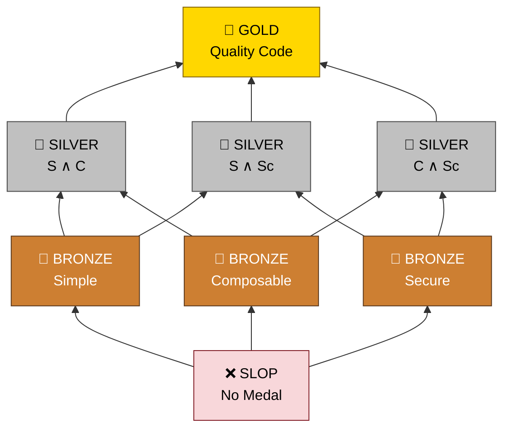

<p align="center">
  <picture>
    <source media="(prefers-color-scheme: dark)" srcset="https://raw.githubusercontent.com/Krv-Labs/topos/main/docs/source/_static/topos-logo-dark.svg">
    <source media="(prefers-color-scheme: light)" srcset="https://raw.githubusercontent.com/Krv-Labs/topos/main/topos-logo.svg">
    
  </picture>
</p>

> **Structural code quality metrics for agent-written programs.**
<!-- mcp-name: io.github.Krv-Labs/topos -->

**Topos** gives you structural code quality metrics your agents can act on. Passing unit tests proves your code works, but Topos proves it's built to last. It measures program structure — not just syntax — giving agents concrete metrics to optimize toward on every pass. You set the target; agents handle the iteration.

### The Quality Pillars

Topos evaluates code along three independent pillars:

- **SIMPLE** — Avoids unnecessary complexity (AST entropy & CFG cyclomatic complexity).
- **COMPOSABLE** — Cleanly decoupled from other modules (MDG Martin instability via GitNexus).
- **SECURE** — Free of dangerous API reachability and taint paths (CPG analysis).

### The Medal Podium

Topos checks all three pillars and awards a **Code Quality Medal** based on how many pass:

| Medal | Criteria |
| :--- | :--- |
| 🥇 **GOLD** | Passes all 3 (SIMPLE + COMPOSABLE + SECURE) |
| 🥈 **SILVER** | Passes 2 of 3 |
| 🥉 **BRONZE** | Passes 1 of 3 |
| ❌ **SLOP** | Passes 0 (or fails to parse) |

Set your **Preferences** (e.g., `simple,composable,secure`) to tell your coding agent which pillars to prioritize when aiming for Gold under token and time budgets.

---

### Quick Start

#### Install

```bash
curl -fsSL https://docs.krv.ai/topos/install.sh | sh
topos --version
topos --help
```

Every command also accepts `-h` / `--help`.

#### Evaluate code — the 60-second tour

```bash
topos evaluate path/to/file.py
topos evaluate src/ -r
topos evaluate src/ -r --json
topos inspect path/to/file.py
topos compare before.py after.py
```

Use `evaluate` for medals, `inspect` for per-file metrics, `compare` for AST edit distance, and `--json` for CI or automation.

#### Review a whole repo or module

Point `evaluate` at a directory with `-r` for a ranked, actionable digest instead of a per-file wall:

```bash
topos evaluate src/ -r
topos evaluate src/mypackage -r
```

The summary surfaces, in order:

- **Pillars** — per-pillar PASS/FAIL with average & minimum scores across all files.
- **Directory Floor Verdict** — the worst verdict any single file drags the codebase down to (the pointwise lattice meet).
- **Needs attention** — the lowest-scoring files (where quality is *worst*).
- **Lowest-hanging fruit** — the files closest to *flipping* a failing pillar, each with the concrete fix. **Start here for the cheapest wins:**

```text
Lowest-hanging fruit
  Smallest improvement that flips a failing pillar.
  1.  src/mypackage/__init__.py
      simple 59% → 60% (+1 pts)
  2.  src/mypackage/util.py
      simple 55% → 60% (+5 pts)
      ↳ Extract helper functions to cut branching (cyclomatic 21 > 15).
```

Add `--json` for a machine-readable rollup, or `-v` to expand every file's raw metrics.

#### Score COMPOSABLE — add a dependency graph

`COMPOSABLE` measures how cleanly a module is decoupled, which needs a cross-file **dependency graph**. Topos reads one from a `.gitnexus/` directory produced by [GitNexus](https://github.com/abhigyanpatwari/GitNexus). Without it, `SIMPLE` and `SECURE` still run — but any medal containing `COMPOSABLE` (including 🥇 GOLD) is unreachable.

```bash
npm install -g gitnexus
topos depgraph generate
topos evaluate src/ -r --gitnexus-dir .gitnexus
```

Install GitNexus once per machine. Run `topos depgraph generate` from each repository you want to score for COMPOSABLE.

> The CLI does **not** auto-detect `.gitnexus/` — pass `--gitnexus-dir` explicitly. Regenerate after imports change (new modules, renames, restructures). *(The `topos mcp` server, by contrast, auto-detects `./.gitnexus`.)*

#### Measure test coverage — structural + semantic

`--tests` takes your test files (repeat the flag for several); the positional arguments are the program-under-test files.

```bash
topos coverage --tests tests/test_foo.py topos/foo.py
topos coverage --tests tests/test_a.py --tests tests/test_b.py src/a.py src/b.py
topos coverage --tests tests/test_foo.py topos/foo.py --coverage-threshold 0.8 --json
```

Reports UAST **declaration coverage** by default. With the optional extra, it also reports **topological ECT coverage**: `uv pip install 'topos-mcp[ect-coverage]'`.

#### Steer the verdict

```bash
topos evaluate src/ -r --preferences simple,composable,secure
topos evaluate app.py --allow yaml.load
topos evaluate src/ -r --language typescript
```

`--preferences` ranks pillars for agents, `--allow` acknowledges a known risky call and caps the grade below Gold, and `--language` supports `python`, `typescript`, `javascript`, `rust`, and `cpp`.

---

### MCP Server

Give any MCP-compatible agent — Claude Code, Cursor, Gemini CLI, Windsurf — a live feed of Topos verdicts so it can evaluate and iterate on its own output.

<details>
<summary><b>Set up <code>topos mcp</code> in your agent</b></summary>

&nbsp;

#### Step 1 — Build the dependency graph (optional but recommended)

> **_⚠️ Recommended:_**
> Without a dependency graph, Topos cannot score COMPOSABLE — any verdict containing it (including `IDEAL`) is unreachable. `SIMPLE` and `SECURE` always run.
>
> ```bash
> npm install -g gitnexus
> cd /path/to/your/repo
> topos depgraph generate
> ```
>
> Re-run when imports change (new modules, renames, restructures). The cache keys on `.gitnexus/` mtime and invalidates itself.

> **_💡 Tip:_**
> Verify the binary before wiring it into editors:
>
> ```bash
> topos mcp
> ```
>
> `topos mcp` prints the FastMCP banner and waits on standard input. Press `Ctrl-C` after the smoke check.

#### Step 2 — Register with your agent

Run from your project root — Topos auto-detects its file-access root by walking up for `.git` or `pyproject.toml`.

##### Claude Code

```bash
claude mcp add topos topos mcp
```

##### Gemini CLI

```bash
gemini mcp add topos topos mcp
```

##### Cursor

<a href="cursor://anysphere.cursor-deeplink/mcp/install?name=topos&config=eyJjb21tYW5kIjogInRvcG9zIG1jcCJ9">**➕ Install `topos` in Cursor**</a>

Or edit `.cursor/mcp.json`:

```json
{ "mcpServers": { "topos": { "command": "topos mcp" } } }
```

##### Windsurf and everything else

```json
{ "mcpServers": { "topos": { "command": "topos mcp" } } }
```

#### Step 3 — Launch from the project root

> *:warning: IMPORTANT*
> Topos refuses to read files outside a trusted root. If you must launch from elsewhere, set it explicitly:
>
> ```json
> {
>   "command": "topos mcp",
>   "env": { "TOPOS_MCP_FILE_ROOT": "/absolute/path/to/repo" }
> }
> ```

> ***:bulb: TIP***
> On the agent's first turn, point it at the workflow doc:
>
> > "Fetch `topos://docs/workflows` and follow the Topos refactor loop."
>
> Or invoke the prompt directly: `topos_refactor_until_ideal(filepath="path/to/file.py")`.

#### Smoke test

> "Use topos to find the worst-scoring file in `src/`, propose a refactor, and verify with `topos_assess_improvement`."

A healthy response shows `{simple: 72%, composable: 65%, secure: 95%}` when GitNexus is configured. If the response is missing `composable`, go back to Step 1.

</details>

---

### How it works

Topos measures code along the three independent quality generators and maps them to an 8-element evaluation lattice:

- **SIMPLE** — Built from the [abstract syntax tree](https://en.wikipedia.org/wiki/Abstract_syntax_tree) (AST) and [control-flow graph](https://en.wikipedia.org/wiki/Control-flow_graph) (CFG). We calculate cyclomatic complexity of the CFG and entropy of the AST to assess complexity.
- **COMPOSABLE** — Built from the [module dependency graph](https://en.wikipedia.org/wiki/Module_dependency_graph) (MDG) using [GitNexus](https://github.com/abhigyanpatwari/GitNexus), to capture inter-module dependencies. This is slightly different than the usual [program dependence graph](https://en.wikipedia.org/wiki/Program_dependence_graph) (PDG) which is used to capture intra-function dependencies. We calculate Martin Instability and Fanning metrics for the MDG to assess coupling.
- **SECURE** — Built from the [code property graph](https://en.wikipedia.org/wiki/Code_property_graph) (CPG). We calculate dangerous-API reachability and taint paths from the CPG to assess security.



> [!TIP]
> **Three Independent Pillars:** `SIMPLE`, `COMPOSABLE`, and `SECURE` are **pairwise incomparable**. A file can achieve any subset of {S, C, Sc} independently. `🥇 GOLD` is the intersection of all three. 

#### Manager Priorities & Agent Iteration

In a perfect world, every file would earn a `🥇 GOLD` medal. In reality, managers and developers have a finite budget of time and tokens. 

Topos allows you to set **Preferences** — an ordering of these medals based on your immediate priorities. Coding agents use this ranking to aim for `🥇 GOLD`. If achieving `🥇 GOLD` isn't feasible within the budget, the preference ranking tells the agent exactly how to *relax* its goals, ensuring it still delivers the highest possible quality medal aligned with your priorities.


---

### Contributing

Topos is used internally at [Krv Labs](https://krv.ai) to manage AI agent code output. We welcome bugs, ideas, and contributions.

- **Bug?** Open an [Issue](https://github.com/Krv-Labs/topos/issues)
- **Idea?** Start a [Discussion](https://github.com/Krv-Labs/topos/discussions) or open a PR
- **Collaborate?** [team@krv.ai](mailto:team@krv.ai)

---

[Full Documentation](docs/) · [Measures & Metrics](docs/source/measures.rst) · [Category Theory Concepts](docs/source/concepts.rst)

_Built with ❤️ by [Krv Labs](https://krv.ai)_
