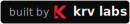

<p align="center">
  <picture>
    <source media="(prefers-color-scheme: dark)" srcset="https://raw.githubusercontent.com/Krv-Labs/topos/main/docs/source/_static/topos-logo-dark.svg">
    <source media="(prefers-color-scheme: light)" srcset="https://raw.githubusercontent.com/Krv-Labs/topos/main/docs/source/_static/topos-logo.svg">
    
  </picture>
</p>

<h3 align="center">A structural quality gate for coding agents.</h3>

<p align="center">
  Topos measures complexity, coupling, and risky data flows, then gives your agent a concrete target&mdash;from SLOP to GOLD.
</p>

<p align="center">
  <a href="https://github.com/mcp/Krv-Labs/topos"></a>
  <a href="https://pypi.org/project/topos-mcp/"></a>
  <a href="https://github.com/Krv-Labs/topos/blob/main/LICENSE"></a>
  <a href="https://glama.ai/mcp/servers/Krv-Labs/topos"></a>
  <a href="https://clawhub.ai/krv-labs/skills/topos"></a>
</p>
<!-- mcp-name: io.github.Krv-Labs/topos -->

<p align="center">
  <a href="#install-and-quick-start">Install</a> ·
  <a href="#what-topos-checks">What it checks</a> ·
  <a href="#under-the-hood">Under the hood</a> ·
  <a href="https://docs.krv.ai/topos/">Docs</a> ·
  <a href="https://github.com/Krv-Labs/topos/issues">Issues</a>
</p>

---

<!--
DEMO STUB — replace this comment only after recording the real release flow.

Show, in under 20 seconds:
1. an agent evaluates a repository;
2. Topos identifies the exact failing pillar and source hotspot;
3. the agent makes one focused refactor;
4. Topos verifies the medal improvement while the project tests stay green.

Prefer a checked-in, captioned GIF or SVG terminal recording with a stable
repository-relative URL. Do not publish a synthetic or hand-written result.
-->

<!--
STUDY STUB — keep hidden until the study, raw results, pinned repository SHAs,
and reproduction method are public.

Candidate headline:
"We evaluated <N> public repositories at pinned commits. <result>."

Required link target: a durable methodology/results page containing the corpus
selection rule, Topos version and configuration, machine details, raw JSON,
known limitations, and a reproduction command. Avoid labeling repositories as
"AI-generated" unless that provenance is explicit and independently verifiable.
-->

## Why Topos

Coding agents produce working code quickly. The harder question is whether the result is still easy to understand, safe to change, and well-fitted to the rest of the repository. **[Quality is the new currency.](https://krv.ai/field-notes/evaluating-code-generation)**

Topos computes that signal from program structure—not from an LLM review or a style opinion—and returns concrete failure locations and next actions. It is fast enough to sit inside the agent loop: measure, edit, verify, repeat.

**Tests check behavior. Topos checks whether the implementation is built to keep changing.**

> Grounded in category theory, powered by a native-Rust engine.


## Under the hood

Topos is a self-contained Rust CLI and MCP server. Analysis runs locally; your source code is not sent to an external model or hosted analysis service.

| Component | Role |
| :--- | :--- |
| [tree-sitter](https://tree-sitter.github.io/tree-sitter/) | Parses six languages and powers the native AST, CFG, CPG, PDG, and UAST representations. |
| [GitNexus](https://github.com/abhigyanpatwari/GitNexus) | Supplies the repository dependency graph scored by COMPOSABLE (`topos depgraph generate`). Requires `npm install -g gitnexus@1.6.8`. |
| [Sighthound](https://github.com/Corgea/Sighthound) | Embedded in the MCP server for supplementary security findings; native CPG probes remain the SECURE scoring source. |
| [Graphify](https://github.com/Graphify-Labs/graphify) | Optional advisory orphan and fragile-edge detection via `topos graphify` / `topos_refactor(target="graphify")`; does not affect the medal. Requires `pip install graphifyy`. |

The result is one agent-facing contract over several structural lenses: one score to optimize, explicit evidence for each failure, and a verification loop that can tell a real improvement from cosmetic churn.

## Install and Quick Start

### VS Code MCP Extension

Open the Extensions view, search **`@mcp topos`**, select **Topos**, and choose **Install**. Or view here: [Topos: GitHub's MCP Registry](https://github.com/mcp/Krv-Labs/topos).

Then ask agent mode:

> Use Topos to find this repository's worst structural problem, make one focused improvement, and verify the result.

See the [agent setup guide](https://docs.krv.ai/topos/agents.html) for tool permissions and troubleshooting.

### Other MCP clients [*Claude Code*]

Run the self-contained MCP server on demand—no persistent Topos or Python installation required:

```bash
claude mcp add --transport stdio topos -- uvx topos-mcp
```

Setup for Codex, Gemini CLI, Cursor, Windsurf, Antigravity, and manual JSON lives in the [agent setup guide](https://docs.krv.ai/topos/agents.html).

### Standalone CLI

```bash
curl -fsSL https://docs.krv.ai/topos/install.sh | sh
```

Prefer Homebrew?

```bash
brew install krv-labs/tap/topos
```

On Homebrew 6+, that one-liner auto-taps and trusts only this formula. If you `brew tap krv-labs/tap` first, run `brew trust --formula krv-labs/tap/topos` before `brew install topos`.


Then run:
```bash
topos evaluate . -r
```

> [!TIP]
> Want GOLD? Run `topos depgraph generate` if your agent hasn't already (+ run again after big structural edits), then evaluate with the added CLI flag `--gitnexus-dir .gitnexus`.

Topos supports Python, Rust, JavaScript, TypeScript, C++, and Go. The CLI defaults to Python; use `--language rust|go|javascript|typescript|cpp` for another language. See [Installation](https://docs.krv.ai/topos/installation.html) for platform support and alternative install paths.

## More ways to use Topos

- **OpenClaw / ClawHub:** [`openclaw skills install @Krv-Labs/topos`](https://clawhub.ai/krv-labs/skills/topos)
- **Hermes:** `hermes skills tap add Krv-Labs/topos` then `hermes skills install Krv-Labs/topos/topos`
- **MCP Registry name:** `io.github.Krv-Labs/topos`
- **CLI reference:** [docs.krv.ai/topos/cli](https://docs.krv.ai/topos/cli.html)


## What Topos checks

Every file gets three independent verdicts:

- **SIMPLE** — avoids unnecessary complexity using AST entropy and control-flow complexity.
- **COMPOSABLE** — stays decoupled from the repository using module-dependency structure and Martin instability.
- **SECURE** — avoids dangerous API reachability and taint paths in the code property graph.

Those verdicts roll up into one memorable quality medal without hiding which pillar failed:

| Medal | Criteria |
| :--- | :--- |
| 🥇 **GOLD** | Passes all 3 |
| 🥈 **SILVER** | Passes 2 of 3 |
| 🥉 **BRONZE** | Passes 1 of 3 |
| ❌ **SLOP** | Passes 0, or fails to parse |

Topos also returns ranked refactor guidance: failing metric locations, control-flow cycles, load-bearing dependency edges, process bottlenecks, and optional Graphify knowledge-graph findings. Advisory findings never silently change the scored medal.

<details>
<summary>How the medal system is derived</summary>

The three pillars are pairwise incomparable and form an eight-element evaluation lattice; GOLD is their intersection.


[Measures](https://docs.krv.ai/topos/measures.html) · [Category-theory foundations](https://docs.krv.ai/topos/concepts.html)

</details>

## Distribution

Topos ships four ways:

- **GitHub Releases** — the `topos` CLI binary (macOS/Linux), via `install.sh` or a direct release download.
- **PyPI** — `topos-mcp`, a thin `bin`-wheel bundling the MCP server binary (`pip install topos-mcp` / `uvx topos-mcp`), zero Python runtime.
- **VS Code Marketplace** — the Topos extension, bundling platform binaries.
- **Docker** — a container image for Glama and other MCP-registry hosting.

Crate layout and adapter details: **[docs.krv.ai/topos/architecture](https://docs.krv.ai/topos/architecture.html)**.

## Contributing

Topos is used internally at [Krv Labs](https://krv.ai) to manage AI-agent code output. We welcome bugs, ideas, and contributions.

- **Bug?** Open an [issue](https://github.com/Krv-Labs/topos/issues)
- **Idea?** Start a [discussion](https://github.com/Krv-Labs/topos/discussions) or open a PR
- **Collaborate?** [team@krv.ai](mailto:team@krv.ai)

---

[Full documentation](https://docs.krv.ai/topos/) · [Measures and metrics](https://docs.krv.ai/topos/measures.html) · [Engineering notes](docs/)

<p align="left">
  <a href="https://krv.ai">
    
  </a>
</p>
