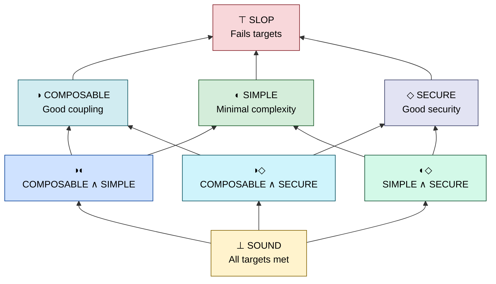

# Topos

> **Structural code quality metrics your agents can act on.**

Topos lets you set and manage the quality target while coding agents handle the iteration. Pick a priority and Topos measures program structure (not just syntax), giving agents concrete metrics to optimize toward on every pass.

Current priorities:

- **SIMPLE:** Minimal external dependencies; functionality lives within the module.
- **COMPOSABLE:** Connects cleanly with other modules without creating fragile dependency chains.
- **SECURE:** Surfaces and hardens risky patterns so agents can drive toward safer structure.

More coming soon.

> [!NOTE]
> We model programs as maps (morphisms) on graphs. This lets us evaluate design properties that go beyond preserving inputs and outputs.

---

### The Verdict

The Hasse diagram is drawn **bottom = best** (`SOUND`, meet of all three satisfied axes), **top = worst** (`SLOP`, no axis satisfied): edges cover **adding one more failure** (turning off one generator). Pair labels are literal **meets** of which generators still pass (for example your program at `COMPOSABLE ∧ SIMPLE`).



The three base measures are **pairwise incomparable** — code can satisfy any one without the others. Along this order, **meet** is intersection of satisfied generators (closure under ∧); `SLOP` is the **top** (⊤) and `SOUND` the **bottom** (⊥).

That diagram is the intrinsic **partial order** on satisfied subsets: one verdict is **below** another in the drawing when it satisfies a *superset* of the same generators (coordinate-wise implication toward `SOUND`). Many pairs of verdicts are still incomparable (for example `COMPOSABLE` versus `SIMPLE`).

**Manager priority lists.** Whoever runs the agent picks a **strict total order on the generators** — which dimension matters most when trade-offs appear. That does not replace the partial order; it **ranks acceptable targets** so the run has a single walk when budgets bite.

Treat the priority list as most important → least important. Write each verdict as a 3-bit pattern in that same order (1 = satisfied). Sort verdicts by the integer value of that bit pattern, **descending** (best targets first). `SLOP` (⊤ here) is always last in that relaxation list.

Example priority list: **SECURE > COMPOSABLE > SIMPLE**. List each verdict as three bits in that same order (most significant bit = **SECURE**).

 Verdict | Bits |
| --- | --- |
| `SOUND` | `111` |
| `COMPOSABLE ∧ SECURE` | `110` |
| `SIMPLE ∧ SECURE` | `101` |
| `COMPOSABLE ∧ SIMPLE` | `011` |
| `SECURE` | `100` |
| `COMPOSABLE` | `010` |
| `SIMPLE` | `001` |
| `SLOP` | `000` |

That is the **target relaxation walk**: aim for step 1, then if time or tokens force a compromise, treat step 2 as the next acceptable plateau, and so on, until the manager’s minimum bar is reached.

> [!TIP]
> Perfect code satisfies every target — but agents operate under token and time budgets. A concrete priority gives them a formula to execute rather than an open-ended target.

---

### Quick Start

#### Install

```bash
curl -sSL https://raw.githubusercontent.com/Krv-Labs/topos/main/install.sh | sh
```

#### CLI

```bash
topos evaluate src/ -r --priority SIMPLE   # classify a directory
topos inspect module.py                             # detailed metrics
topos compare before.py after.py                    # AST edit distance
```

#### In an agent loop

```
Agent iteration 1: structural: ⊤ SLOP [41%]
  → Reduce cyclomatic complexity and normalize entropy toward 0.5

Agent iteration 2: structural: ◐ SIMPLE [72%]
  → ✓ Target achieved.
```

---

### MCP Server

Give any MCP-compatible agent — Claude Code, Cursor, Gemini CLI, Windsurf — a live feed of Topos verdicts so it can evaluate and iterate on its own output.

<details>
<summary><b>Set up <code>topos-mcp</code> in your agent</b></summary>

&nbsp;

#### Step 1 — Build the dependency graph

> [!IMPORTANT]
> **Do this first.** Without a dependency graph, Topos scores the structural dimension only — `COMPOSABLE` and `SOUND` become unreachable.
>
> ```bash
> npm install -g gitnexus        # one-time per machine
> cd /path/to/your/repo
> topos depgraph generate        # one-time per repo; writes .gitnexus/
> ```
>
> Re-run when imports change (new modules, renames, restructures). The cache keys on `.gitnexus/` mtime and invalidates itself.

> [!TIP]
> Verify the binary before wiring it into editors:
>
> ```bash
> topos-mcp   # prints the FastMCP banner and waits on stdin. Ctrl-C to exit.
> ```

#### Step 2 — Register with your agent

Run from your project root — Topos auto-detects its file-access root by walking up for `.git` or `pyproject.toml`.

##### Claude Code

```bash
claude mcp add topos topos-mcp
```

##### Gemini CLI

```bash
gemini mcp add topos topos-mcp
```

##### Cursor

<a href="cursor://anysphere.cursor-deeplink/mcp/install?name=topos&config=eyJjb21tYW5kIjogInRvcG9zLW1jcCJ9">**➕ Install `topos` in Cursor**</a>

Or edit `.cursor/mcp.json`:

```json
{ "mcpServers": { "topos": { "command": "topos-mcp" } } }
```

##### Windsurf and everything else

```json
{ "mcpServers": { "topos": { "command": "topos-mcp" } } }
```

#### Step 3 — Launch from the project root

> [!IMPORTANT]
> Topos refuses to read files outside a trusted root. If you must launch from elsewhere, set it explicitly:
>
> ```json
> {
>   "command": "topos-mcp",
>   "env": { "TOPOS_MCP_FILE_ROOT": "/absolute/path/to/repo" }
> }
> ```

> [!TIP]
> On the agent's first turn, point it at the workflow doc:
>
> > "Fetch `topos://docs/workflows` and follow the Topos refactor loop."
>
> Or invoke the prompt directly: `topos_refactor_until_sound(filepath="path/to/file.py")`.

#### Smoke test

> "Use topos to find the worst-scoring file in `src/`, propose a refactor, and verify with `topos_assess_improvement`."

A healthy response has `coupling_available: true`. If every response shows `coupling_available: false`, go back to Step 1.

</details>

---

### Contributing

Topos is used internally at [Krv Labs](https://krv.ai) to manage AI agent code output. We welcome bugs, ideas, and contributions.

- **Bug?** Open an [Issue](https://github.com/Krv-Labs/topos/issues)
- **Idea?** Start a [Discussion](https://github.com/Krv-Labs/topos/discussions) or open a PR
- **Collaborate?** [team@krv.ai](mailto:team@krv.ai)

---

[Full Documentation](docs/) · [Measures & Metrics](docs/source/measures.rst) · [Category Theory Concepts](docs/source/concepts.rst)

_Built with ❤️ by [Krv Labs](https://krv.ai)_
