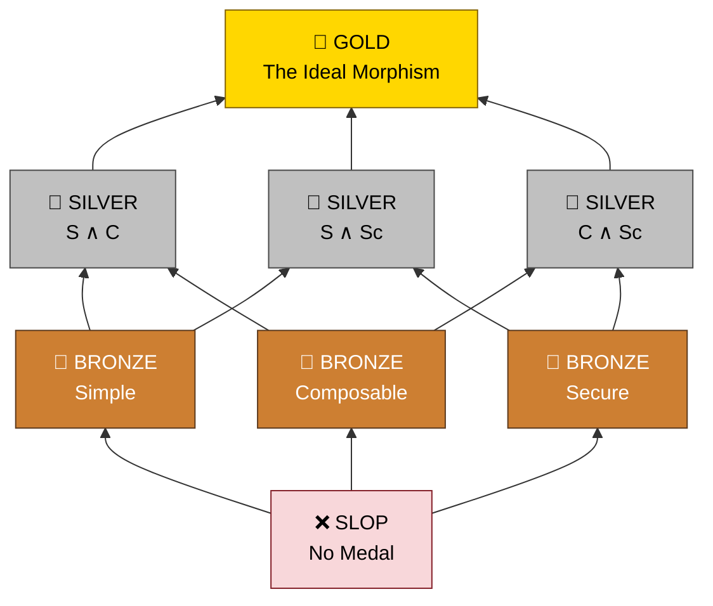

# Topos

> **Structural code quality metrics for agent-written programs.**

**Topos** gives you structural code quality metrics your agents can act on. Pick a preference ranking and Topos measures program structure — not just syntax — giving agents concrete metrics to optimize toward on every pass. You set the target; agents handle the iteration.

> [!IMPORTANT]
> **Correctness is expected. Quality is the new currency.**
> Passing unit tests only proves that your code is a solution to a finite set of requirements. Agents have proved to be exceptional at this and will continue to improve. We believe the new currency is the quality of these solutions. Topos provides the structural evaluations that empower coding agents to find higher quality solutions.

---

### Beyond Correctness

**Assume you passed the tests. How good is your solution?**

Current code evaluations focus heavily on *correctness* — does the code pass the unit tests we created? But passing tests doesn't guarantee that you've written good, secure, or maintainable code. 

Topos fills this gap by measuring structural quality, ensuring that your code isn't just correct, but built to last. It provides well-principled evaluations of a programs structure along three independent quality pillars:

- **SIMPLE** — The code avoids unnecessary complexity. (Evaluates CFG complexity and AST entropy).
- **COMPOSABLE** — The module is cleanly decoupled from other modules. (Evaluates Martin coupling and instability; requires GitNexus).
- **SECURE** — The code is free of operations known to expose security vulnerabilities. (Evaluates dangerous-API reachability and taint paths).

---

### The Medal Podium

Topos measures each file along the three independent quality pillars. Each pillar is pass or fail on its own. Topos checks all three pillars and awards a **Code Quality Medal** based on how many you pass. While *which* pillars you pass matters for diagnosis, the medal tier depends only on the count:

| Pillars passed | Medal | Example (any combination with this count) |
| :--- | :--- | :--- |
| **3 of 3** | 🥇 **GOLD** | SIMPLE + COMPOSABLE + SECURE |
| **2 of 3** | 🥈 **SILVER** | e.g. SIMPLE + SECURE, or COMPOSABLE + SECURE |
| **1 of 3** | 🥉 **BRONZE** | e.g. SIMPLE only, or SECURE only |
| **0 of 3** | ❌ **SLOP** | Fails every pillar (or the file could not be parsed) |

---

### Quick Start

#### Install

```bash
curl -sSL https://raw.githubusercontent.com/Krv-Labs/topos/main/install.sh | sh
```

#### CLI

```bash
# Set your preferences by ordering the evaluation pillars
topos evaluate src/ -r --preferences simple,composable,secure  # classify each file in the `src` directory
```

---

### MCP Server

Give any MCP-compatible agent — Claude Code, Cursor, Gemini CLI, Windsurf — a live feed of Topos verdicts so it can evaluate and iterate on its own output.

<details>
<summary><b>Set up <code>topos-mcp</code> in your agent</b></summary>

&nbsp;

#### Step 1 — Build the dependency graph (optional but recommended)

> [!IMPORTANT]
> **Recommended.** Without a dependency graph, Topos cannot score COMPOSABLE — any verdict containing it (including `IDEAL`) is unreachable. `SIMPLE` and `SECURE` always run.
>
> ```bash
> npm install -g gitnexus        # one-time per machine
> cd /path/to/your/repo
> topos depgraph generate        # one-time per repo; writes .gitnexus/
> ```
>
> Re-run when imports change (new modules, renames, restructures). The cache keys on `.gitnexus/` mtime and invalidates itself.

> [!TIP]
> Verify the binary before wiring it into editors:
>
> ```bash
> topos-mcp   # prints the FastMCP banner and waits on stdin. Ctrl-C to exit.
> ```

#### Step 2 — Register with your agent

Run from your project root — Topos auto-detects its file-access root by walking up for `.git` or `pyproject.toml`.

##### Claude Code

```bash
claude mcp add topos topos-mcp
```

##### Gemini CLI

```bash
gemini mcp add topos topos-mcp
```

##### Cursor

<a href="cursor://anysphere.cursor-deeplink/mcp/install?name=topos&config=eyJjb21tYW5kIjogInRvcG9zLW1jcCJ9">**➕ Install `topos` in Cursor**</a>

Or edit `.cursor/mcp.json`:

```json
{ "mcpServers": { "topos": { "command": "topos-mcp" } } }
```

##### Windsurf and everything else

```json
{ "mcpServers": { "topos": { "command": "topos-mcp" } } }
```

#### Step 3 — Launch from the project root

> [!IMPORTANT]
> Topos refuses to read files outside a trusted root. If you must launch from elsewhere, set it explicitly:
>
> ```json
> {
>   "command": "topos-mcp",
>   "env": { "TOPOS_MCP_FILE_ROOT": "/absolute/path/to/repo" }
> }
> ```

> [!TIP]
> On the agent's first turn, point it at the workflow doc:
>
> > "Fetch `topos://docs/workflows` and follow the Topos refactor loop."
>
> Or invoke the prompt directly: `topos_refactor_until_ideal(filepath="path/to/file.py")`.

#### Smoke test

> "Use topos to find the worst-scoring file in `src/`, propose a refactor, and verify with `topos_assess_improvement`."

A healthy response shows `{simple: 72%, composable: 65%, secure: 95%}` when GitNexus is configured. If the response is missing `composable`, go back to Step 1.

</details>

---

### How it works

Topos measures code along the three independent quality generators and maps them to an 8-element evaluation lattice:

- **SIMPLE** — Built from the [abstract syntax tree](https://en.wikipedia.org/wiki/Abstract_syntax_tree) (AST) and [control-flow graph](https://en.wikipedia.org/wiki/Control-flow_graph) (CFG). We calculate cyclomatic complexity of the CFG and entropy of the AST to assess complexity.
- **COMPOSABLE** — Built from the [module dependency graph](https://en.wikipedia.org/wiki/Module_dependency_graph) (MDG) using [GitNexus](https://github.com/abhigyanpatwari/GitNexus), to capture inter-module dependencies. This is slightly different than the usual [program dependence graph](https://en.wikipedia.org/wiki/Program_dependence_graph) (PDG) which is used to capture intra-function dependencies. We calculate Martin Instability and Fanning metrics for the MDG to assess coupling.
- **SECURE** — Built from the [code property graph](https://en.wikipedia.org/wiki/Code_property_graph) (CPG). We calculate dangerous-API reachability and taint paths from the CPG to assess security.



> [!TIP]
> **Three Independent Pillars:** `SIMPLE`, `COMPOSABLE`, and `SECURE` are **pairwise incomparable**. A file can achieve any subset of {S, C, Sc} independently. `🥇 GOLD` is the intersection of all three. 

### Manager Priorities & Agent Iteration

In a perfect world, every file would earn a `🥇 GOLD` medal. In reality, managers and developers have a finite budget of time and tokens. 

Topos allows you to set **Preferences** — an ordering of these medals based on your immediate priorities. Coding agents use this ranking to aim for `🥇 GOLD`. If achieving `🥇 GOLD` isn't feasible within the budget, the preference ranking tells the agent exactly how to *relax* its goals, ensuring it still delivers the highest possible quality medal aligned with your priorities.


---

### Contributing

Topos is used internally at [Krv Labs](https://krv.ai) to manage AI agent code output. We welcome bugs, ideas, and contributions.

- **Bug?** Open an [Issue](https://github.com/Krv-Labs/topos/issues)
- **Idea?** Start a [Discussion](https://github.com/Krv-Labs/topos/discussions) or open a PR
- **Collaborate?** [team@krv.ai](mailto:team@krv.ai)

---

[Full Documentation](docs/) · [Measures & Metrics](docs/source/measures.rst) · [Category Theory Concepts](docs/source/concepts.rst)

_Built with ❤️ by [Krv Labs](https://krv.ai)_
