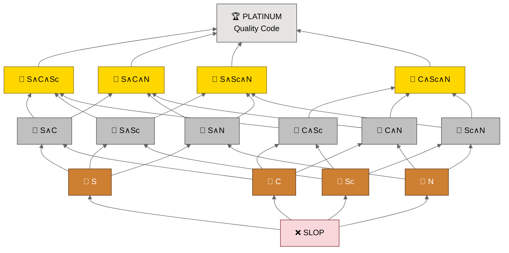

<p align="center">
  <picture>
    <source media="(prefers-color-scheme: dark)" srcset="https://raw.githubusercontent.com/Krv-Labs/topos/main/docs/source/_static/topos-logo-dark.svg">
    <source media="(prefers-color-scheme: light)" srcset="https://raw.githubusercontent.com/Krv-Labs/topos/main/docs/source/_static/topos-logo.svg">
    
  </picture>
</p>

<h3 align="center">the agent harness for structural code quality</h3>

<p align="center">
 Topos measures complexity, coupling, risky data flows, and agent cognitive load, then gives your agent a concrete target&mdash;from SLOP to PLATINUM.
</p>

<p align="center">
  <a href="#what-topos-checks"></a>
  <a href="https://github.com/mcp/Krv-Labs/topos"></a>
  <a href="https://pypi.org/project/topos-mcp/"></a>
  <a href="https://github.com/Krv-Labs/topos/blob/main/LICENSE"></a>
  <a href="https://glama.ai/mcp/servers/Krv-Labs/topos"></a>
  <a href="https://clawhub.ai/krv-labs/skills/topos"></a>
</p>
<!-- mcp-name: io.github.Krv-Labs/topos -->

<p align="center">
  <a href="#install-and-quick-start">Install</a> ·
  <a href="#what-topos-checks">What it checks</a> ·
  <a href="#under-the-hood">Under the hood</a> ·
  <a href="https://docs.krv.ai/topos/">Docs</a> ·
  <a href="https://github.com/Krv-Labs/topos/issues">Issues</a>
</p>

---

<!--
DEMO STUB — replace this comment only after recording the real release flow.

Show, in under 20 seconds:
1. an agent evaluates a repository;
2. Topos identifies the exact failing pillar and source hotspot;
3. the agent makes one focused refactor;
4. Topos verifies the medal improvement while the project tests stay green.

Prefer a checked-in, captioned GIF or SVG terminal recording with a stable
repository-relative URL. Do not publish a synthetic or hand-written result.
-->

<!--
STUDY STUB — keep hidden until the study, raw results, pinned repository SHAs,
and reproduction method are public.

Candidate headline:
"We evaluated <N> public repositories at pinned commits. <result>."

Required link target: a durable methodology/results page containing the corpus
selection rule, Topos version and configuration, machine details, raw JSON,
known limitations, and a reproduction command. Avoid labeling repositories as
"AI-generated" unless that provenance is explicit and independently verifiable.
-->

## Why Topos

Coding agents produce working code quickly. The harder question is whether the result is still easy to understand, safe to change, and well-fitted to the rest of the repository. **[Quality is the new currency.](https://krv.ai/field-notes/evaluating-code-generation)**

Topos computes that signal from program structure—not from an LLM review or a style opinion—and returns concrete failure locations and next actions. It is fast enough to sit inside the agent loop: measure, edit, verify, repeat.

**Tests check behavior. Topos checks whether the implementation is built to keep changing.**

> Grounded in category theory, written in Rust.

## Install and Quick Start

One binary. Every supported agent harness. A clean way back out.

### 1. Install the CLI

Use the verified release installer:

```bash
curl -fsSL https://docs.krv.ai/topos/install.sh | bash
```

Or install with Homebrew:

```bash
brew install krv-labs/tap/topos
```

> [!TIP]
> **Prefer an editor-managed install?** In VS Code or Cursor, search `@mcp topos` in the Extensions view or choose [Install MCP server](https://github.com/mcp/Krv-Labs/topos). This is an alternative to `topos install`: your editor installs and manages the Topos MCP server for you.

### 2. Connect your coding agents

`topos install` detects every supported MCP harness and lets you configure any—or all—of them from one interactive checklist:

```bash
topos install
```

```text
┌  Which agent integrations do you want to configure?
│
│  ↑↓ move · space toggle · a all · enter confirm · esc cancel
│
│ ❯ ○ Claude Code          (detected)
│   ○ Claude Desktop       (detected)
│   ● Codex CLI            (✓ active)
│   ● Gemini CLI           (✓ active)
│   ○ GitHub Copilot CLI   (detected)
│   ○ Cursor               (detected)
│   ○ VS Code              (detected)
│   ○ Google Antigravity   (detected)
└
```

Restart the agents you configured, then ask:

> *"Use Topos to find this repository's worst structural problem, make one focused improvement, and verify the result."*


> [!IMPORTANT]
> Too many tools spray MCP servers across agent JSON files, scatter symlinks around your machine, then leave you to burn half a Claude session untangling the mess—or pull your own hair out doing it. Topos does not play that game. We follow a leave-no-trace policy: `topos status` shows every registration, while **`topos uninstall` opens the same selector, previews exactly what will change, and removes everything Topos installed.** If Topos makes it easy to do, it should be just as easy to undo.
>
> ```bash
> topos status
> topos uninstall
> ```


See the [agent setup guide](https://docs.krv.ai/topos/agents.html) for permissions, manual configuration, and troubleshooting.

### 3. Evaluate from the terminal

```bash
topos evaluate . -r
```

Topos discovers Python, Rust, JavaScript, TypeScript, C++, and Go automatically. Pass `--language` only when you want to narrow the run.

See [Installation](https://docs.krv.ai/topos/installation.html) for platform support and alternative install paths.


## What Topos checks

Every file gets four independent verdicts:

- **SIMPLE** — avoids unnecessary complexity using AST entropy and control-flow complexity.
- **COMPOSABLE** — limits a file's outward dependency burden; broader coupling and stability metrics remain available for diagnosis.
- **SECURE** — avoids dangerous API reachability and taint paths in the code property graph.
- **NAVIGABLE** — stays shallow enough for an agent to read and change in one pass, using depth-weighted nesting divergence over the AST scope tree.

Those verdicts roll up into one memorable quality medal without hiding which pillar failed:

| Medal | Criteria |
| :--- | :--- |
| 🏆 **PLATINUM** | Passes all 4 |
| 🥇 **GOLD** | Passes 3 of 4 |
| 🥈 **SILVER** | Passes 2 of 4 |
| 🥉 **BRONZE** | Passes 1 of 4 |
| ❌ **SLOP** | Passes 0, or fails to parse |


See the [full metrics reference](topos/mcp/docs/content/metrics.md). Refactor guidance also surfaces control-flow cycles, load-bearing dependency edges, process bottlenecks, and optional Graphify knowledge-graph findings.

<details>
<summary>How the medal system is derived</summary>

The four pillars are pairwise incomparable and form a sixteen-element evaluation lattice (a 4-cube); PLATINUM is their intersection. Labels below abbreviate the pillars as **S**imple, **C**omposable, **Sc** = Secure, **N**avigable.


```mermaid
---
config:
  layout: dagre
  theme: neutral
---
graph BT
    SLOP["❌ SLOP"]
    S["🥉 S"]
    C["🥉 C"]
    Sc["🥉 Sc"]
    N["🥉 N"]
    SC["🥈 S∧C"]
    SSc["🥈 S∧Sc"]
    SN["🥈 S∧N"]
    CSc["🥈 C∧Sc"]
    CN["🥈 C∧N"]
    ScN["🥈 Sc∧N"]
    SCSc["🥇 S∧C∧Sc"]
    SCN["🥇 S∧C∧N"]
    SScN["🥇 S∧Sc∧N"]
    CScN["🥇 C∧Sc∧N"]
    IDEAL["🏆 PLATINUM<br/>Quality Code"]

    SLOP --> S
    SLOP --> C
    SLOP --> Sc
    SLOP --> N
    S --> SC
    S --> SSc
    S --> SN
    C --> SC
    C --> CSc
    C --> CN
    Sc --> SSc
    Sc --> CSc
    Sc --> ScN
    N --> SN
    N --> CN
    N --> ScN
    SC --> SCSc
    SC --> SCN
    SSc --> SCSc
    SSc --> SScN
    SN --> SCN
    SN --> SScN
    CSc --> SCSc
    CSc --> CScN
    CN --> SCN
    CN --> CScN
    ScN --> SScN
    ScN --> CScN
    SCSc --> IDEAL
    SCN --> IDEAL
    SScN --> IDEAL
    CScN --> IDEAL

    style SLOP   fill:#f8d7da,stroke:#842029,color:#000
    style S      fill:#cd7f32,stroke:#5c3a1e,color:#fff
    style C      fill:#cd7f32,stroke:#5c3a1e,color:#fff
    style Sc     fill:#cd7f32,stroke:#5c3a1e,color:#fff
    style N      fill:#cd7f32,stroke:#5c3a1e,color:#fff
    style SC     fill:#c0c0c0,stroke:#4a4a4a,color:#000
    style SSc    fill:#c0c0c0,stroke:#4a4a4a,color:#000
    style SN     fill:#c0c0c0,stroke:#4a4a4a,color:#000
    style CSc    fill:#c0c0c0,stroke:#4a4a4a,color:#000
    style CN     fill:#c0c0c0,stroke:#4a4a4a,color:#000
    style ScN    fill:#c0c0c0,stroke:#4a4a4a,color:#000
    style SCSc   fill:#ffd700,stroke:#856404,color:#000
    style SCN    fill:#ffd700,stroke:#856404,color:#000
    style SScN   fill:#ffd700,stroke:#856404,color:#000
    style CScN   fill:#ffd700,stroke:#856404,color:#000
    style IDEAL  fill:#e5e4e2,stroke:#4a4a4a,color:#000
```

[Measures](https://docs.krv.ai/topos/measures.html) · [Category-theory foundations](https://docs.krv.ai/topos/concepts.html)

</details>


## Under the hood

Topos is a self-contained Rust CLI and MCP server. Analysis runs locally; your source code is not sent to an external model or hosted analysis service.

| Component | Role |
| :--- | :--- |
| [tree-sitter](https://tree-sitter.github.io/tree-sitter/) | Parses six languages and powers the native AST, CFG, CPG, PDG, and UAST representations. |
| [GitNexus](https://github.com/abhigyanpatwari/GitNexus) | Supplies the repository dependency graph scored by COMPOSABLE (`topos depgraph generate`). Requires `npm install -g gitnexus@1.6.8`. |
| [Sighthound](https://github.com/Corgea/Sighthound) | Embedded in the MCP server for supplementary security findings; native CPG probes remain the SECURE scoring source. |
| [Graphify](https://github.com/Graphify-Labs/graphify) | Optional advisory orphan and fragile-edge detection via `topos graphify` / `topos_refactor(target="graphify")`; does not affect the medal. Requires `pip install graphifyy`. |

The result is one agent-facing contract over several structural lenses: one score to optimize, explicit evidence for each failure, and a verification loop that can tell a real improvement from cosmetic churn.


## More ways to use Topos

- **OpenClaw / ClawHub:** [`openclaw skills install @Krv-Labs/topos`](https://clawhub.ai/krv-labs/skills/topos)
- **Hermes:** `hermes skills tap add Krv-Labs/topos` then `hermes skills install Krv-Labs/topos/topos`
- **MCP Registry name:** `io.github.Krv-Labs/topos`
- **CLI reference:** [docs.krv.ai/topos/cli](https://docs.krv.ai/topos/cli.html)


## Distribution

Topos ships four ways:

- **GitHub Releases** — the `topos` CLI binary (macOS/Linux), via `install.sh` or a direct release download.
- **PyPI** — `topos-mcp`, a thin `bin`-wheel bundling the MCP server binary (`pip install topos-mcp` / `uvx topos-mcp`), zero Python runtime.
- **VS Code Marketplace** — the Topos extension, bundling platform binaries.
- **Docker** — a container image for Glama and other MCP-registry hosting.

Crate layout and adapter details: **[docs.krv.ai/topos/architecture](https://docs.krv.ai/topos/architecture.html)**.

## Contributing

Topos is used internally at [Krv Labs](https://krv.ai) to manage AI-agent code output. We welcome bugs, ideas, and contributions.

- **Bug?** Open an [issue](https://github.com/Krv-Labs/topos/issues)
- **Idea?** Start a [discussion](https://github.com/Krv-Labs/topos/discussions) or open a PR
- **Collaborate?** [team@krv.ai](mailto:team@krv.ai)

---

[Full documentation](https://docs.krv.ai/topos/) · [Measures and metrics](https://docs.krv.ai/topos/measures.html) · [Engineering notes](docs/)

<p align="left">
  <a href="https://krv.ai">
    
  </a>
  &nbsp;
  <a href="#what-topos-checks">
    
  </a>
</p>
