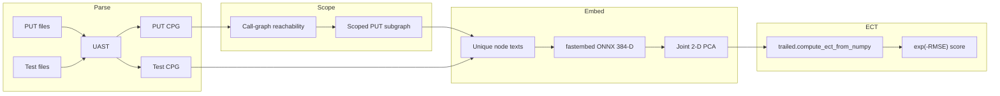

# ECT Coverage Integration — Feasibility Report

**Branch:** `ect-coverage`  
**Date:** 2026-06-16  
**Status:** Integration complete; ready for larger empirical experiments  
**Audience:** Engineers scaling benchmarks, release validation, or product decisions

---

## Executive summary

Topological (ECT) semantic test coverage is **feasible** for Topos without abandoning a lightweight default install, provided usage stays **module- or file-scoped** rather than whole-repository merges.

| Dimension | Verdict | Notes |
|-----------|---------|-------|
| Binary / VSIX size | **Feasible** | +33 MB measured on macOS arm64; still ~130 MiB under 200 MiB VSIX gate |
| Default `pip install topos` | **Feasible** | ECT behind `topos[ect-coverage]` optional extra |
| VS Code release binary | **Feasible** | PyInstaller collects `onnxruntime`, `fastembed`, `trailed` |
| MCP cold start | **OK** | Lazy imports; no ECT cost until first topological call |
| Agent loop runtime (file pairs) | **OK** | Warm path sub-second to low seconds on small fixtures |
| Whole-repo coverage | **Poor fit** | Embedding + CPG build scale with node count |

**Recommended product model:** slim pip default, ECT in bundled VS Code binary, runtime model download, per-module invocation.

---

## What ECT coverage measures

ECT coverage complements **UAST structural coverage** (declaration-level bipartite matching). It asks: *does the test CPG’s semantic shape (in a shared 2-D embedding space) resemble the call-reachable subgraph of the PUT?*

It does **not** replace line/branch coverage and does **not** prove that tests invoke specific production entry points unless call linkage is added separately.

### Pipeline



### Algorithm parameters (defaults)

| Parameter | Value | Location |
|-----------|-------|----------|
| Embedding model | `snowflake/snowflake-arctic-embed-xs` | `get_embedding_model()` |
| Embedding dimension | 384 | fastembed |
| PCA output | 2-D (joint on PUT ∪ test) | `_joint_pca_2d` |
| ECT directions (`num_thetas`) | 32 | `calculate_topological_coverage` |
| ECT resolution (`num_steps`) | 64 | `calculate_topological_coverage` |
| Score | `exp(-RMSE)` after per-graph node-count normalization | `topological_coverage.py` |

### Key implementation files

| Layer | Path |
|-------|------|
| Algorithm | `topos/functors/profunctors/cpg/topological_coverage.py` |
| Policy / threshold | `topos/evaluation/policies/coverage.py` |
| CLI | `topos/cli/commands/coverage.py` (`topos coverage`) |
| MCP tool | `topos/mcp/tools/coverage.py` (`topos_calculate_coverage`) |
| MCP schemas | `topos/mcp/schemas.py` |
| UAST coverage (always on) | `topos/functors/profunctors/uast/structural_test_coverage.py` |

---

## Distribution model

### Pip install

```toml
# pyproject.toml
[project.optional-dependencies]
ect-coverage = ["fastembed", "trailed>=0.1.2"]
```

| Install | Added download | Disk after first ECT use |
|---------|----------------|--------------------------|
| `pip install topos` | 0 | unchanged |
| `pip install 'topos[ect-coverage]'` | ~20 MB (onnxruntime wheel) | ~45–110 MB (includes cached model) |
| `uv sync --group dev` | includes fastembed + trailed for CI/tests | same as optional extra |

When the extra is missing:

- `ect_coverage_available()` returns `False`
- `require_ect_coverage()` raises `ECTCoverageUnavailableError` with install hint
- CLI and MCP still return **UAST** metrics; topological section reports `unavailable`

### VS Code / release binary

PyInstaller args (see `.github/workflows/release.yml` and `extensions/vscode/workflow/publishing.md`):

```bash
--collect-all onnxruntime
--collect-all fastembed
--collect-all trailed
--copy-metadata fastembed
```

Embedding model is **not** bundled in the binary; it downloads on first topological coverage call.

### First-run model download

| Item | Detail |
|------|--------|
| Model | `snowflake/snowflake-arctic-embed-xs` |
| Cache path | `~/.cache/fastembed` |
| Quantized ONNX size | ~23 MB |
| FP32 variant | ~90 MB (if selected) |
| Network | Required on first ECT use unless cache is pre-populated |

Expect **2–8 s** one-time cold start (ONNX session + model load) per process; a process-wide singleton amortizes this across repeated calls.

---

## Empirical results (2026-06-16)

### Binary size

**Baseline (v0.3.4, no ECT)** — [release tag](https://github.com/Krv-Labs/topos/releases/tag/v0.3.4):

| Artifact | Size |
|----------|------|
| `topos-macos-arm64` | 38.1 MB |
| `topos-macos-amd64` | 40.3 MB |
| `topos-linux-arm64` | 54.3 MB |
| `topos-linux-amd64` | 57.6 MB |

**ECT-enabled build (local, macOS arm64):**

| Metric | Value |
|--------|-------|
| Binary size | **71.0 MB** (73,955,712 bytes) |
| Delta vs v0.3.4 arm64 | **+32.9 MB** |
| VSIX gate | 200 MiB (`extensions/vscode/scripts/check-vsix-size.js`) |
| Projected ECT VSIX | ~60–95 MB (still under gate) |

Detailed size notes: `docs/ect-coverage-release-sizes.md`.

**Size attribution (estimated):**

| Component | Approx. contribution |
|-----------|---------------------|
| `onnxruntime` native libs | Dominant (~18–19 MB wheel per platform) |
| `trailed` | ~0.5 MB |
| `fastembed` + transitive Python deps | ~5–15 MB |
| Bundled ONNX model (if ever added) | +23–90 MB (not current strategy) |

### Runtime — theoretical cost model

| Phase | Small pair (~50–200 scoped nodes) | Large pair (~2k nodes) | Whole-repo merge |
|-------|-------------------------------------|------------------------|------------------|
| Parse + CPG build | 50–300 ms | 1–5 s | 10 s–minutes |
| Model cold start | 2–8 s | same (singleton) | same |
| Model warm embed | 50–500 ms | 2–15 s | minutes |
| Joint PCA (SVD) | <10 ms | ~50–200 ms | seconds at 10k+ |
| ECT (32×64, Rust) | <50 ms | <200 ms | <1 s |

**Dominant costs:** (1) first ONNX load, (2) unique-text embedding count, (3) CPG construction — **not** ECT itself.

### Runtime — smoke benchmarks (in-repo harness)

Harness: `tests/benchmarks/test_ect_coverage_perf.py`

| Fixture | Scoped nodes (typical) | Warm budget (assertion) |
|---------|------------------------|-------------------------|
| `tiny` | small | 5 s |
| `medium` | moderate | 8 s |
| `branchy` (3× duplicated) | larger | 15 s |

Each case measures separately:

- `t_cpg_s` — CPG build for PUT + test
- `t_cold_s` — ECT path with embedding model reset (`_EMBEDDING_MODEL = None`)
- `t_warm_s` — second call (model cached)

**Run and print metrics:**

```bash
TOPOS_BENCHMARK=1 uv run pytest tests/benchmarks/test_ect_coverage_perf.py -s --no-cov
```

**Run full coverage test suite:**

```bash
uv run pytest \
  tests/benchmarks/test_ect_coverage_perf.py \
  tests/cli/test_coverage.py \
  tests/mcp/test_coverage.py \
  tests/functors/profunctors/cpg/test_topological_coverage.py \
  tests/functors/profunctors/cpg/test_ect_coverage_optional.py \
  --no-cov
```

### PyInstaller reproduction (size experiments)

From repo root:

```bash
uv run --with pyinstaller pyinstaller --name topos --onefile --clean \
  --collect-all tree_sitter \
  --collect-all tree_sitter_python \
  --collect-all tree_sitter_rust \
  --collect-all tree_sitter_javascript \
  --collect-all tree_sitter_cpp \
  --collect-all tree_sitter_typescript \
  --collect-all topos \
  --collect-all fastmcp \
  --collect-all ladybug \
  --collect-all onnxruntime \
  --collect-all fastembed \
  --collect-all trailed \
  --copy-metadata fastmcp \
  --copy-metadata fastembed \
  topos/cli/main.py

ls -lh dist/topos
stat -f%z dist/topos   # macOS
```

Record platform, Python version, and compare to v0.3.4 artifacts from GitHub Releases.

---

## Operational characteristics

| Behavior | Detail |
|----------|--------|
| Lazy imports | `fastembed` and `trailed` load only on first topological call |
| Singleton embedder | `get_embedding_model()` caches across calls in one process |
| Unique-text dedup | Embeddings computed once per distinct node text in PUT ∪ test |
| Call-graph scoping | PUT subgraph = nodes reachable from callees referenced in tests |
| No test entry points | Fallback marks all functions untested; can inflate scoped graph |
| File nodes stripped | Excluded before embed/ECT (identical sources would dominate filtration) |
| CLI merge behavior | All PUT paths merged into one CPG (`merge_cpgs` in CLI/MCP) |

### Scoping guidance (product + experiments)

| Scope | Expected runtime | Recommendation |
|-------|------------------|----------------|
| Single file pair | <5 s warm | **Preferred** for agents |
| Package (~10–30 files) | 5–30 s | Marginal; measure before automating |
| Entire `src/` vs `tests/` | 10⁴–10⁵ nodes possible | **Avoid**; split by package |

Example (good):

```bash
topos coverage src/pkg/mod.py --tests tests/pkg/test_mod.py --json
```

Example (risky at scale):

```bash
topos coverage src/ --tests tests/ --json
```

---

## Suggested larger experiments

Use this section as a checklist when scaling validation beyond smoke tests.

### Experiment A — Latency vs node count

**Goal:** Empirical curve of `t_cpg`, `t_cold`, `t_warm` vs `scoped_node_count` and `unique_text_count`.

**Fixtures to add:**

| ID | Description | Target scoped nodes |
|----|-------------|---------------------|
| `tiny` | inline strings (existing) | <50 |
| `medium_500loc` | synthetic or real ~500 LOC module | 200–500 |
| `large_2k_loc` | synthetic or real ~2k LOC module | 1k–2k |
| `topos_eval_pkg` | sample `topos/evaluation/*.py` + matching tests | real-world |

**Metrics to record (CSV columns):**

```
fixture, put_files, test_files, scoped_nodes, put_nodes, test_nodes,
unique_texts, t_cpg_s, t_cold_s, t_warm_s, coverage_score, distance,
python_version, platform, ect_available
```

**Pseudocode:**

```python
for fixture in fixtures:
    t0 = perf_counter()
    put_cpg, test_cpg = build_cpgs(fixture)
    t_cpg = perf_counter() - t0

    reset_embedding_singleton()
    t0 = perf_counter()
    report_cold = calculate_topological_coverage(put_cpg, test_cpg)
    t_cold = perf_counter() - t0

    t0 = perf_counter()
    report_warm = calculate_topological_coverage(put_cpg, test_cpg)
    t_warm = perf_counter() - t0

    append_csv(...)
```

### Experiment B — Binary size matrix

**Goal:** Confirm +20–35 MB delta on all four release platforms.

| Platform | Build in CI or locally | Record `stat` size | Compare to v0.3.4 |
|----------|------------------------|--------------------|-------------------|
| macOS arm64 | done (71.0 MB) | ✓ | +32.9 MB |
| macOS amd64 | pending | | |
| Linux arm64 | pending | | |
| Linux amd64 | pending | | |

Also build VSIX per target and run `extensions/vscode/scripts/check-vsix-size.js`.

### Experiment C — Model bundling strategies

Compare **runtime download** (current) vs **bundled quantized ONNX** in PyInstaller:

| Strategy | Binary size | First-call latency | Offline/air-gap |
|----------|-------------|--------------------|-----------------|
| A: runtime download | ~71 MB (arm64 observed) | 2–8 s cold | needs network once |
| B: bundle `model_int8.onnx` | ~+23 MB more | lower cold | works offline |

### Experiment D — ECT grid sensitivity

Vary `num_directions` and `num_steps` in `calculate_topological_coverage` on fixed fixtures:

- Quality: correlation of score vs baseline (32×64)
- Cost: ECT wall time (expected to stay small vs embed)

### Experiment E — Agent loop end-to-end

Measure MCP `topos_calculate_coverage` round-trip including JSON serialization on:

- `tests/fixtures/ect_coverage/tiny_put.py` + `tiny_test.py` (existing)
- A real module from this repo
- An external open-source package (e.g. small library + its tests)

### Experiment F — Optional extra missing path

Verify UAST-only behavior when `ect-coverage` is not installed:

```bash
# In a clean venv without the extra
pip install -e .
topos coverage ...   # topological section: unavailable
# MCP: topological_coverage.unavailable == true
```

Harness: `tests/functors/profunctors/cpg/test_ect_coverage_optional.py`

---

## Risks and open questions

| Risk | Severity | Mitigation / follow-up |
|------|----------|------------------------|
| Users run whole-repo coverage | Medium | Docs; future `--max-nodes` guardrail |
| ONNX wheel mismatch per platform | Low–medium | CI matrix build on all 4 targets |
| Model download failure (offline) | Low | Document cache path; optional bundled model flavor |
| No test entry points inflates graph | Low | Document; improve fallback behavior later |
| Score interpretability | Research | Compare ECT score vs UAST F2 on labeled fixtures |

**Open questions for larger studies:**

1. At what `scoped_node_count` does warm embed exceed 30 s on typical CI hardware?
2. Does unique-text dedup ratio plateau for real codebases (boilerplate reuse)?
3. How stable is the score under harmless refactors (rename, formatting)?
4. Is 32×64 ECT resolution sufficient for discrimination vs cost at 10k nodes?
5. Should VS Code ship a separate “slim” VSIX without ECT for bandwidth-sensitive users?

---

## API quick reference

### CLI

```bash
pip install 'topos[ect-coverage]'

topos coverage PUT_PATH --tests TEST_PATH [--json] [--coverage-threshold 0.5]
```

JSON includes `topological_coverage` object when ECT deps are present; otherwise `unavailable` + `reason`.

### MCP

```python
topos_calculate_coverage(
    put_files=["tests/fixtures/ect_coverage/tiny_put.py"],
    test_files=["tests/fixtures/ect_coverage/tiny_test.py"],
    k=3,
    coverage_threshold=0.5,
)
```

Response field: `topological_coverage` (`TopologicalCoverageResult`).

### Python (direct)

```python
from topos.functors.profunctors.cpg.topological_coverage import (
    calculate_topological_coverage,
    ect_coverage_available,
)
```

---

## Related documentation

| Document | Contents |
|----------|----------|
| `docs/structural-test-coverage.md` | UAST + ECT user-facing overview |
| `docs/ect-coverage-release-sizes.md` | Binary size table (updated per build) |
| `docs/source/installation.rst` | Optional extra install |
| `docs/source/cli.rst` | `topos coverage` command |
| `docs/source/agents.rst` | MCP `topos_calculate_coverage` |
| `docs/source/measures.rst` | Formal measure description |

---

## Feasibility conclusion

ECT coverage integration is **technically and product-feasible** under these constraints:

1. **Default pip install stays slim** via `topos[ect-coverage]`.
2. **VS Code binary includes ECT** with acceptable size growth (~1.9× on arm64, still under VSIX gate).
3. **Runtime is acceptable for file-pair agent loops**; whole-repo merges need explicit scoping policy.
4. **Core algorithm is implemented**; remaining work is empirical validation at scale using the experiment playbook above.

Use this report as the baseline for larger benchmarks; append measured rows to Experiment A/B tables as you run them.
