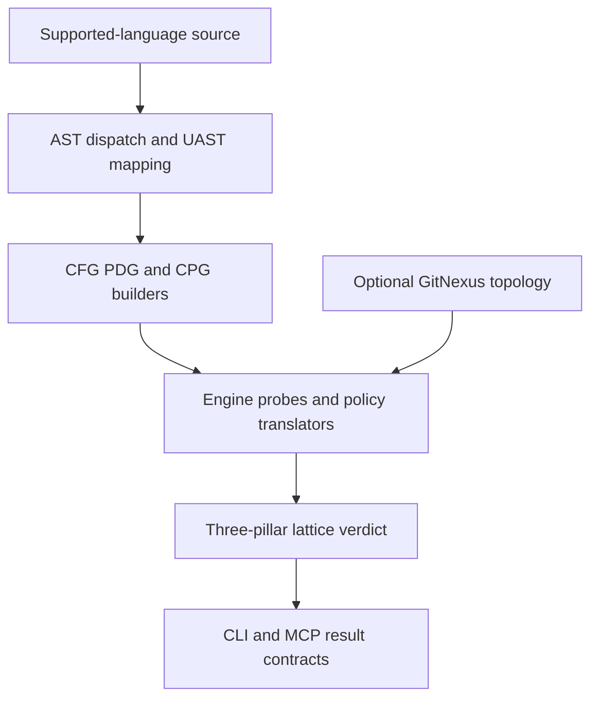

# Rust analysis and evaluation architecture

Topos is a Rust workspace: `topos/engine` contains pure structural analysis, while `topos/cli` and `topos/mcp` are its human and agent-facing consumers. The engine parses six languages with tree-sitter and models source as UAST, CFG, PDG, CPG, MDG, and process-graph representations. It then applies the three-pillar policies described in the [quality model](../domain/quality-model.md); the [CLI and MCP workflows](../workflows/agent-and-cli.md) expose those results.

## Evaluation flow

1. **Parse and normalize.** `graphs::ast::dispatch` parses supported source and language mappers produce UAST nodes with source spans, native provenance, and deterministic IDs.
2. **Build per-file graphs.** The UAST is consumed by CFG, PDG, and CPG builders; these are derived views, not independent parsers.
3. **Attach repository topology when available.** The MDG reads GitNexus state for cross-file COMPOSABLE signals, as described in the [GitNexus integration](../integrations/distribution.md#gitnexus-for-composable).
4. **Measure and decide.** Engine probes supply metrics to policy translators, which produce SIMPLE, COMPOSABLE, and SECURE results and their lattice outcome.
5. **Present a contract.** The CLI and MCP server link the same engine, so their differences should be output/routing concerns rather than separate scoring logic.

This is the shared engine path: GitNexus adds COMPOSABLE topology while CLI and MCP only present the resulting evaluation.

## Representation boundaries

| Representation | Scope and primary use | Key anchors |
| --- | --- | --- |
| AST/UAST | Per-file parsing and normalized structural shape | `topos/engine/src/graphs/{ast,uast}/` |
| CFG | Intra-file control flow and SIMPLE complexity inputs | `topos/engine/src/graphs/cfg/` |
| PDG | Intra-procedural data/control dependence for diagnostics and CPG construction | `topos/engine/src/graphs/pdg/` |
| CPG | AST, projected CFG, DDG, and CDG edge families; SECURE analysis input | `topos/engine/src/graphs/cpg/` |
| MDG | GitNexus inter-module topology for COMPOSABLE | `topos/engine/src/graphs/mdg/` |
| Process graph | GitNexus process transitions for advisory refactoring | `topos/engine/src/graphs/process/` |

<!-- openwiki: broken internal link [../../topos/engine/src/graphs/cpg/builder.rs] link "../../topos/engine/src/graphs/cpg/builder.rs" is outside the wiki root. Fix the href or restore the target, then delete this comment. -->
The [CPG builder](../../topos/engine/src/graphs/cpg/builder.rs) fuses AST edges with projected CFG edges and PDG DDG/CDG edges. PDG reaching definitions are deliberately textual-order approximations rather than alias-, SSA-, or flow-sensitive analysis; do not overstate them when changing SECURE diagnostics.

## UAST and graph identity contract

Mappers assign deterministic UAST IDs. For hand-built nodes without an ID, `graphs::uast::models::node_key` provides an `anon::<address>` key that is valid only during one live tree/build. CFG, PDG, and CPG must use that shared helper: the CPG relies on matching keys to connect projected CFG/DDG/CDG endpoints to collected nodes.

UAST clone, drop, and equality are iterative, and CFG construction uses an iterative continuation machine. These stack-safety properties protect deeply nested source, but derived `Debug` formatting remains recursive and is not appropriate for extremely deep trees.

CFG behavior is protected by `graphs/cfg/edge_contracts.rs`, which locks branch/loop, match/switch-return, and supported try-return edge layouts across every registered language. Preserve that contract when altering traversal; add an explicit fixture and expectation for a genuinely new control-flow shape. `cfg.nesting_depth` must use the forward CFG DAG calculation rather than repeatedly traversing loopback/continue cycles: cycle re-entry incorrectly turns block count into static nesting. Preserve the regression tests around loops and untagged-cycle degradation when changing `graphs/cfg/` or its probes.

## Parser and mapper maintenance

The Rust parser uses `tree-sitter-rust` 0.24. This version is required for ordinary Rust locals named `raw` to parse while retaining genuine raw-borrow syntax; do not reintroduce mapper-side naming workarounds for a grammar defect. The JavaScript and TypeScript UAST maps `switch_statement` to `MatchStmt` intentionally, recorded in `docs/decisions/js-switch-matchstmt.md`; histogram differences from the former Python implementation are therefore expected mapping semantics rather than a regression.

## SIMPLE complexity boundary

`ast.max_function_complexity` walks each UAST function/method subtree and is a real SIMPLE gate; whole-file `cfg.cyclomatic` shapes reporting and suggestions but does not independently determine achievement. The complexity walk counts conventional decision nodes, short-circuit boolean operators, ternaries, Python comprehension clauses, `with`/`assert`, try handlers, and match/switch arms. The [quality model](../domain/quality-model.md#simple) owns the product meaning and threshold implications.

## Design constraints to preserve

- The engine crate contains no CLI or MCP concerns; keep shared structural behavior there so interfaces do not drift.
- Cross-file COMPOSABLE depends on GitNexus topology. Source edits cannot be silently treated as an incrementally reconstructed MDG; status and freshness handling are part of the result contract.
- PDG is diagnostic infrastructure consumed by CPG, not a fourth lattice pillar.
- CPG node payloads intentionally avoid recursively duplicating full descendants; retain this when evolving graph output.

## Change navigation

- Parsing and UAST: `topos/engine/src/graphs/{ast,uast}/`.
- Per-file graph semantics and contracts: `topos/engine/src/graphs/{cfg,pdg,cpg}/`.
- Metrics and policy assembly: `topos/engine/src/{functors,evaluation}/`, then the [quality model](../domain/quality-model.md).
- CLI/MCP transport or result contracts: [agent and CLI workflows](../workflows/agent-and-cli.md).
- Focused Cargo checks and CI: [testing and release operations](../operations/testing-and-release.md).