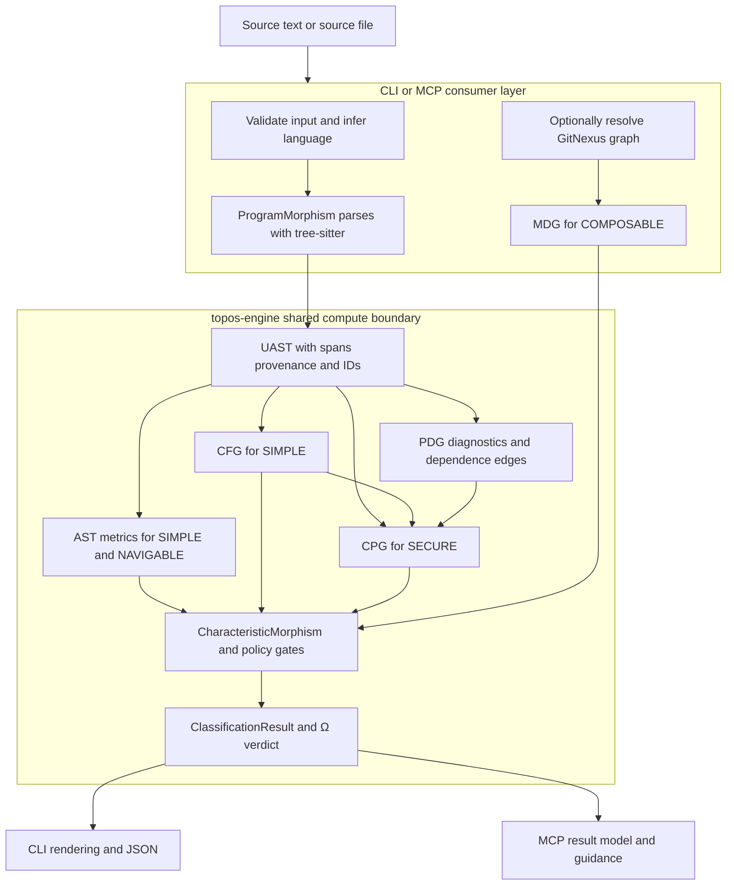

# Rust analysis and evaluation architecture

The workspace has three Rust crates: `topos-engine` is the shared, transport-free analysis engine, while `topos` is the CLI and `topos-mcp` is the stdio MCP server. Both consumer crates depend on the engine; the CLI also embeds the MCP server for `topos mcp`. The engine owns parsing, normalized program representations, measurements, policy translation, and the raw four-pillar verdict. Consumer layers own source discovery, GitNexus availability/generation, request/path handling, configuration application, and output contracts.

## From source to verdict

`ProgramMorphism` owns the source text, language, optional file path, parsed program object, and lazily cached CFG, PDG, and CPG. Construction immediately attempts parsing. The only parser route is tree-sitter: it selects grammars for Python, Rust, JavaScript, TypeScript (TSX for a `.tsx` file path), C++, and Go, then maps the concrete tree into a language-neutral UAST in the same parse operation. A tree-sitter error node makes the morphism invalid even though an AST object was produced; unsupported languages have no AST.

This flow shows ownership rather than a separate scoring implementation: CLI and MCP build the representations required for their operation and both pass them to `CharacteristicMorphism::classify_detailed`.

### Representation assembly

| Representation | Scope | Classification role |
| --- | --- | --- |
| UAST / `AstRepresentation` | One parsed file | `ast.entropy` and worst-function complexity feed SIMPLE. |
| `NavigableRepresentation` | The same UAST | Worst-function divergence feeds NAVIGABLE; it is an AST reading, not another graph. |
| CFG | All callables in one file | Emits control-flow metrics, including `cfg.cyclomatic`, for SIMPLE. |
| PDG | Intra-procedural statements | Provides DDG/CDG diagnostics and is an input to CPG construction; it has no pillar of its own. |
| CPG | One file | Combines AST, projected CFG, DDG, and CDG edges and emits dangerous-call and taint-flow counts for SECURE. |
| MDG | Cross-file repository topology | A GitNexus-derived module graph emits coupling metrics for COMPOSABLE. |

`ProgramMorphism` caches each derived graph once, but CPG construction independently builds a CFG and PDG from the UAST. The CPG projects block-level CFG edges between the last source statement and first target statement, and retains AST, CFG, DDG, and CDG as labeled edge families. PDG data dependence is intentionally a textual-order reaching-definition approximation, without alias analysis, SSA, or flow sensitivity; its security-facing results should be described as structural diagnostics rather than full semantic proof.

## Classification semantics

For valid input, the classifier always creates `AstRepresentation` and `NavigableRepresentation`; therefore SIMPLE and NAVIGABLE are measured for every parseable source. Callers add CFG and CPG in normal CLI/MCP classification, making SIMPLE and SECURE measurable. COMPOSABLE is present only when an MDG is attached. An unavailable MDG means COMPOSABLE is **not measured**, not failed. Conversely, a parse failure returns the default result: `is_parseable` is false and the overall verdict is `SLOP`.

Metrics are grouped by their declared dimension and sent to the corresponding policy translator: `score_simple`, `score_coupling`, `score_secure`, and `score_navigable`. Each produces a normalized `[0, 1]` score, per-metric interpretation, and an `achieved` Boolean. The decisive Boolean is an AND of applicable raw-metric gates evaluated through `evaluate_gates`; the normalized score is reporting information, not the live classifier's threshold. `Priority` is retained as result metadata and guides consumers, but does not relax individual policy thresholds.

The classifier records each achieved pillar as its singleton `EvaluationValue`, otherwise `SLOP`, then joins the satisfied generators into the final `EvaluationValue`. The resulting `Ω` contains all 16 subsets of SIMPLE, COMPOSABLE, SECURE, and NAVIGABLE; `IDEAL` means all four were satisfied and `SLOP` means none. For a multi-file result, `combine_dimensions` uses a per-pillar meet: each measured pillar holds only if every parseable file that measured it achieved that pillar. A missing dimension on a file does not itself make that pillar fail.

### What the pillar inputs mean

- **SIMPLE** combines source-compression entropy and worst-function complexity with CFG observations. Whole-file `cfg.cyclomatic` remains visible and affects the normalized score, but it is advisory because a merged file CFG grows with many small functions. Entropy and `ast.max_function_complexity` are the decisive SIMPLE gates; import/export-only entrypoint modules receive the documented entropy exemption.
- **NAVIGABLE** gates `nav.max_function_divergence`, the maximum Semantic Compositional Divergence across callables. It charges nested block scopes and their immediate scope fanout, not sequential branches, ternaries, or short-circuit expressions. Thus deeply nested and sequential code can have similar SIMPLE complexity while differing in NAVIGABLE.
- **SECURE** uses CPG counts for reachable dangerous APIs and source-to-sink taint paths. Its raw verdict is strict: both counts must be zero. The core CPG metric path deliberately uses an empty allowlist so allowlisted findings do not silently change the canonical raw classification.
- **COMPOSABLE** relies on the GitNexus MDG for inter-module coupling, instability, fan-in/out, dependency depth, and abstractness-related readings. At file scope, fan-out is decisive; other coupling readings remain scored, interpreted, and actionable. Entrypoint and stable-leaf role detection supplies narrow policy exemptions.

The [quality model](../domain/quality-model.md) is the product-level reference for pillars and thresholds.

## Identity and graph safety contracts

UAST mapper output preserves each node's source span and native parser provenance, while assigning a deterministic BLAKE2b-derived ID from language, native kind, span, and parent ID. Derived graph layers must use `node_key` whenever they cross-reference UAST nodes. It selects that mapper ID, or an `anon::<address>` fallback for manually constructed empty-ID nodes. The fallback is valid only while that particular UAST remains alive and must not be persisted or compared across parses.

The UAST's clone, equality, and destruction paths are iterative, and CPG node collection is iterative, so deeply nested input does not require recursive traversal in those paths. CFG contracts also cover branch/loop, match/switch-return, and try-return shapes across all six supported languages. Its longest-acyclic-path calculation discards explicitly tagged `Loopback` and `Continue` edges; if an unexpected untagged cycle remains, it degrades to `0` rather than panicking.

## Consumer and operational boundaries

The CLI's `evaluate` and `inspect` commands share `classify_with_representations`, which builds CFG, PDG, CPG, an abstractness reading, and an optional MDG before calling the engine classifier. They recursively discover supported source suffixes when no language filter is supplied. Unless `--no-composable` is set, CLI evaluation and inspection resolve or generate fresh GitNexus state; failures degrade to SIMPLE/SECURE/NAVIGABLE with a warning rather than aborting the whole evaluation.

MCP has equivalent classification helpers. `classify_code_string` rejects an explicitly unsupported language before creating a morphism, while `classify_file` detects a language from its suffix, reads the file, and attempts to load an MDG. Its dep-graph cache is keyed by graph directory, target file, branch, and store modification time; it caps at 32 entries and invalidates naturally when the branch or GitNexus store changes. Inline MCP code has no target file, so it cannot attach an MDG and cannot measure COMPOSABLE. MCP can also layer configured security acknowledgements over the raw result: it recomputes an adjusted SECURE view and exposes both results, and active acknowledgement prevents an `IDEAL` grade.

See [agent and CLI workflows](../workflows/agent-and-cli.md) for interface contracts, [distribution](../integrations/distribution.md) for GitNexus context, and [testing and release operations](../operations/testing-and-release.md) for the broader validation workflow.

## Safe extension and focused checks

- Add a source language in parser dispatch, suffix discovery, and its UAST mapper; preserve the cross-language CFG and divergence contracts.
- Add a graph-derived metric through `Representation::metrics()` with a namespaced key, then explicitly route its dimension in `CharacteristicMorphism`. Adding a fifth quality generator additionally requires extending `Generator`, the `EvaluationValue` carrier, the policy translator, and consumer presentation.
- Keep raw gate comparisons and shared remediation metadata in `evaluation/policies/gates.rs`; keep only normalization curves in pillar scorers. This prevents classifications, suggestions, and MCP refactor targets from drifting.
- Preserve the distinction between unavailable COMPOSABLE evidence and a failed COMPOSABLE gate, and between the canonical raw SECURE verdict and an explicitly disclosed allowlist-adjusted view.
- Run `cargo test -p topos-engine` for parser/UAST/graph/policy regressions. When changing consumer assembly or MCP behavior, also run the relevant CLI and MCP crate tests; high-value regressions include CFG edge contracts, CPG endpoint resolution for anonymous nodes, NAVIGABLE's nested-versus-sequential branching test, parse failure collapse, and optional-MDG classification.
