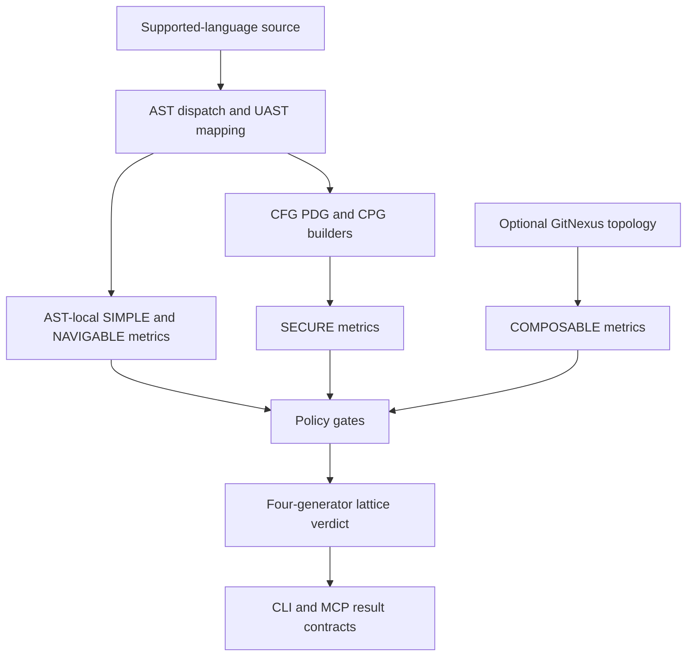

# Rust analysis and evaluation architecture

Topos is a Rust workspace: `topos/engine` contains shared structural analysis, while `topos/cli` and `topos/mcp` present it to humans and agents. The engine parses six languages with tree-sitter and models source as UAST, CFG, PDG, CPG, MDG, and process-graph representations. `CharacteristicMorphism` combines those inputs into the four pillars defined in the [quality model](../domain/quality-model.md); the [CLI and MCP workflows](../workflows/agent-and-cli.md) expose the result.

## Evaluation flow

1. **Parse and normalize.** `graphs::ast::dispatch` parses supported source and language mappers produce UAST nodes with source spans, native provenance, and deterministic IDs.
2. **Measure AST-local pillars.** `AstRepresentation` provides SIMPLE entropy and worst-function complexity; `NavigableRepresentation` reads the same UAST for worst-function divergence. Both exist for every parseable source file.
3. **Build derived graphs.** CFG, PDG, and CPG builders consume the UAST. CPG-backed SECURE can then be measured locally.
4. **Attach repository topology when available.** The MDG reads GitNexus state for COMPOSABLE signals, as described in the [GitNexus integration](../integrations/distribution.md#gitnexus-for-composable).
5. **Apply gates and assemble a verdict.** Policy scorers use `evaluate_gates`, then `CharacteristicMorphism::classify_detailed` joins satisfied `Generator` values into an `EvaluationValue`.

The CLI and MCP server share this engine path; they should differ in transport and presentation, not scoring logic.

## Representation boundaries

| Representation | Scope and primary use | Key anchors |
| --- | --- | --- |
| AST/UAST | Per-file parsing, normalized structural shape, SIMPLE and NAVIGABLE AST readings | `topos/engine/src/graphs/{ast,uast}/` |
| CFG | Intra-file control flow and SIMPLE reporting | `topos/engine/src/graphs/cfg/` |
| PDG | Intra-procedural data/control dependence for diagnostics and CPG construction | `topos/engine/src/graphs/pdg/` |
| CPG | AST, projected CFG, DDG, and CDG edge families; SECURE input | `topos/engine/src/graphs/cpg/` |
| MDG | GitNexus inter-module topology for COMPOSABLE | `topos/engine/src/graphs/mdg/` |
| Process graph | GitNexus process transitions for advisory refactoring | `topos/engine/src/graphs/process/` |

The CPG builder fuses AST edges with projected CFG edges and PDG DDG/CDG edges. PDG reaching definitions are deliberately textual-order approximations rather than alias-, SSA-, or flow-sensitive analysis; do not overstate them when changing SECURE diagnostics.

## UAST identity and traversal contracts

Mappers assign deterministic UAST IDs. For hand-built nodes without an ID, `graphs::uast::models::node_key` provides an `anon::<address>` key valid only within one live tree/build. CFG, PDG, and CPG must use that helper so projected CFG/DDG/CDG endpoints match collected nodes.

UAST clone, drop, and equality are iterative, and CFG construction uses an iterative continuation machine. These stack-safety properties protect deeply nested source, but derived `Debug` formatting remains recursive and is unsuitable for extremely deep trees.

`graphs/cfg/edge_contracts.rs` locks branch/loop, match/switch-return, and supported try-return layouts across every registered language. In `graphs/cfg/builder.rs`, `CFGBuildState` keeps a `continue_stack` of loop-header block IDs and a separate `break_stack` of loop-after or match-join IDs: `start_loop` pushes both targets, `handle_terminal_stmt` routes `ContinueStmt` or `BreakStmt` to the innermost target, and `finish_loop` pops them. This symmetric stack representation replaced the former one-field loop wrapper without changing CFG behavior or edge contracts. `cfg.nesting_depth` must use the forward CFG DAG calculation rather than repeatedly traversing loopback/continue cycles. Preserve the loop and untagged-cycle regressions when changing `graphs/cfg/` or its probes.

## Two distinct AST-local gates

SIMPLE’s `ast.max_function_complexity` walks each UAST function/method subtree. It is a real gate; whole-file `cfg.cyclomatic` remains reporting/advisory because it grows with many otherwise-simple functions. The walk counts decision nodes, short-circuit booleans, ternaries, Python comprehension clauses, `with`/`assert`, try handlers, and match/switch arms.

NAVIGABLE uses `nav.max_function_divergence`, calculated by `calculate_max_function_divergence` in `functors/probes/ast/divergence.rs`. Its Semantic Compositional Divergence sums nested block-scope fanout within each callable and gates the worst function. It intentionally excludes conditional expressions and short-circuit binaries: those are expression branching already measured by SIMPLE. `NavigableRepresentation` is an AST reading, not a new graph.

When changing a mapper or scope classification, run divergence regressions—especially `nesting_costs_where_sequential_branching_does_not`—as well as complexity tests. The product meaning and thresholds are canonical in the [quality model](../domain/quality-model.md#navigable).

## Design constraints and change navigation

- Keep CLI/MCP transport out of the engine; their common evaluation behavior belongs here.
- Cross-file COMPOSABLE depends on GitNexus topology. Freshness and availability are part of the result contract, not a reason to invent an incremental MDG.
- `evaluation/policies/gates.rs` owns decisive comparisons, interpretations, and suggested operations. Scorers own score shaping; update both only when a policy change warrants it.
- PDG is diagnostic infrastructure consumed by CPG, not a fifth lattice pillar.
- Parsing/UAST: `topos/engine/src/graphs/{ast,uast}/`; graphs: `topos/engine/src/graphs/{cfg,pdg,cpg}/`; policies: `topos/engine/src/{evaluation,functors}/`.
- Use [agent and CLI workflows](../workflows/agent-and-cli.md) for public result contracts and [testing and release operations](../operations/testing-and-release.md) for broader checks.
