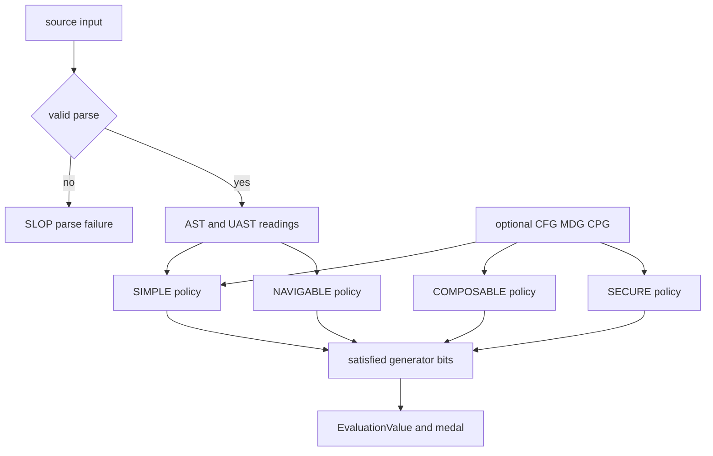

# Four-pillar quality model and verdict semantics

Topos classifies parseable source against four independent generators: **SIMPLE**, **COMPOSABLE**, **SECURE**, and **NAVIGABLE**. Each satisfied generator sets one bit in an `EvaluationValue`; the resulting 16-element `Ω` is a powerset lattice, not a linear quality scale. `IDEAL` is the four-bit top and is therefore **PLATINUM**. Three, two, one, and zero satisfied pillars are respectively GOLD, SILVER, BRONZE, and SLOP. In particular, `SIMPLE_COMPOSABLE_SECURE` is a GOLD result, not the pre-NAVIGABLE meaning of `IDEAL`.

| Pillar | Primary evidence | Hard gate | Availability |
| --- | --- | --- | --- |
| **SIMPLE** | AST entropy and per-function UAST complexity; CFG complexity is reported | entropy in `0.2..=0.8` and max function complexity `<= 10` | Every parseable file |
| **COMPOSABLE** | MDG coupling and call relationships | file fan-out `<= 10` | Only with an attached GitNexus MDG |
| **SECURE** | CPG dangerous-call and taint probes | zero dangerous calls **and** zero taint flows | With a CPG |
| **NAVIGABLE** | UAST scope tree | worst-function divergence `<= 10.0` | Every parseable file |

## Classification control flow

`CharacteristicMorphism::classify_detailed` constructs AST and NAVIGABLE readings itself, accepts optional CFG/MDG/CPG representations, dispatches their metrics to one policy translator per pillar, and records each translator's `achieved` result as either that pillar's singleton value or `SLOP`. It then builds the final verdict from the satisfied generators. A missing MDG or CPG is **not measured**, rather than a failed dimension. Invalid or unparseable input returns the default result: `is_parseable = false` and overall `SLOP`.

This is the classification path: optional representations can leave a pillar unmeasured, while parse failure collapses the whole result to SLOP.

## Gates are not scores

A `ScoredDecision` has two separate outputs. `achieved` is the AND of its supplied raw-metric gate comparisons and is what enters the lattice. `score` is a normalized `0.0..=1.0` reporting value, generally the minimum per-metric quality, and does not decide the bit. `evaluate_gates` is the common gate registry used by policies and consumers, which prevents suggestions and scoring from applying different comparisons. It also fails closed for `NaN` values.

Some metrics remain deliberately advisory even though they are scored, interpreted, and can suggest refactors. Whole-file `cfg.cyclomatic` does not gate SIMPLE because a merged file CFG rises with the number of otherwise simple functions. For COMPOSABLE at file granularity, instability, main-sequence distance, and fan-in are advisory; only outward fan-out gates the achieved bit. Do not substitute a normalized-score floor for the live raw-gate path: score floors belong to the separate `meet_satisfied` path for callers that possess only pre-aggregated scores.

### SIMPLE

SIMPLE requires AST entropy within the inclusive `0.2..=0.8` band and `ast.max_function_complexity <= 10`. Import/export-only entrypoint modules may be exempted on either entropy side. `cfg.cyclomatic <= 15` remains useful reporting and targeting evidence but is not decisive; the per-function maximum is the hard structural complexity gate.

### COMPOSABLE

<!-- openwiki: broken internal link [../integrations/distribution.md#gitnexus-for-composable] heading anchor "gitnexus-for-composable" does not exist in "../integrations/distribution.md". Fix the href or restore the target, then delete this comment. -->
COMPOSABLE needs MDG metrics, normally supplied from GitNexus; when none are attached, the dimension key is absent rather than failed. Its decisive file-level check is `mdg.fan_out <= 10`. Instability (`0.3..=0.7` reference band), fan-in (`<= 15` reference), and, where there is real abstractness and coupling signal, Martin main-sequence distance `|A + I - 1| <= 0.5`, remain advisory score and interpretation inputs. The stable-leaf and entrypoint conditions are thus diagnostic carve-outs, not routes around the fan-out gate. See [GitNexus for COMPOSABLE](../integrations/distribution.md#gitnexus-for-composable) for acquisition and freshness behavior.

### SECURE and acknowledged risk

SECURE is strict: `cpg.dangerous_calls` and `cpg.taint_flows` must both be zero. Its reporting score decays exponentially with finding counts, but any nonzero count clears the canonical SECURE bit.

A `.topos.toml` found by walking upward can define `[[secure.allow]]` entries with a pattern, mandatory non-empty reason, and optional glob scope; invalid entries and malformed configuration are ignored rather than terminating evaluation. CLI `--allow` patterns are merged as one-run, all-scope entries with an explicit ephemeral reason.

Allowing a finding does not rewrite canonical classification. The suppression overlay keeps the raw SECURE pass/fail status and raw lattice element, partitions full-registry findings into active and acknowledged lists, and recomputes an adjusted SECURE result only when it can inspect the CPG. Acknowledgements and their reasons remain visible. If acknowledgements would otherwise produce `IDEAL`, the overlay clears the SECURE bit and yields `SIMPLE_COMPOSABLE_NAVIGABLE`—GOLD—so an acknowledged risk cannot buy PLATINUM.

### NAVIGABLE

NAVIGABLE measures **Semantic Compositional Divergence** rather than branch count. For each callable it sums `depth(u) * ln(1 + fanout(u))` over block-scope nodes; `nav.max_function_divergence` is the maximum callable value. The scope set comprises `IfStmt`, `ForStmt`, `WhileStmt`, `MatchStmt`, `TryStmt`, `WithStmt`, and nested function/method declarations. Conditional expressions and short-circuit binary expressions do not open a block and are intentionally excluded.

A flat function, and a module with no callable, reports `0.0`. Sequential branches can therefore preserve NAVIGABLE while a deeply nested version with similar SIMPLE complexity fails it. The hard gate is inclusive at `10.0`; the independent reporting score decays linearly to zero at the `12.0` cap. Both the gate metric and the located per-function entries use the same scope walk, so a failure can be mapped to its offending callable. Focused regressions cover flat-versus-nested code, the exact threshold, all supported languages, and agreement between the worst located entry and gate metric.

## Lattice aggregation and preference guidance

The default lattice's generator atoms are pairwise incomparable. Use `Omega::leq`, not bit integer order, for its partial order; meet and join correspond to bit-set intersection and union. For a multi-file roll-up, a measured pillar survives only when every parseable file that measured it achieves it; a file missing that representation does not drag the dimension down, but an unparseable file does. An empty lattice aggregate is `IDEAL` by the empty-meet convention.

A `Priority` labels the generator to emphasize in guidance; current policy translators do not change thresholds or `achieved` based on it. `UserPreferences` is stronger: it requires a complete permutation of all four generators and produces a lexicographic total order with weights `8/4/2/1`. The default order is `SIMPLE ≻ NAVIGABLE ≻ SECURE ≻ COMPOSABLE`; it aims first for `IDEAL` and uses `SIMPLE_NAVIGABLE`, the top two preferences, as its plateau fallback. Legacy three-pillar rankings are rejected as invalid configuration rather than partially applied.

## Scoring versus advisory analyses

<!-- openwiki: broken internal link [../workflows/agent-and-cli.md#advisory-and-non-lattice-analysis] heading anchor "advisory-and-non-lattice-analysis" does not exist in "../workflows/agent-and-cli.md". Fix the href or restore the target, then delete this comment. -->
The four generators alone determine `EvaluationValue`. Structural test coverage, AST comparison, clone detection, and MCP `topos_refactor` cycle/dependency/process hotspots may inform inspection and refactor planning, but do not set a generator or change a medal. Likewise, advisory gate metrics may lower the displayed score without changing `achieved`. Preserve this boundary when adding probes, CLI commands, or MCP response fields; see [agent and CLI workflows](../workflows/agent-and-cli.md#advisory-and-non-lattice-analysis).

## Change and test checklist

1. Put decisive raw comparisons and gate metadata in `evaluation/policies/gates.rs`; retain calibration values and score-only caps in `calibration.rs`.
2. Update the owning translator and its targeted tests whenever a metric's gate, availability, or normalization changes.
3. Changes to a generator require coordinated `Generator`, `EvaluationValue`, classifier wiring, preference-ranking width, public schemas, and medal tests. The invariant is non-negotiable: `IDEAL`/PLATINUM means all four bits.
4. For NAVIGABLE changes, retain the nested-versus-sequential and exact-threshold tests. For suppression changes, retain raw-versus-adjusted and capped-grade tests.
5. Run `cargo test -p topos-engine`; also run CLI/MCP tests when changing their assembly, schemas, diagnostics, or rendering.
