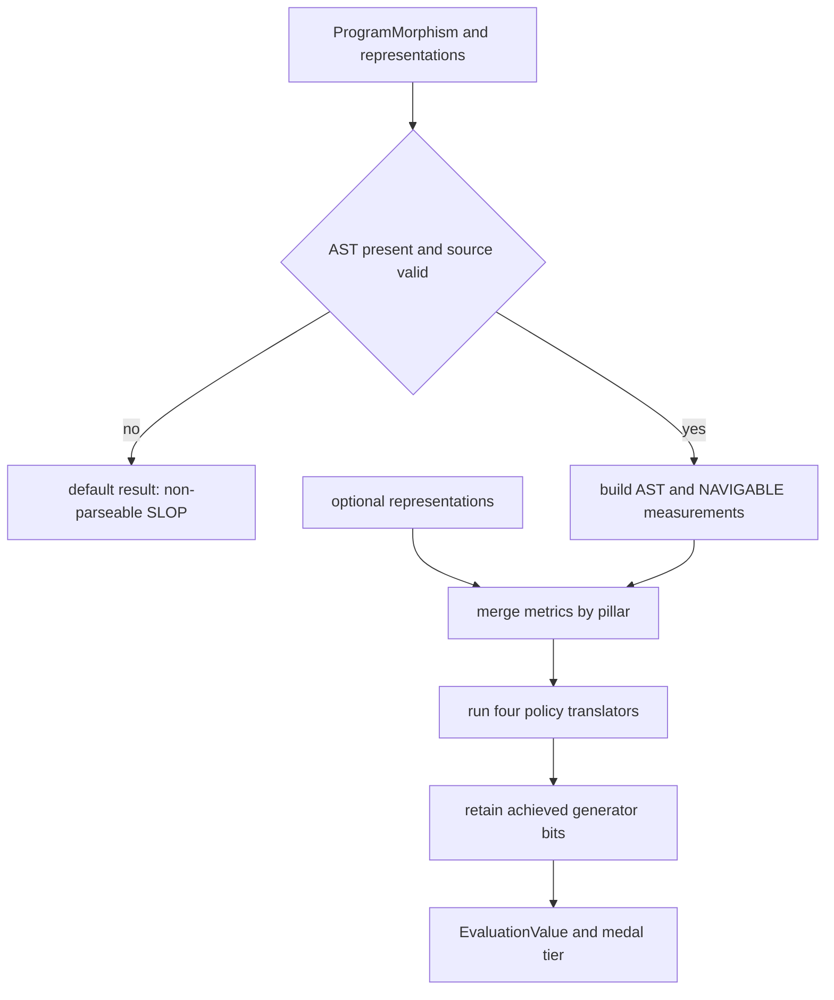

# Four-pillar quality model and verdict semantics

Topos expresses source quality as four independent generators: **SIMPLE**, **COMPOSABLE**, **SECURE**, and **NAVIGABLE**. An `EvaluationValue` represents the subset that has passed its **canonical raw-metric gates**, producing a 16-value lattice rather than a single continuous quality scale. `IDEAL` means all four generators passed and receives **PLATINUM**; three, two, one, and zero satisfied pillars receive GOLD, SILVER, BRONZE, and SLOP respectively. Thus `SIMPLE_COMPOSABLE_SECURE` is GOLD, not `IDEAL`.

The generator atoms are incomparable. Consumers that need lattice comparison must use `Omega::leq`, rather than integer bit ordering. `Omega` also supplies the generic lattice operations and its aggregate operation; an empty aggregate is `IDEAL` by the empty-meet convention.

| Pillar | Canonical input and gate | Availability |
| --- | --- | --- |
| **SIMPLE** | `ast.entropy` in `0.2..=0.8` and `ast.max_function_complexity <= 10` | Every parseable source file |
| **COMPOSABLE** | `mdg.fan_out <= 10` | When MDG observations are attached |
| **SECURE** | `cpg.dangerous_calls == 0` and `cpg.taint_flows == 0` | When CPG observations are attached |
| **NAVIGABLE** | `nav.max_function_divergence <= 10.0` | Every parseable source file |

## Classification and evidence states

`CharacteristicMorphism::classify_detailed` is the canonical classification entry point. It rejects absent ASTs or invalid `ProgramMorphism`s with the default, non-parseable `SLOP` result. For valid source it builds `AstRepresentation` and `NavigableRepresentation` from the UAST, merges caller-provided representations by their dimension, invokes each pillar translator, and joins only translators whose `ScoredDecision.achieved` is true into the final value.



*Classification flow: parse failure is a canonical SLOP outcome, while absent optional evidence leaves only its respective pillar unmeasured.*

SIMPLE and NAVIGABLE are normally measured for every parseable file because their inputs are built locally. By contrast, if no MDG metrics are attached, `composable` is absent from `dimensions`; if neither CPG metric is present, `secure` is absent. **Unmeasured is not failed and is not passed**: it must not be presented as a substitute for a canonical gate result.

## Gates, scores, and advisories

Each translator returns a `ScoredDecision` with deliberately separate outputs:

- `achieved` is the AND of registered raw-metric gates marked `gates_achieved`. The classifier uses it to set a lattice bit.
- `score` is a normalized reporting value, usually the minimum quality among measured metrics. It does not set a lattice bit or override a gate.
- Interpretation text and suggested operations make gate and advisory readings actionable, but neither is a verdict.

`evaluate_gates` is the shared gate registry for scorers and consumers such as suggestion/refactor paths, preventing their comparisons from drifting. Its `NaN` guard fails closed rather than allowing a non-numeric value to pass a bounded comparison. `meet_satisfied` is a separate, score-floor path for callers that possess only aggregated normalized scores; it is not the live `CharacteristicMorphism` decision path.

### SIMPLE: local structure

SIMPLE requires entropy within the inclusive `0.2..=0.8` band and maximum per-function UAST complexity no greater than `10`. Import/export-only entrypoint modules can be exempted from either entropy-side failure. `cfg.cyclomatic <= 15` is still scored, interpreted, and can drive refactor advice, but is advisory: the whole-file merged CFG grows with the count of otherwise-simple functions. A poor advisory score must therefore not be reported as a SIMPLE gate failure.

### COMPOSABLE: outward dependency burden

At file granularity COMPOSABLE has one decisive metric: `mdg.fan_out <= 10`. Instability, fan-in, and main-sequence distance are retained as scored and interpreted architectural diagnostics, not alternate pass routes or hard failures. When abstractness and a resolvable import-graph coupling signal exist, the scorer diagnoses `mdg.main_sequence_distance = |A + I - 1|`; otherwise it diagnoses raw instability. Neither changes the fan-out gate.

COMPOSABLE needs MDG input, commonly supplied by GitNexus, so no attached MDG produces an unavailable dimension rather than a negative verdict. This makes the pillar useful for project context without claiming a file passed solely because dependency evidence was unavailable.

### SECURE: strict canonical result and acknowledgement overlay

SECURE is strict: any nonzero dangerous-call or taint-flow count clears the canonical SECURE bit. Its exponential score is reporting only and cannot compensate for a finding.

Security acknowledgements are a separate overlay, invoked only for a parseable result whose raw CPG metrics show SECURE failure. The MCP diagnostic path then loads configuration, builds a CPG, obtains **raw** findings, and calls `apply_allowlist`; this preserves the information needed to partition findings into active and acknowledged lists. The raw classification remains visible alongside the adjusted view.

A nearest `.topos.toml` can supply `[[secure.allow]]` entries. Each entry needs a non-empty `pattern` and `reason`, and may restrict itself with `scope`; malformed configuration or invalid entries are ignored rather than making evaluation fail. One-run `--allow` patterns are merged as all-scope entries with the explicit ephemeral reason `CLI --allow (ephemeral)`.

Acknowledgement is not a clean security pass. When the overlay can inspect the CPG, it recomputes adjusted dangerous and taint counts excluding allowlisted patterns, exposes both active findings and acknowledgement reasons, and caps an otherwise `IDEAL` adjusted result by clearing SECURE. An acknowledged risk therefore cannot obtain `IDEAL`/PLATINUM; in the all-other-pillars-passing case the adjusted value is `SIMPLE_COMPOSABLE_NAVIGABLE` (GOLD). Do not treat acknowledgements, adjusted scores, or displayed findings as replacements for the raw SECURE gate outcome.

### NAVIGABLE: nesting load, not branch count

NAVIGABLE uses the maximum callable **Semantic Compositional Divergence**:

```text
SCD(fn) = Σ depth(u) · ln(1 + fanout(u))
```

The sum ranges over nested block scopes (`IfStmt`, loops, `MatchStmt`, `TryStmt`, `WithStmt`, and nested function/method declarations). `fanout(u)` counts immediate child scopes, while a callable root starts at depth zero. Conditional expressions and short-circuit binary expressions do not create such scopes, so they are excluded rather than duplicating SIMPLE’s branch-oriented concern.

A flat callable—and a file with no callable—has divergence `0.0`. The hard gate is inclusive at `10.0`; its independent normalized score declines linearly to zero at the `12.0` cap. The probe also produces per-callable names and spans using the same scope walk as the maximum metric, so the worst failure can be located and targeted. Focused tests cover flat versus nested code, fanout, exact gates, supported languages, and agreement between the worst entry and gate metric.

## Project roll-up and guidance

`CharacteristicMorphism::combine_dimensions` rolls a project up per measured dimension. A dimension is retained only when every parseable result that measured it achieved it; an unparseable result fails every dimension that is otherwise being rolled up. Files without a key for a given optional representation are ignored for that dimension. Scores may be averaged or displayed by callers, but they never alter this gate-based roll-up.

`Priority` is a single-pillar emphasis carried with the result; current translators do not change thresholds or `achieved` according to it. `UserPreferences` instead requires a complete permutation of all four generators and induces a lexicographic order over lattice values with weights `8/4/2/1`. The default is `SIMPLE ≻ NAVIGABLE ≻ SECURE ≻ COMPOSABLE`; its aspirational target is `IDEAL` and its two-top-pillar fallback is `SIMPLE_NAVIGABLE`. A malformed or legacy three-pillar ranking is not partially applied by configuration loading: it falls back to the default preferences.

## Boundaries, operations, and safe changes

Structural coverage, clone detection, AST comparison, and MCP cycle/dependency/process analyses can support inspection and refactoring, but they are outside the four-generator lattice. Likewise, an advisory gate reading may lower a displayed score or create a recommendation without changing a medal or canonical verdict.

When changing this model:

1. Keep decisive comparison structure, exemptions, interpretation, and operations in `evaluation/policies/gates.rs`; keep calibration constants and score curves in the appropriate policy/calibration modules.
2. Update the owning scorer, classifier wiring, schemas/renderers, and focused tests whenever a gate, representation availability, or generator changes.
3. Preserve the distinction between parse failure, measured failure, and missing optional evidence. Never promote an advisory score or acknowledgement into a gate pass.
4. For NAVIGABLE, retain nested-versus-sequential, exact-threshold, and worst-entry-location tests. For suppressions, retain raw-versus-adjusted, scope, disclosure, and grade-cap tests.
5. Run `cargo test -p topos-engine`; include CLI and MCP tests when changing result assembly, configuration, overlays, schemas, or rendering.
