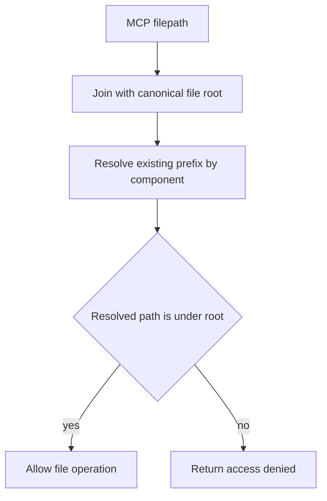

# Analysis integrations and distribution surfaces

Topos combines four structural pillars into one lattice verdict. GitNexus supplies the inter-module topology used by COMPOSABLE, while the Rust MCP package embeds Sighthound for supplementary SECURE finding handling. These integrations feed the [quality model](../domain/quality-model.md) through the [architecture pipeline](../architecture/overview.md). The CLI can register that MCP package in user agents through the separate [harness-registration workflow](../workflows/harness-registration.md).

## GitNexus for COMPOSABLE

GitNexus generates `.gitnexus/`, containing a LadybugDB-backed knowledge graph. `ModuleDependencyGraph` parses nodes and typed relationships such as `IMPORTS`, `CALLS`, and `INHERITS`, then derives coupling, instability, fan-in/out, and dependency-depth metrics.

```bash
npm install -g gitnexus@1.6.8
topos depgraph generate
# Underlying generation: gitnexus analyze --skip-agents-md
```

An explicit `--gitnexus-dir` or MCP `gitnexus_dir` identifies the store and makes the store’s parent the COMPOSABLE project root. Resolve the override once, including symlink-aware resolution of existing prefixes, before status, freshness, loading, or generation uses it. This prevents both indexing the wrong ancestor and double-appending a relative override after root derivation.

Missing in-root stores can be generated. Missing GitNexus, generation failure, and unreadable stores leave SIMPLE, SECURE, and NAVIGABLE available but COMPOSABLE unmeasured. Outside-root, branch-mismatched, stale, invalid-path, or schema-mismatched stores are status conditions rather than crashes; a schema mismatch is not silently regenerated. The CLI/MCP flow and its freshness contract are described in [agent workflow guidance](../workflows/agent-and-cli.md#baseline-evaluation-and-composable).

## Embedded Sighthound for SECURE

`topos-mcp` depends on a pinned Sighthound crate, so the server/container compile it into the Rust distribution rather than invoking a user-installed `sighthound` executable. Native CPG probes remain Topos’s local structural SECURE mechanism; Sighthound contributes supplementary finding handling. This integration is supplementary to the four-pillar lattice rather than a new generator. Changes to that boundary belong in `topos/mcp/src/{security,security_findings,sighthound}.rs` and CPG/SECURE tests together.

## MCP file-access boundary

New MCP filesystem tools use `resolve_project_path` for each requested path. With `TOPOS_MCP_FILE_ROOT` set, it is a canonical maximum boundary; without it, the requested path must be absolute and its containing project is discovered by walking ancestors for `.git`, `pyproject.toml`, or `Cargo.toml`. The call fails closed when the path is unreadable, outside a configured boundary, or no project marker exists. This permits a user-level stdio server to work against the host-provided workspace instead of being pinned to its startup directory.

`resolve_within_root` calls `resolve_existing_prefix` before testing containment for operations that may address missing paths. It canonicalizes every existing path component, then applies a missing tail lexically only after no further symlink can exist. It must resume symlink resolution if `..` removes missing components. This prevents an absent requested leaf or an intermediate `..` from hiding an existing symlink that escapes the configured root.



The containment check resolves existing symlink prefixes before deciding whether a file operation is permitted.

When changing this code, cover ordinary relative paths, missing in-root leaves, direct symlink escapes, and symlink escapes involving a missing intermediate component plus `..`. Those regression tests live beside `resolve_path_within` in `topos/mcp/src/security.rs`; run `cargo test -p topos-mcp security` or the focused test filter. Do not weaken the check to lexical normalization.

## MCP package and registry

`topos mcp` launches the in-process Rust server; the `topos-mcp` binary starts that same server directly for MCP clients. `.mcp/server.json` declares the canonical MCP Registry name `io.github.Krv-Labs/topos`, PyPI package (`topos-mcp`), version, and stdio transport. The public GitHub MCP Registry listing and VS Code’s `@mcp topos` discovery flow surface the server used by the [agent-facing MCP workflow](../workflows/agent-and-cli.md#mcp-agent-loop); ClawHub distributes a separate agent skill.

For a PyPI registry package, omit both `registryBaseUrl` and a `--index-url` runtime argument. VS Code otherwise injects or duplicates the index option, and `uv` rejects duplicate values. `scripts/check_versions.py` enforces that invariant in addition to version parity.

## Container and editor surfaces

### Docker / Glama

The Dockerfile builds a Maturin `bin` wheel for the compiled `topos-mcp` server, then installs it in a runtime image with Node.js, Git, and pinned GitNexus. It sets `TOPOS_MCP_FILE_ROOT=/workspace` and uses `topos-mcp` as its stdio entrypoint. Mount source below that trusted root or deliberately configure another root.

### VS Code extension

`extensions/vscode/` contributes an MCP server provider plus project-evaluation and dependency-graph commands. It launches `topos mcp` with the workspace as `TOPOS_MCP_FILE_ROOT`, resolves an executable from configured/bundled/cached/PATH sources, and packages platform-specific VSIX artifacts in release CI. This editor-managed route is distinct from the CLI’s user-scope `topos install vscode` registration.

## Change checklist

- GitNexus loader/root/metric changes: `topos/engine/src/{adapters/gitnexus.rs,graphs/mdg/}` and CLI/MCP evaluation callers; test available, missing, and rejected/stale state.
- Security path changes: exercise native CPG behavior separately from Sighthound handling, and retain symlink-aware root containment regressions.
- MCP/container/editor changes: verify trusted-root behavior, stdio entry points, metadata parity, and focused extension or wheel checks.
- Do not expose credentials or document secret values; workflow secret identifiers are sufficient for operations.
