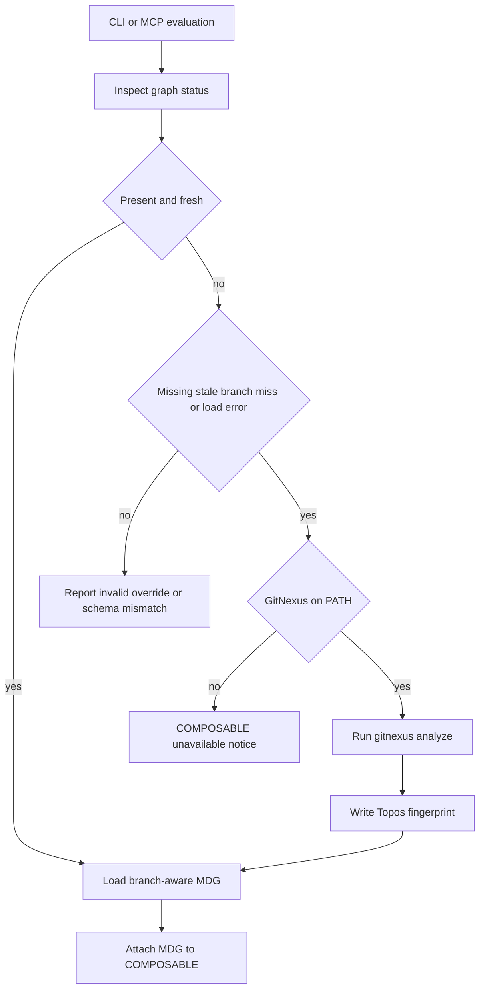
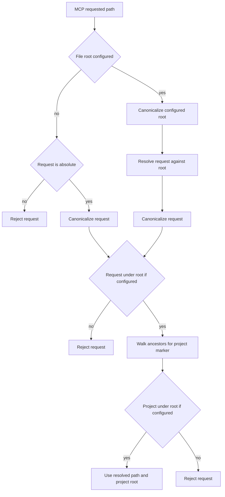

# Analysis integrations and distribution surfaces

Topos is a Rust workspace. The native `topos` CLI and the `topos-mcp` stdio server use `topos-engine`; distribution mechanisms change how a host locates, starts, confines, and updates that analyzer, not its scoring model. This page covers those contracts. For the analysis pipeline, see the [architecture overview](../architecture/overview.md); for agent usage, see the [agent and CLI workflow](../workflows/agent-and-cli.md).

## External topology: GitNexus and the MDG

GitNexus is the optional executable behind the COMPOSABLE pillar. Both `topos depgraph generate` and MCP `topos_generate_depgraph` use the shared engine adapter, which runs `gitnexus analyze --skip-agents-md` in the selected analysis root. Topos looks for `gitnexus` on `PATH`, recognizes `1.5.0` as the minimum supported version, and pins the known-good install to `gitnexus@1.6.8`. A version newer than that pin is reported as *untested*, rather than categorically rejected, because it can still work but its store format may have drifted.

GitNexus produces `.gitnexus/`; Topos consumes it as an inter-module `ModuleDependencyGraph`, not as a replacement parser. The loader supports legacy JSON directories and current LadybugDB `lbug` stores. For a native store it discovers node tables, loads node properties, and reads `CodeRelation` edges including confidence and reason. The resulting graph supplies coupling, instability, call fan-in/out, and import-chain depth. Call fan measures symbols transitively contained by the target File through `CONTAINS`, `DEFINES`, `HAS_METHOD`, and `HAS_PROPERTY`; following `MEMBER_OF` would incorrectly cross into a community cluster.

### Generation, freshness, and recoverability

Generation records a Topos-owned `.topos-fingerprint.json` beside the resolved store (including a branch-scoped store). It captures a source-content fingerprint, file count, start/end times, and Git HEAD when available. The same discovery and ignore rules used for evaluation determine the fingerprint, so changing ignored inputs does not make COMPOSABLE stale. A status check chooses the branch-specific store where applicable and classifies it as `missing`, `present`, `stale`, `load_error`, `schema_mismatch`, `invalid_dir`, or `branch_not_indexed`.

By default, evaluation attempts one generation for a missing, stale, branch-not-indexed, or load-error graph. `--no-composable` / `no_composable` restores read-only behavior. A missing executable, timeout, or failed subprocess yields a structured failure and leaves SIMPLE, SECURE, and NAVIGABLE usable. The subprocess limit is 300 seconds by default; `TOPOS_DEPGRAPH_TIMEOUT` overrides it, and a non-positive value disables the limit. In contrast, a schema mismatch or an outside-root override is not retried because the same command cannot safely repair that condition.

This is the shared graph-generation decision: recoverable states get one bounded attempt, while unsafe or incompatible states do not.

### Root selection is also a containment rule

For CLI evaluation, the default graph root is the current directory. MCP file tools first detect the innermost project for the requested file, then climb to the nearest `.git` for the default GitNexus root; that avoids treating a nested `Cargo.toml` as the owner of a repository-level `.gitnexus`. The climb stops at `TOPOS_MCP_FILE_ROOT`.

An explicit `--gitnexus-dir` / `gitnexus_dir` is resolved once before deriving its parent as the generation and freshness root. Keeping that resolved value absolute prevents a relative override from being joined a second time. An existing override must canonicalize inside the MCP project boundary; an in-boundary path that has not yet been created is instead a valid first-run target.

## Sighthound is supplementary evidence, not SECURE scoring

`topos-mcp` links Sighthound at a pinned Git revision. It does not discover or execute a user-installed `sighthound` command. For Python, JavaScript, TypeScript, and Go, it runs Sighthound’s explicit scan and taint analysis in process with embedded rules, maps findings to `SecurityFinding`, applies the caller’s allowlist, and stops at the requested finding cap. It scans an actual supplied file when possible, otherwise a temporary source file. Unsupported languages, scan failure, or a non-empty `TOPOS_DISABLE_SIGHTHOUND` value other than `0` select the local CPG-probe fallback.

**The canonical SECURE verdict remains CPG-native.** Sighthound-derived `security_findings` are supplementary, advisory evidence returned with the analysis; they neither replace the SECURE score nor define its gate. Keep tests and documentation for the two layers separate: changing an embedded rule mapping can change diagnostic detail without changing the canonical SECURE classification.

For taint findings, Topos identifies the actionable callee and display sink from `sink_info.sink_type` before the containing function name. The allowlist is matched afresh against that callee, so an entry for `os.system` can suppress a matching taint sink but an entry for a surrounding `handle_request` function cannot. This avoids acknowledging the wrong operation.

## MCP server: launch and filesystem trust boundary

With no arguments, `topos-mcp` serves MCP over standard input/output until its client closes stdin; `--version` and `--help` are its only local options. The server aggregates tool routers and exposes tools, resources, and the `topos_refactor_until_ideal` prompt. It deliberately pins negotiation to MCP revisions `2024-11-05`, `2025-03-26`, `2025-06-18`, `2025-11-25`, and `2026-07-28`. The latter permits `server/discover` as the first request; the initialize and discovery paths expose the same tool surface.

Filesystem tools call `resolve_project_path`, rather than trusting the server process working directory. A requested existing file or directory is canonicalized and must be readable. When `TOPOS_MCP_FILE_ROOT` is set, the canonical root is a maximum boundary: both the resolved request and its discovered project root must remain below it. When it is unset, a request must be absolute; Topos walks ancestors from the resolved path to find `.git`, `pyproject.toml`, or `Cargo.toml`. Canonicalization failure, boundary escape, and missing project marker are errors, not fallbacks to cwd.

This is the file-tool containment flow. It makes an existing symlink escape observable before Topos reads the target.

A separate resolver supports paths that may not exist yet, chiefly a graph-store override. `resolve_existing_prefix` canonicalizes every existing component; it applies a missing tail lexically, but resumes symlink resolution if `..` removes that tail. `resolve_path_within` then compares that result with the canonical root. This is why a missing leaf and paths such as `link/missing/..` cannot hide an existing symlink escape; lexical normalization alone is unsafe here.

## Registry wheel, native binaries, and container image

`.mcp/server.json` declares the MCP Registry entry `io.github.Krv-Labs/topos` at version `0.6.0`: the `topos-mcp` PyPI package is launched with `uvx` using stdio transport. `pyproject.toml` packages the Rust server with Maturin `bindings = "bin"`. The wheel installs the compiled `topos-mcp` command on `PATH`; it has no Python runtime dependencies or Python import surface, although it declares Python `>=3.9` as its package-installation requirement.

The workspace version in `Cargo.toml` is the version authority. `scripts/check_versions.py` checks it against the extension, Agent Plugin, registry entry, and its package entry; release CI also compares a tag after stripping an optional leading `v`. PyPI registry metadata must omit both `registryBaseUrl` and a `--index-url` runtime argument, because VS Code appends its own index option and `uv` rejects the duplicate option.

Release CI builds the native `topos` executable for Linux amd64/arm64 and macOS arm64. Before publishing, it checks unexpected dynamic linkage and runs `--version`; the macOS path may also sign and notarize when its secrets are available. Target-specific VSIX packages receive the corresponding staged native binary. Those checks establish portability of the native CLI, but the extension’s manifest is separately trusted for downloadable fallback artifacts.

The Dockerfile is a two-stage Glama-oriented build. A Python builder installs Rust and Maturin, then compiles a release bin wheel from `topos/mcp/Cargo.toml`. The Python-slim runtime uses Python/pip to install that wheel and adds Git, Node.js 20, and `gitnexus@1.6.8`; its `ENTRYPOINT` is `topos-mcp`. Thus Python exists in the image as the wheel-installation substrate, while the installed server itself has no Python runtime dependency. Embedded Sighthound is part of the Rust build and needs no separate executable.

The image sets `TOPOS_MCP_FILE_ROOT=/workspace` and `WORKDIR /workspace`. Mount the repository there (or deliberately set another boundary): the mount location and this environment variable jointly define the file-access trust configuration.

## VS Code: host-mediated launch and artifact trust

The workspace extension activates on startup, an MCP-server request, or either Topos command. Its declared engine is VS Code `^1.105.0`, but it feature-detects `vscode.lm.registerMcpServerDefinitionProvider` and `McpStdioServerDefinition`; without both, it does not register a server and tells the user that an MCP-capable VS Code 1.120+ or compatible host is needed. Native Windows is blocked with WSL/manual-install guidance.

When the host requests `topos-mcp`, the extension registers a stdio definition and ultimately launches `topos mcp`. It passes the first workspace folder as `TOPOS_MCP_FILE_ROOT`, connecting editor workspace selection to the MCP containment boundary. **Evaluate Project** and **Generate Dependency Graph** run the same resolved executable in a VS Code terminal; evaluation detects supported languages and runs one CLI invocation per detected language. GitNexus absence is a dismissible, non-blocking prompt because only COMPOSABLE depends on it.

Executable resolution is ordered: `topos.executablePath`, bundled target binary, verified cached binary, `PATH`, optionally an active Python environment, then optionally a remote manifest download. Every viable local candidate must run `--version`; cached/downloaded files must also match SHA-256 and are removed on failed validation. The manifest and download client accept only HTTP 200, follow at most five redirects, and use a 15-second request timeout. Consequently, integrity checking protects the binary payload, while `https://raw.githubusercontent.com/Krv-Labs/topos/main/releases.json` is an explicit trust root for the selected URL and checksum.

## Plugin and skill surfaces versus CLI harness registration

The portable Agent Plugins 1.0 package is **host-owned setup**. `agent-plugin/plugin.json` provides package identity and metadata; `agent-plugin/mcp.json` asks a compatible host to start `topos mcp` over stdio. Discovery, enablement, permission prompts, environment construction, and process supervision belong to that host, not to Topos. The package checker constrains the manifest shape, forbids traversal and path-like command forms except plugin-relative `./`, reserves host-supplied `PLUGIN_ROOT`/`PLUGIN_DATA`, rejects all symlinks, and requires the packaged skill to be a byte-for-byte regular-file copy of the canonical skill.

The canonical skill is an instruction distribution surface, not a credential or executable installer. Its ClawHub workflow runs on skill changes and release tags, invokes a pinned external reusable workflow, and passes only the named ClawHub secret through that interface.

This is distinct from **CLI-owned harness registration**. `topos install`, `topos uninstall`, and `topos status` write or inspect one `topos` MCP entry in selected user harness configuration files. The intended entry uses the resolved absolute `topos` command with exactly `args: ["mcp"]`; the format adapter uses `mcpServers`, `mcp_servers`, or VS Code’s `servers` and adds `type: "stdio"` only for VS Code JSONC. It does not install skills, author instruction files, or take ownership of other entries. Existing foreign/conflicting entries are reported and preserved; an owned but stale command is repairable. Uninstall removes only the owned registration and deletes an emptied configuration file only when its ownership ledger records that install created it.

`pi` is the narrow exception: it lacks an MCP client unless the user separately installs `pi-mcp-adapter`. If a Topos skill already exists in a known external skill directory, `topos install pi` may append that directory path to pi’s `settings.json` `skills` array; it never writes the skill content. If pi already discovers the skill or no skill is installed, it writes no reference. This preserves the ownership boundary even where a harness needs two integration artifacts.

## Focused checks when changing a boundary

- **GitNexus and MDG:** test version classification, branch-store selection, fresh/stale and first-run overrides, containment relationships used for fan metrics, and timeout/failed subprocess behavior. `cargo test -p topos-engine gitnexus` is a focused starting point.
- **MCP containment and lifecycle:** run `cargo test -p topos-mcp security` and lifecycle tests. Keep regressions for missing in-root leaves and direct or `..`-mediated symlink escapes, and exercise both initialize and `server/discover` protocol eras.
- **Sighthound:** test supported-language mapping, disable/fallback behavior, cap and allowlist handling, and taint sink selection independently from canonical CPG SECURE tests.
- **Distribution metadata:** run `python3 scripts/check_versions.py` and `python3 scripts/check_agent_plugin.py`. A version or registry metadata change should also be checked through the release workflow’s platform/linkage paths.
- **VS Code:** run `pnpm run test` in `extensions/vscode`. Its unit tests cover invocation formation, language detection, SHA-256, manifest selection, redirects, non-200 responses, and timeout behavior without reaching the network.
- **Harness changes:** use `topos/cli/tests/install_e2e.rs` plus dry-run, conflict, repair, and uninstall scenarios. Do not merge a convenience change that lets harness registration overwrite a user-owned entry or install skill contents.
