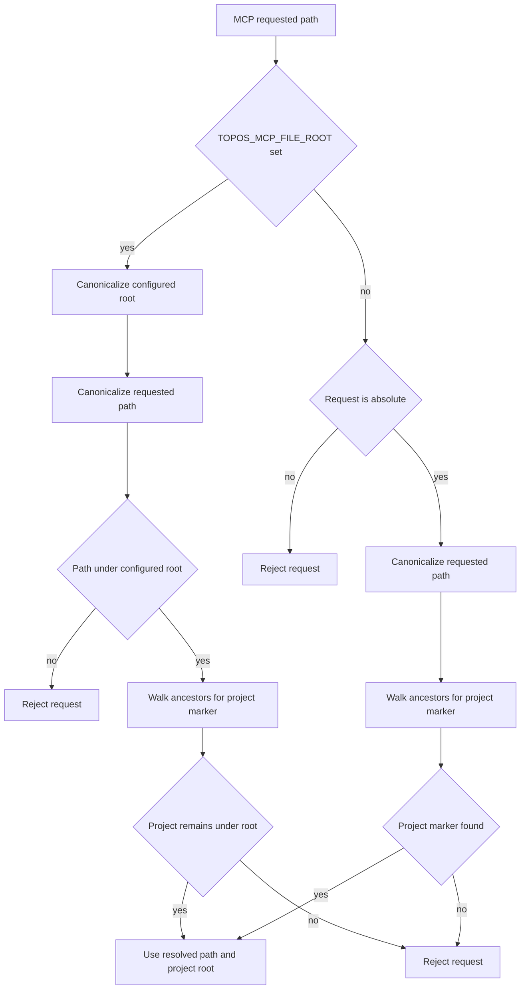

# Analysis integrations and distribution surfaces

Topos is a Rust workspace whose CLI and MCP wire layer use `topos-engine` for analysis. Its distribution surfaces package the same local analyzer in different host contracts: an MCP Registry PyPI wheel, native release binaries, a Glama-oriented container, a VS Code extension, an Agent Plugins package, and a ClawHub skill. The related [architecture overview](../architecture/overview.md) explains the pipeline; the [agent and CLI workflow](../workflows/agent-and-cli.md) explains how an agent uses the resulting tools.

## GitNexus: optional COMPOSABLE topology

GitNexus is the only external executable required for the COMPOSABLE dependency-graph path. `topos depgraph generate` and MCP `topos_generate_depgraph` share the adapter and run `gitnexus analyze --skip-agents-md`; it writes `.gitnexus/`. The adapter recognizes GitNexus 1.5.0 as the minimum supported version and pins the tested installation command to `gitnexus@1.6.8`. A newer version is reported as untested rather than rejected, because its store format may drift.

The engine consumes GitNexus output as an inter-module `ModuleDependencyGraph`, not as an AST replacement. It loads either legacy JSON or the LadybugDB `lbug` store, indexes typed nodes and relationships, and derives coupling, instability, call fan-in/out, and import dependency depth for COMPOSABLE. To count calls attached to symbols, it traverses `CONTAINS`, `DEFINES`, `HAS_METHOD`, and `HAS_PROPERTY` containment relationships rather than treating file nodes as the only call-edge endpoints.

GitNexus stores can be flat or branch-scoped. Store selection matches the current branch from `meta.json`; a detached/non-Git project may use the flat store. A successful generation writes a Topos-owned `.topos-fingerprint.json` beside the selected store, recording the source fingerprint and, when available, Git HEAD. Freshness prefers source-content hash, then HEAD, then generated-time/mtime checks, so a graph that no longer represents the working tree is regenerated before COMPOSABLE is trusted.

Evaluation normally tries to make COMPOSABLE available: missing, stale, branch-not-indexed, or load-error graph states cause one generation attempt unless `--no-composable` / `no_composable` is set. Missing GitNexus or a failed/timed-out generation produces a structured result and leaves the other pillars usable; the default subprocess ceiling is 300 seconds and `TOPOS_DEPGRAPH_TIMEOUT` can override it or disable it with a non-positive value. Schema mismatch and an outside-root override are terminal states because rerunning the same generation cannot safely fix them.

### Root and store invariant

For CLI evaluation, the default COMPOSABLE root is the current directory; for MCP file tools it climbs from the detected project to the nearest `.git`, stopping at the configured file boundary. An explicit `--gitnexus-dir` / `gitnexus_dir` is resolved once, including symlinks on an existing prefix; its parent becomes the analysis and freshness root. The resolved absolute override is then reused so a relative path is not appended twice. MCP rejects an override that resolves outside this root, while an in-root store that does not yet exist remains a valid first-run target.

## Sighthound: embedded supplementary findings

`topos-mcp` compiles Sighthound into the server from a pinned Git revision; it does not discover or invoke a user-installed `sighthound` executable. For Python, JavaScript, TypeScript, and Go it executes Sighthound's embedded rules in-process with both explicit and taint passes, maps findings to Topos `SecurityFinding` values, and caps returned findings. Rust and C++ have no Sighthound rule pack and fall back to Topos's local CPG probes; `TOPOS_DISABLE_SIGHTHOUND=1` forces that fallback for every language.

This is a detail and compatibility boundary, not a replacement SECURE scorer: SECURE remains CPG-native and the Sighthound-derived `security_findings` are advisory supplementary detail. Taint findings are classified from Sighthound tags (with legacy type fallback); their actionable callee and allowlist key preferentially use the sink operation, not the containing function. Thus an allowlist must match the actual sink to suppress such a finding.

## MCP runtime and filesystem trust boundary

`topos-mcp` with no arguments serves MCP on standard input/output until the client disconnects. The Rust server aggregates its tool routers and provides tools, resources, and a refactor prompt. It deliberately bounds supported protocol negotiation to `2024-11-05`, `2025-03-26`, `2025-06-18`, `2025-11-25`, and `2026-07-28`; both initialize-era sessions and the stateless `server/discover` path expose the same tool surface.

Filesystem tools use `resolve_project_path`. The requested file or directory must already be readable because it is canonicalized. If `TOPOS_MCP_FILE_ROOT` is set, its readable canonical directory is a maximum boundary: both the resolved request and detected project must be beneath it. If it is unset, the request must be absolute and Topos walks ancestors of the resolved path for `.git`, `pyproject.toml`, or `Cargo.toml`. A failure to canonicalize, escape the boundary, or find a marker fails the tool request rather than silently using the server working directory.

This is the `resolve_project_path` containment and project-discovery flow; canonicalization makes existing symlink escapes visible before Topos reads a requested file.

A separate internal resolver is used for paths that may not exist yet, principally a `gitnexus_dir` override. `resolve_existing_prefix` canonicalizes each existing component, applies only a genuinely missing tail lexically, and resumes symlink resolution when `..` removes that tail. `resolve_path_within` then tests the result against the canonical root. This prevents a missing leaf or `link/missing/..` from concealing an existing symlink escape. Do not replace this with lexical normalization.

## Registry package and agent plugin

`.mcp/server.json` is the MCP Registry manifest for `io.github.Krv-Labs/topos`, version `0.5.1`. It declares `topos-mcp` as a PyPI package using `uvx` and stdio transport. `pyproject.toml` defines that package as a Maturin `bin` wheel: installing it puts the compiled `topos-mcp` server on `PATH`, with no Python runtime dependency or Python import surface.

The registry manifest intentionally omits `registryBaseUrl` and `--index-url`: VS Code adds its own index option for PyPI packages and duplicate options make `uv` reject the invocation. `scripts/check_versions.py` makes the Cargo workspace version authoritative and checks it against the registry manifest, package entry, VS Code extension, and agent-plugin manifest; release CI also checks a release tag after normalizing its optional `v` prefix.

The portable Agent Plugins 1.0 package has its own trust boundary. `plugin.json` supplies identity and metadata, while `mcp.json` asks a compatible client to launch the local `topos mcp` stdio command. The client, not Topos, owns plugin discovery, enablement, permissions, and process environment. The packaged skill is a regular copy of `skills/topos/SKILL.md`, not a symlink, and `scripts/check_agent_plugin.py` requires byte equality to the canonical skill and rejects escaping path forms in plugin commands and working directories.

The skill itself is a local instruction surface that requires a `topos` binary and advertises macOS/Linux support; it contains CLI/MCP refactor guidance, not an authentication credential. CI validates the canonical skill's required metadata, sections, and version parity. ClawHub publishing is triggered by skill changes or version tags, uses a pinned external workflow, and passes only the named repository secret through the workflow interface.

## Docker / Glama surface

The Dockerfile is a two-stage Glama-oriented build. The builder compiles `topos-mcp` into a Maturin release `bin` wheel. The runtime image installs that wheel plus Git, Node.js 20, and `gitnexus@1.6.8`, then starts `topos-mcp` as its stdio entrypoint. Sighthound is already inside the Rust artifact, so the image does not add a Python runtime for it.

The image sets `TOPOS_MCP_FILE_ROOT=/workspace` and uses `/workspace` as its working directory. This confines MCP filesystem access to a mounted repository below that directory unless the operator deliberately overrides the variable. Container mounting is therefore part of the trust configuration, not merely a convenience for locating source.

## VS Code extension: host-mediated execution

The `topos-vscode` extension is a workspace extension whose manifest declares VS Code `^1.105.0`, while activation feature-detects the MCP definition APIs and reports that an MCP-capable host needs VS Code 1.120 or compatible support. It registers an `McpStdioServerDefinitionProvider` named `topos-mcp`, invokes `topos mcp`, and passes the first workspace folder as `TOPOS_MCP_FILE_ROOT`. It also offers **Evaluate Project** and **Generate Dependency Graph** commands; GitNexus absence prompts non-blockingly so the other pillars stay available.

Before starting either MCP or command-palette work, the extension resolves a runnable Topos executable in a fixed order: user `topos.executablePath`, bundled platform binary, verified cached binary, `PATH`, optional active Python environment, then optional manifest download. Cached and downloaded binaries are SHA-256 checked and must also pass `--version`; a failed check removes the cached artifact or abandons the candidate. The download client follows at most five redirects, requires HTTP 200, and has a 15-second request timeout. This protects artifact integrity but makes the GitHub-hosted release manifest a deliberate distribution trust boundary.

Native Windows activation stops with guidance to use WSL or install the CLI separately. Release CI builds and smoke-tests Linux amd64/arm64 and macOS arm64 binaries, verifies unexpected dynamic linkage before publication, packages matching target-specific VSIX files, and publishes them with duplicate-safe VSCE handling.

## Focused change checks

- **GitNexus/MDG:** run `cargo test -p topos-engine gitnexus` and MDG tests; test compatible version classification, branch-store selection, fingerprint placement/freshness, and missing/timeout/failed subprocess results. The CI COMPOSABLE job analyzes a fixture with pinned GitNexus and asserts that a COMPOSABLE score is emitted.
- **MCP containment and protocol:** run `cargo test -p topos-mcp security` and lifecycle tests. Preserve regression coverage for missing in-root paths and direct or `..`-mediated symlink escapes; exercise both MCP lifecycle eras when changing `rmcp` or version support.
- **Sighthound:** test supported-language mapping, disable behavior, taint sink selection, and allowlist behavior alongside CPG SECURE tests.
- **Metadata and delivery:** run `python3 scripts/check_versions.py`, `python3 scripts/check_skill.py`, and `python3 scripts/check_agent_plugin.py`; for the editor, run `pnpm run test` in `extensions/vscode`. Do not place credentials or token values in manifests, documentation, output, or tests.
