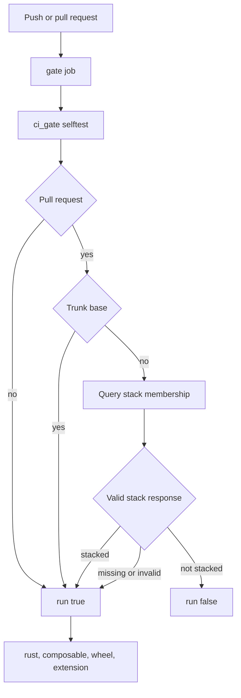
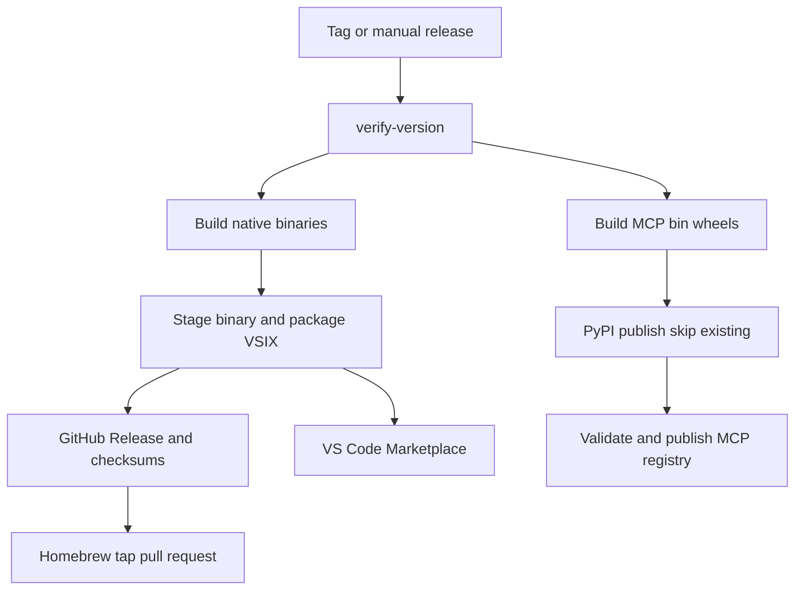

# Testing, packaging, CI, and release operations

Topos is a Rust workspace with separate CLI and MCP packages, then ships that analyzer through native release binaries, a `topos-mcp` bin wheel and registry record, a VS Code extension, an Agent Plugins package, a skill publication workflow, and a container. Start with the narrowest check that proves the changed contract; use the full workspace suite for shared code or before merge. The [distribution guide](../integrations/distribution.md) explains what each delivered surface runs, while [agent and CLI workflows](../workflows/agent-and-cli.md) describes consumer use.

## Local validation selection

The baseline Rust and metadata checks are:

```bash
python3 scripts/check_versions.py
python3 scripts/check_skill.py
python3 scripts/check_agent_plugin.py
cargo fmt --all --check
cargo clippy --workspace --all-targets -- -D warnings
cargo test --workspace
```

| Changed behavior | Focused proof | Escalate when |
| --- | --- | --- |
| Engine or CLI behavior | Run the affected `cargo test -p topos-engine` or `cargo test -p topos` filter; use a direct `cargo run -p topos -- …` smoke case for a public CLI change. | The change crosses crates or alters shared analysis. |
| MCP protocol, routes, or lifecycle | `cargo test -p topos-mcp`; build and send `initialize`, `notifications/initialized`, and `tools/list` frames to `topos-mcp`. | A wire or tool change needs a real stdio smoke test in addition to unit tests. |
| COMPOSABLE / GitNexus | Test the adapter path, then generate a `.gitnexus` store in a committed fixture repository with `gitnexus@1.6.8` and evaluate it. | Store compatibility or scoring changes must demonstrate that a COMPOSABLE score is present, not merely that the command exits. |
| MCP wheel | `maturin build --release --bindings bin --manifest-path topos/mcp/Cargo.toml`; exercise the installed or extracted `topos-mcp` entrypoint. | Native dependencies or platform support changed. |
| VS Code extension | In `extensions/vscode/`: `pnpm install --frozen-lockfile`, then `pnpm run check-types`, `pnpm run lint`, and `pnpm run test:unit`. Use `pnpm run test` when staging behavior changed. | The extension bundle, VSIX contents, or host integration changed. |
| Agent skills or plugin | Run both `python3 scripts/check_skill.py` and `python3 scripts/check_agent_plugin.py`. | A release version changes or a canonical skill is copied into the plugin package. |
| Binary installer or Homebrew guidance | `pytest tests/packaging/test_install_sh_preflight.py` (with the repository's Python test environment). | Installer preflight, channel detection, formula template, or advertised command changed. |

The Rust CI job also builds the MCP binary and asserts its `tools/list` response contains `topos_evaluate_code`; retain this end-to-end check when changing server registration or tool exposure.

## CI admission and required checks

`CI` runs on pushes to `main` and on all pull requests. The unfiltered pull-request trigger is intentional: a stacked PR targets its parent topic branch, so a trigger filtered only on trunk bases would omit it. The `gate` job owns admission and exposes one `run` output consumed by the `rust`, `composable`, `wheel`, and `extension` jobs.



This is the CI admission path: unreadable stack information results in more validation, not a skipped PR.

`scripts/ci_gate.py` mirrors the former PR-base allowlist in `TRUNK_PATTERNS`: `main`, `worktree-rust-migration-v0.4.0`, and `release/**`. It accepts non-PR events, accepts trunk-targeting PRs before querying GitHub, accepts a topic-base PR only when the raw GraphQL `PullRequestStack` response contains a stack, and normally skips an unstacked topic-base PR. Missing, malformed, or GraphQL-error responses deliberately fail open to `run=true` and print a warning. Its branch matcher follows Actions glob semantics—`*` does not cross `/`, while `**` does—so do not replace it with `fnmatch`.

Run the fully local decision table with:

```bash
python3 scripts/ci_gate.py --selftest
```

A real Actions run is still needed to verify token access to the new GraphQL field. Preserve the downstream `needs.gate.outputs.run == 'true'` condition on every required job, and use `actionlint` when modifying workflow syntax or expressions.

### What downstream CI proves

- **rust** provisions a pinned static LadybugDB (`lbug`) library before restoring the Cargo cache, then runs version, skill, and Agent Plugin validation, format, Clippy with warnings denied, workspace tests, and the MCP stdio smoke test. The ordering matters because the dependency build script does not register the environment variable as a rerun input; restoring a target built without `LBUG_LIBRARY_DIR` can retain a missing native search path.
- **composable** installs GitNexus `1.6.8`, builds the CLI, copies and commits the fixture, runs `gitnexus analyze --skip-agents-md`, requires a file—not directory—at `.gitnexus/lbug`, and fails if evaluation reports a missing store or omits `results[0].scores.composable`.
- **wheel** builds the `topos-mcp` Maturin `bin` wheel in a manylinux 2.34 environment. This is a packaging build, not a Python implementation test.
- **extension** installs with the lockfile and runs the extension's type, lint, and unit-test scripts.

`setup-lbug-prebuilt.sh` caches/downloads the requested lbug binary and exports `LBUG_LIBRARY_DIR`, `LBUG_INCLUDE_DIR`, and `LBUG_VERSION`; on macOS it refuses source-build override variables. When reproducing CI locally, evaluate its exported commands in the current shell (for example, `eval "$(./scripts/setup-lbug-prebuilt.sh)"`) before building.

## Metadata, skills, and plugin invariants

The workspace package version in `Cargo.toml` is authoritative. `check_versions.py` requires the same version in the VS Code manifest, `agent-plugin/plugin.json`, `.mcp/server.json`, and every MCP package entry; `--tag` accepts either `vX.Y.Z` or `X.Y.Z` but requires the normalized value to match Cargo. It also rejects a PyPI `registryBaseUrl` or a `--index-url` runtime argument in the MCP record because VS Code supplies its own index argument and duplicate arguments cause `uv` to reject the launch.

`check_skill.py` validates every non-hidden folder in `skills/`: a `SKILL.md`, matching slug/name, bounded description, and—in OpenClaw/Hermes metadata—the required metadata, documentation sections, credential declaration, and Cargo-version parity. `check_agent_plugin.py` schema-closes the plugin and MCP manifests, rejects plugin symlinks and path traversal in stdio command/working-directory entries, forbids client-reserved `PLUGIN_ROOT` and `PLUGIN_DATA` environment entries, and requires the packaged `agent-plugin/skills/topos/SKILL.md` to be a regular byte-for-byte copy of the canonical skill.

ClawHub publication is a separate reusable-workflow operation. It runs a dry-run for qualifying PRs and publishes skill changes on `main` or `v*` tags through a pinned `openclaw/clawhub` workflow, with `CLAWHUB_TOKEN` passed by name and OIDC enabled. A missing token does not prevent the PR dry run, but upstream publishing fails on main/tag events; fork PRs cannot receive the required OIDC token.

## Installer and Homebrew checks

`install.sh` is Bash, and all documented pipe examples must use `| bash`, not `| sh`. It resolves a Linux/macOS amd64/arm64 asset, downloads the matching release checksum, verifies SHA-256 before moving the executable into `TOPOS_INSTALL` (default `~/.local/bin`), optionally adds a marked PATH block, records binary-installer provenance, and verifies the installed binary. It supports `TOPOS_VERSION`, `TOPOS_NO_MODIFY_PATH`, `TOPOS_FORCE` / `TOPOS_YES`, and `TOPOS_SKIP_MAIN` for tests.

Before installation it discovers existing executables from `PATH` and known local targets, de-duplicates resolved paths, and distinguishes Homebrew using known layouts or an explicitly declared `HOMEBREW_PREFIX`. A same-target install is upgraded in place; foreign installations yield channel-specific advice. It prompts only when stdin is a terminal: piped, CI, and agent-shell installs warn and continue rather than reading `/dev/tty` and hanging. `TOPOS_FORCE`, `TOPOS_YES`, and update mode bypass the confirmation as appropriate. PATH order remains the effective executable selection, so test coexistence behavior after changing any install channel.

The packaging test checks Bash syntax, helper behavior, noninteractive/piped preflight, Homebrew-template expectations, and that install documentation does not advertise `| sh`. The formula intentionally has no Ruby `version` stanza because Homebrew derives it from the release URL. Release automation substitutes version and checksums, opens or updates a tap PR, and leaves merge gated by tap CI; it never pushes the formula directly to the tap default branch.

## Release runbook

`Build and Release` is a build verification workflow for PRs to `main`; publication happens only for a `v*` tag or manual dispatch. A dispatch accepts a version with or without `v`, and its `pypi_only` option omits the native binary, VSIX, GitHub Release, Homebrew, and Marketplace path while still building and publishing PyPI artifacts. Verify metadata first, then use the workflow rather than manually assembling a release.



This is the delivery dependency graph for a normal release; `pypi_only` follows the right-hand wheel path.

1. **Prepare and verify version.** Update all release-facing metadata and run `python3 scripts/check_versions.py`. For a tag or dispatch, the workflow repeats the check with `--tag`; do not create a mismatched tag.
2. **Build portable native artifacts.** The matrix builds `topos` for Linux amd64/arm64 and macOS arm64, stages target-named files, rejects non-system macOS libraries and unexpected Linux `DT_NEEDED` entries, then runs `--version`. macOS signing and notarization are attempted only outside PRs when the named Apple secrets are configured; missing secrets cause warnings and an unsigned/unnotarized artifact rather than exposing a secret. A signed macOS binary is smoke-tested again because hardened-runtime library validation can fail only after signing.
3. **Package the editor.** Each target VSIX downloads its matching binary artifact, stages it in `extensions/vscode/bin/topos`, checks VSIX size, and uploads the VSIX. The staging script accepts an explicit `TOPOS_BINARY_SOURCE` for tests, otherwise searches the expected `dist` artifact locations; it fails on a missing or empty binary and can require Darwin signature verification with `TOPOS_REQUIRE_DARWIN_CODESIGN=1`.
4. **Publish native channels.** The release job downloads all binary and VSIX artifacts, computes `checksums.txt`, and creates the GitHub Release. Homebrew then fetches those published checksums, renders `packaging/homebrew/topos.rb.template`, and opens/updates a checksum-backed tap PR. Marketplace publishing requires `VSCE_PAT`, uses `--skip-duplicate`, and summarizes per-target published, duplicate-skipped, failed, or unknown-log outcomes, making a partial upload rerunnable.
5. **Publish the MCP channels.** Maturin builds `topos-mcp` wheels for manylinux amd64/arm64 and macOS arm64. The workflow unpacks each wheel to reject non-system macOS linkage or unexpected Linux `DT_NEEDED` libraries before upload. PyPI preflight classifies filenames already present and trusted publishing uses `skip-existing: true`, so only missing files are uploaded on a rerun. Finally, a checksum-verified `mcp-publisher` authenticates with GitHub OIDC, validates `.mcp/server.json`, and publishes it to the MCP Registry.

Secret identifiers such as `APPLE_DEVELOPER_ID_CERTIFICATE_P12_BASE64`, `HOMEBREW_TAP_TOKEN`, and `VSCE_PAT` are sufficient for operations documentation. Never copy secret values into manifests, test fixtures, logs, or runbooks.

## Documentation and badge automation

The docs workflow uses Python 3.12 plus `uv` to build Sphinx HTML on `main` and PRs to `main`; only a successful `main` push deploys the Pages artifact. The self-badge workflow is path-filtered to core Rust inputs and badge generator changes, only runs ordinary PR work for `release/v*` heads, builds/indexes the repository with pinned GitNexus, and commits updated SVG badges only on `main`. Treat that commit as generated output: it uses `[skip ci]` to avoid a CI loop.

## Before merge or release

1. Run the focused check from the table, then workspace tests for shared Rust changes.
2. Run format and Clippy; run version, skill, and plugin checks for metadata or agent-asset changes.
3. Test the real boundary that changed: stdio frames for MCP, a generated GitNexus fixture for COMPOSABLE, staging for VSIX, or piped preflight for the installer.
4. For CI gate changes, run `python3 scripts/ci_gate.py --selftest` and confirm all four downstream jobs remain gated.
5. For delivery changes, inspect the whole release dependency path through the channel affected and preserve checksum, linkage, and rerun behavior.
