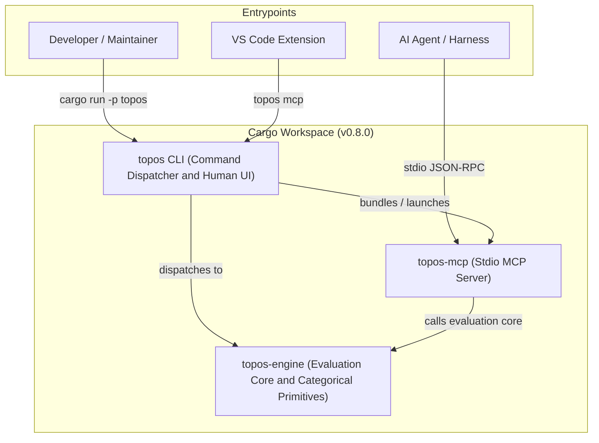

# Topos Engineering Quickstart

Topos is a three-crate Cargo workspace: `topos-engine` owns shared structural analysis, categorical model representations, and quality classification; `topos` provides the human CLI interface and command dispatch; and `topos-mcp` implements the stdio Model Context Protocol (MCP) server. Keep domain policy and structural analysis in the engine crate. The CLI and MCP crates wrap engine capabilities into their respective transport interfaces; `topos mcp` launches the same in-process MCP server implementation as the standalone `topos-mcp` binary.

Source code and tests are authoritative. Use this quickstart to route maintenance tasks, apply agent guidelines, run targeted verification, and navigate the OpenWiki documentation suite.

## Workspace Architecture

The root `Cargo.toml` defines the workspace package version (`0.8.0`) and contains three member crates:

- **`topos-engine`**: Pure-Rust evaluation core containing configuration (`.topos.toml`), categorical primitives (`core`), AST/CFG/CPG/PDG/MDG/UAST representations (`graphs`), metrics/functors (`functors`), quality translators (`evaluation`), and adapters (`adapters`).
- **`topos`**: Standalone CLI binary (`src/main.rs`) dispatching 12 root subcommands: `evaluate`, `inspect`, `pr-recap`, `config`, `compare`, `coverage`, `depgraph`, `install`, `uninstall`, `update`, `status`, and `mcp`. On failure, commands print an error message to stderr and exit with status 1.
- **`topos-mcp`**: Stdio MCP server exposing structural quality tools, embedded documentation resources (`topos://docs/*`), and the `topos_refactor_until_ideal` prompt.


*Topos workspace component relationships, entrypoints, and communication channels.*

## Start Safely

From a clean repository checkout, verify the CLI binary and run a baseline evaluation that disables automatic GitNexus background graph generation:

```bash
cargo run -p topos -- --help
cargo run -p topos -- evaluate . -r --no-composable
```

Use the narrowest relevant test during development, then expand validation before committing or opening a pull request:

```bash
cargo fmt --all --check
cargo clippy --workspace --all-targets -- -D warnings
cargo test --workspace
```

For package, version, skill, or agent plugin updates, also run the Python verification scripts:

```bash
python3 scripts/check_versions.py
python3 scripts/check_skill.py
python3 scripts/check_agent_plugin.py
```

## Route the Task

Use the following task routing map to locate relevant documentation, starting source directories, and focused verification commands across the entire OpenWiki suite:

| Task or Symptom | Read First | Start Location | Focused Proof |
| --- | --- | --- | --- |
| Pillars (`SIMPLE`, `COMPOSABLE`, `SECURE`, `NAVIGABLE`), gate decisions, thresholds, suppressions, preferences | [Quality Model and Metrics](domain/quality-model.md) | `topos/engine/src/evaluation/`, `topos/engine/src/core/` | `cargo test -p topos-engine <filter>` |
| Structural views (AST, UAST, CFG, PDG, CPG, MDG), graph metrics, categorical functors, curvature | [Architecture Overview](architecture/overview.md) | `topos/engine/src/graphs/`, `topos/engine/src/functors/` | `cargo test -p topos-engine <filter>` |
| CLI subcommands (`evaluate`, `inspect`, `pr-recap`, `config`, `compare`, `coverage`), terminal rendering, JSON output | [Agent and CLI Workflows](workflows/agent-and-cli.md) | `topos/cli/src/main.rs`, `topos/cli/src/commands/` | `cargo test -p topos <filter>` and `cargo run -p topos -- <cmd> --help` |
| MCP tools, JSON-RPC schemas, resources, prompts, stdio transport lifecycle, MCP protocol version | [Agent and CLI Workflows](workflows/agent-and-cli.md) | `topos/mcp/src/main.rs`, `topos/mcp/src/server.rs` | `cargo test -p topos-mcp --test lifecycle` |
| Agent harness registration (`install`, `uninstall`, `status`), harness configs (`~/.claude.json`, Codex, Gemini), clean-home residue | [Harness Registration Workflow](workflows/harness-registration.md) | `topos/cli/src/commands/install/` | `cargo test -p topos --test install_e2e` |
| GitNexus (`.gitnexus` store), distribution channels (binary, homebrew, cargo, wheel, VS Code VSIX, agent skills/plugins), updates | [Distribution and Integration Channels](integrations/distribution.md) | `topos/engine/src/adapters/gitnexus.rs`, `topos/cli/src/commands/update/` | `python3 scripts/check_skill.py` and channel-specific checks |
| CI pipelines, release packaging, version consistency, release tags, publishing workflows | [Testing and Release Operations](operations/testing-and-release.md) | `.github/workflows/`, `scripts/check_versions.py` | `python3 scripts/check_versions.py` |
| Complete codebase file structure, cross-crate module paths, script locations | [Source Map](source-map.md) | Target source file named in the map | Relevant crate or module unit tests |

## Agent Interaction Policies

When working as an AI agent or maintainer in the Topos repository, adhere to the guidelines defined in `AGENTS.md`:

- **Just-in-Time Documentation Retrieval**: Do not enumerate, preload, or search wikis at task start. Retrieve documentation only when requested or when unfamiliar architecture materially impacts the task. If MCP retrieval tools are unavailable, read `openwiki/quickstart.md` and follow relative links.
- **Authoritative Sources**: Source code and tests are primary authority. Briefs or documentation notes represent verification gaps, not automatic requirements.
- **Quiet, Targeted Validation**: Prefer the narrowest quiet validation command that proves the changed behavior. Always preserve complete failure output when tests fail.
- **Skill and Plugin Parity**: Synchronize versions and content across `skills/topos/SKILL.md`, `agent-plugin/`, `.mcp/server.json`, `extensions/vscode/package.json`, and `Cargo.toml`. Validate changes using `python3 scripts/check_skill.py` and `python3 scripts/check_agent_plugin.py`.
- **OpenWiki CI Policy**: The `.github/workflows/openwiki.yml` pipeline regenerates engineering documentation from source on `main` branch pushes or manual dispatch, submitting documentation PRs without modifying workflow files directly.
- **Embedded MCP Docs vs Workspace Wiki**: Embedded MCP resources (`topos_get_doc` / `topos://docs/*`) serve six specific topics (`agent-contract`, `lattice`, `metrics`, `preferences`, `priority`, `workflows`). Broader workspace engineering guides live under `openwiki/` on the filesystem and are read directly by agents with repository access.

## Update Mechanics and Checking Options

The `topos update` command inspects the binary's installation channel and reports available upgrades:

- **Distribution Channels**: Identifies whether the running binary was installed via binary download (`install.sh`), Homebrew (`brew install krv-labs/tap/topos`), Cargo (`cargo install`), or source checkout (`cargo build`).
- **Command Options**:
  - `topos update --check`: Reports installed vs published versions without making changes or prompting. Implied in non-terminal environments.
  - `topos update --yes` (`-y`): Applies channel-specific upgrades non-interactively without confirmation prompts.
  - `topos update --json`: Emits the update survey as machine-readable JSON.
- **Passive Notices & Throttling**: Interactive CLI invocations execute a throttled passive update check at most once every 24 hours, caching results in `~/.local/state/topos`. Set `TOPOS_NO_UPDATE_NOTICES=1` to silence passive update notices completely.

## High-Value Engineering Invariants

- **Classification Belongs in the Engine**: Quality evaluations, metric scores, and gate verdicts MUST be computed within `topos-engine`. Never override or patch quality verdicts in CLI renderers or MCP formatters.
- **Scores Are Not Gate Verdicts**: Quality metrics yield normalized float scores, but gate decisions (`SIMPLE`, `COMPOSABLE`, `SECURE`, `NAVIGABLE`) are Heyting algebra elements evaluated against project priority thresholds.
- **COMPOSABLE Graph Independence**: COMPOSABLE uses GitNexus module graphs. If GitNexus is uninstalled or graph generation fails, standard evaluation continues operating on `SIMPLE`, `SECURE`, and `NAVIGABLE` pillars. Use `topos depgraph generate` to explicitly manage graph generation.
- **MCP Wire Safety**: `topos-mcp` explicitly bounds protocol version support (`2024-11-05`, `2025-03-26`, `2025-06-18`, `2025-11-25`, `2026-07-28`) and isolates filesystem roots. Always run `cargo test -p topos-mcp --test lifecycle` when modifying MCP tool schemas, resources, or lifecycle handlers.
- **Harness Clean-Up**: `topos install` and `topos uninstall` must preserve non-Topos configuration entries in `~/.claude.json`, Codex TOML, and Gemini settings. Running `cargo test -p topos --test install_e2e` verifies that installation and uninstallation leave no unwanted residue in `$HOME`.
