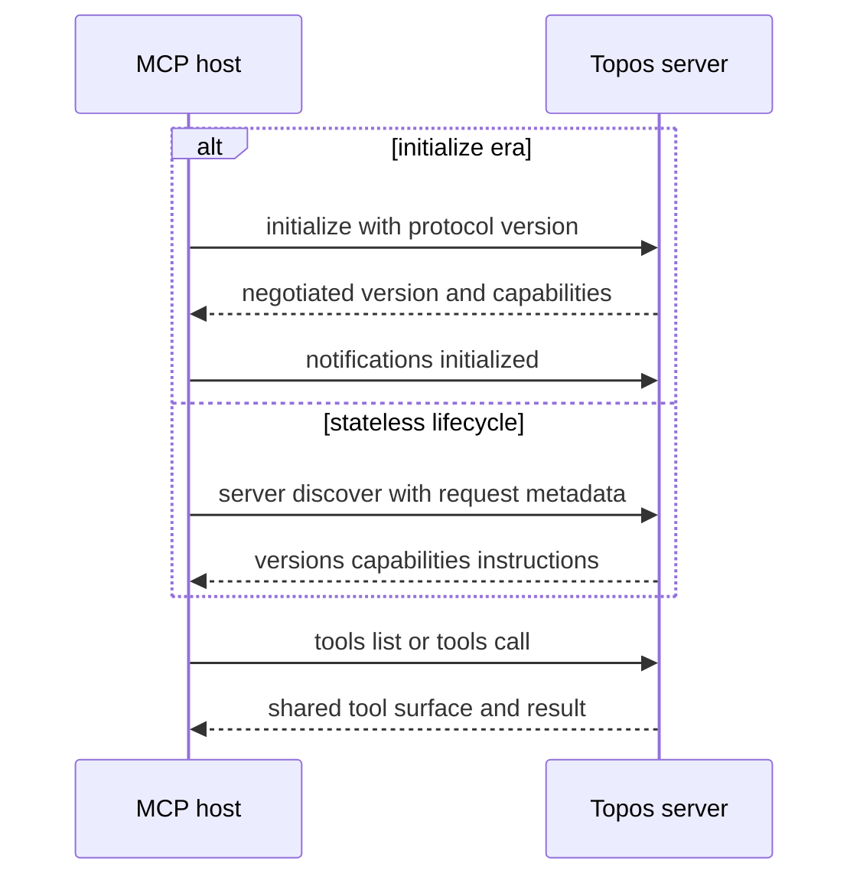
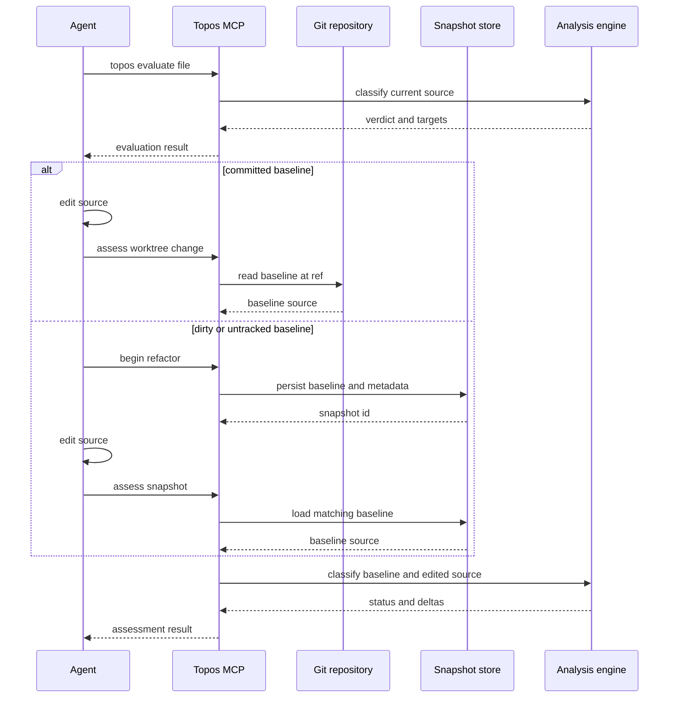

# CLI, MCP, and agent improvement workflows

Topos provides the `topos` CLI for local work and the stdio `topos-mcp` server for MCP hosts. They expose the same quality model but have different interaction contracts: CLI output is intended for a human or shell, while MCP tool names, JSON schemas, result shapes, annotations, protocol versions, and filesystem containment are public client-facing behavior. Quality verdicts are described in the [quality model](../domain/quality-model.md); structural coverage and comparison are complementary signals, not lattice verdicts.

## Select an entrypoint

The root command dispatches `config`, `evaluate`, `inspect`, `compare`, `coverage`, `depgraph`, `install`, `uninstall`, `status`, and `mcp`. A returned command error is printed as `Error: ...` and exits with status 1; invoking `topos` with no arguments prints root help and exits 2.

| Entry point | Use it when |
| --- | --- |
| `topos evaluate PATH...` | You want local scores for files or directories, terminal summaries, or JSON. |
| `topos inspect FILE` | You need a single file's metrics, functions, and detailed guidance. |
| `topos depgraph generate [PATH]` | You want to explicitly build or refresh the GitNexus graph used for COMPOSABLE. |
| `topos mcp` | An MCP host launches the unified CLI executable as a stdio server. |
| `topos-mcp` | An MCP host launches the standalone server binary; without `--help` or `--version`, it serves stdio rather than an interactive shell. |

`topos mcp` creates a multi-thread Tokio runtime and delegates to `topos_mcp::server::serve`, the same serving implementation used by the standalone binary. Harness installation, removal, and status are separate workflows; see [harness registration](harness-registration.md).

## Resolve CLI evaluation inputs

`topos evaluate` accepts one or more files or directories. Directory discovery only descends when `-r`/`--recursive` is set. `--language` is a discovery filter, not the parser default:

- Without a filter, Topos discovers every supported suffix and detects each file's language. The identifiers are `python`, `rust`, `javascript`, `typescript`, `cpp`, and `go`.
- `--language LANGUAGE` first validates the identifier, then restricts discovery to that language's suffixes.
- Explicit existing files are never silently dropped. A named unsupported suffix fails without a filter; a supported file outside an active filter also fails, explaining the filter and expected suffixes. Missing paths report `path not found` separately.
- An empty directory is successful: terminal output explains that no supported sources were found (and suggests `--recursive` when applicable), while `--json` returns an empty result document. `--failures` still fails if its requested pillar was not measured.

```bash
# Discover all supported languages below src/.
topos evaluate src/ -r

# Limit directory discovery to Python.
topos evaluate services/ -r --language python

# This reports a filter mismatch instead of silently omitting the Rust file.
topos evaluate src/main.rs --language python
```

Output controls are intentionally separate from discovery. `--json` cannot be combined with `--info` or `--failures PILLAR`; `--verbose` provides detailed output, `--info` selects actionable detail, and `--failures` focuses one pillar. `--priority` accepts one pillar or a comma-separated ranking: its first generator sets classification priority and the ranking orders remediation targets, but it does not turn a failed gate into a pass.

`topos inspect FILE` uses detected language and project configuration, and follows the same default GitNexus policy as `evaluate`. Its text mode treats an unparseable file as a shell failure after printing a parse-failure summary; `topos inspect --json` instead emits its inspection object.

## COMPOSABLE preparation is optional

COMPOSABLE depends on a GitNexus module-dependency graph (MDG); the other pillars do not. Unless `--no-composable`/`no_composable: true` is selected, CLI evaluation and inspection and the filesystem-backed MCP tools attempt to use a current `.gitnexus` store, generating or refreshing it with `gitnexus analyze --skip-agents-md` when graph state is missing, stale, branch-unindexed, or unloadable. The generation subprocess is bounded by `TOPOS_DEPGRAPH_TIMEOUT` (300 seconds by default).

```bash
# Deliberately leave COMPOSABLE unmeasured.
topos evaluate src/ -r --no-composable

# Make graph preparation an explicit operation.
topos depgraph generate
topos evaluate src/ -r
```

A missing GitNexus executable, failed generation, or unavailable graph degrades ordinary evaluation rather than aborting it: SIMPLE, SECURE, and NAVIGABLE still run and warnings explain why COMPOSABLE was not scored. `topos depgraph generate` is the explicit, stricter setup operation: it skips a current graph unless `--force` is supplied and returns an error for a schema-mismatched store rather than overwriting it.

For CLI commands, the default graph root is the Git root found from the working directory. A `--gitnexus-dir` override chooses a store and makes its parent the COMPOSABLE project root; relative overrides are resolved once before reuse so their path segment is not joined twice. MCP starts from the accessed file's detected project but climbs to the Git root for the default graph location. An in-root override that does not exist yet is a first-run `missing` state and may be generated; a resolved override outside the trusted project root, including a symlink escape, is rejected and reported as unavailable.

## MCP lifecycle and trust boundary

`ToposServer` combines evaluate, assess, compare, coverage, depgraph, documentation, inspect, preferences, and refactor routers. It advertises tools, resources, and prompts. Documentation is readable at `topos://docs/<slug>` (with `topos_get_doc` as a tool fallback), `topos://build` reports binary identity, and `topos_refactor_until_ideal` provides a refactor-loop scaffold.



This diagram shows the initialize-era and stateless MCP lifecycle paths served by the same `ToposServer`.

The server pins support to `2024-11-05`, `2025-03-26`, `2025-06-18`, `2025-11-25`, and `2026-07-28`. Initialize-era clients negotiate through `initialize` followed by `notifications/initialized`. A `2026-07-28` client may begin with `server/discover`; each request then carries the protocol version and client capabilities in `_meta`. The lifecycle test sends real JSON-RPC frames to the server binary and asserts both lifecycle paths expose the same tools.

Filesystem tools canonicalize access before reading. `TOPOS_MCP_FILE_ROOT`, when nonempty, is a maximum boundary; otherwise callers must give an absolute path, which establishes context independently of the server's startup directory. The server requires an existing readable path and finds its nearest `.git`, `pyproject.toml`, or `Cargo.toml` ancestor. It rejects paths and project roots outside the boundary, including traversal or symlink escapes; a path without a project marker fails closed.

### Evaluation and inspection tools

Tool annotations communicate side effects to hosts and must change with the implementation:

- `topos_evaluate_code` evaluates an in-memory snippet and is read-only, idempotent, and closed-world. It cannot measure COMPOSABLE because a snippet has no module position in an MDG.
- `topos_evaluate_file` and `topos_evaluate_project` are non-read-only, non-idempotent, open-world tools because default COMPOSABLE preparation can create or refresh `.gitnexus`; they do not edit source files. The file tool runs blocking work off the async transport and defaults to three ranked refactor targets (zero disables them).
- `topos_inspect_code` accepts exactly one of inline `code` or `filepath`. A filepath can trigger the same graph preparation and therefore has non-read-only annotations; inline code cannot reach COMPOSABLE.

Project evaluation recursively discovers all supported languages, skips unsupported files, and produces a per-dimension weakest-file floor together with language rollups and paginated file rows. `limit` defaults to 25 and is clamped to 1–500; submit `next_offset` as the next request's `offset`. Rows omit raw metrics by default, and omit security findings unless `include_security_findings` is requested.

## Baseline-aware evaluate–edit–assess loop

Choose the baseline *before* changing a file. A committed baseline is retrieved from Git; a dirty or untracked baseline needs a snapshot. `topos_assess_improvement` is instead for two variants supplied side by side, while `topos_assess_changeset` is the multi-file Git-baseline route.



This diagram shows the two baseline-preserving routes for an in-place edit.

1. Call `topos_evaluate_file` for an on-disk target and use its targets or `topos_inspect_code` to plan a focused change. Request a project rollup later for cross-file work.
2. When the before-state exists at a Git ref, edit in place and call `topos_assess_worktree_change` with `filepath` and optionally `baseline_ref` (default `HEAD`). It reads `<ref>:<path>` through Git, so it cannot represent a new file or uncommitted pre-edit source; dash-prefixed refs are rejected rather than passed as Git options.
3. For dirty or untracked before-states, call `topos_begin_refactor` before editing and retain `snapshot_id`; then call `topos_assess_snapshot` with that ID and filepath. Snapshots are content-addressed records outside the worktree (system temporary storage by default, or `TOPOS_SNAPSHOT_DIR`), survive server restart, expire after 24 hours, and bind metadata to the resolved filepath. Malformed, missing, expired, or filepath-mismatched IDs produce a blocked assessment rather than silently selecting another baseline.
4. Use `topos_assess_improvement` only with exactly one of `filepath`/`current_code` and exactly one of `proposed_code`/`proposed_filepath`. Use `topos_assess_changeset` for a multi-file edit; it compares each file to a Git ref and aggregates before/after results.

Assessments compare lattice order and score and metric deltas. If both sources parse, they also calculate normalized AST edit distance. An otherwise improving result becomes `SUSPICIOUS_NO_STRUCTURAL_CHANGE` when distance is below `0.02` and any score delta has magnitude at least `3.0`; it is a metric-gaming or scoring-instability warning, not an acceptance result.

Accept an iteration only after `IMPROVEMENT` or `IMPROVEMENT_SCORE`, no suspicious outcome, review of active or acknowledged SECURE risks, a project rollup where relevant, and appropriate behavior tests, type checks, or linters. Topos supplies structural evidence and explicitly routes an improvement toward project evaluation and behavior checks; it does not execute those checks.

## Safely evolve these contracts

Treat MCP tool names, descriptions, schemas, annotations, result shapes, and protocol support as versioned external contracts. Add a tool through its `#[tool_router]` implementation and include that router in `ToposServer::new`; test `tools/list` as well as handler behavior. Changes to resolution must preserve containment checks even for missing leaf paths, because existing symlink prefixes can escape a lexical root.

Focused checks include:

```bash
cargo test -p topos
cargo test -p topos-mcp
cargo test -p topos-mcp --test lifecycle
```

The CLI input tests cover mixed-language discovery, filter mismatches, missing paths, and empty directories. Snapshot tests cover content-addressed IDs and expiry; security tests cover containment and symlink traversal; the lifecycle test covers negotiation, stateless discovery, and equal tool surfaces. For broader release validation, use the [testing and release guidance](../operations/testing-and-release.md).
