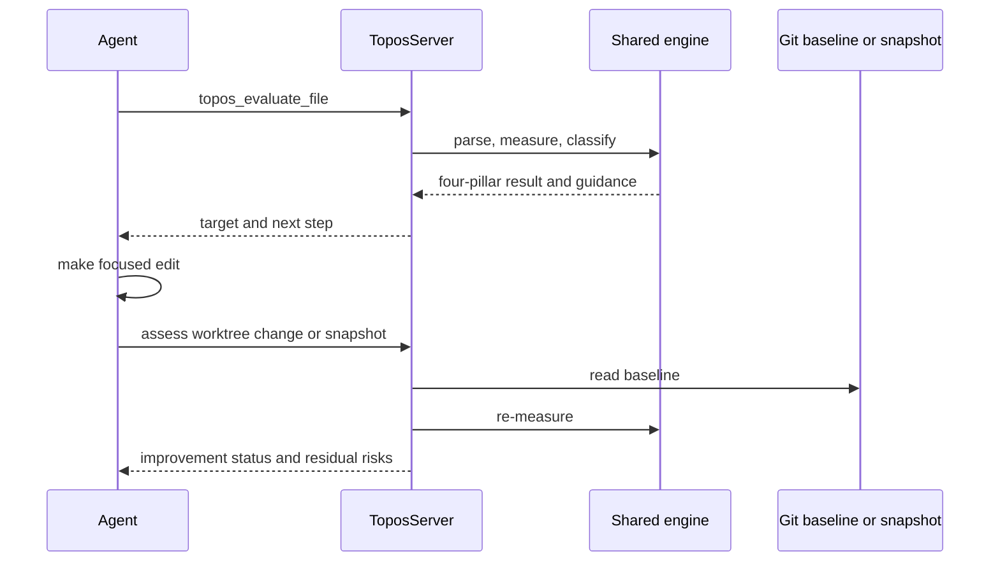

# CLI, MCP, and agent improvement workflows

The Clap CLI and RMCP stdio server are interfaces over the shared [analysis engine](../architecture/overview.md). Use the CLI for direct evaluation and local registration lifecycle; use MCP for an agent’s evaluate-edit-assess loop. Both report the four-pillar [quality model](../domain/quality-model.md).

## CLI commands

| Command | Use |
| --- | --- |
| `topos evaluate PATH [-r]` | Evaluate file(s) and aggregate directory/project results; discovers supported languages unless filtered with `--language`. |
| `topos inspect FILE` | Explain detailed metrics, functions, and guidance for one file. |
| `topos config` | View or edit project priority settings. |
| `topos compare SOURCE TARGET` | Compare structural AST distance. |
| `topos coverage` | Compare source structure with tests without running them; outside the lattice. |
| `topos graphify …` | Generate Graphify knowledge graphs or find orphans; outside the lattice. |
| `topos depgraph generate [PATH]` | Prepare or refresh GitNexus topology. |
| `topos install [HARNESS…]`, `topos uninstall [HARNESS…]`, `topos status` | Register, remove, or inspect Topos-owned MCP entries; see [registration lifecycle](harness-registration.md). |
| `topos mcp` | Start the Rust stdio MCP server. |

`Command` in `topos/cli/src/main.rs` is the public root dispatch. `evaluate` accepts recursive discovery, JSON, `--language`, `--no-composable`, GitNexus selection, failure/info views, and a single pillar or full four-pillar priority ranking. Priority changes remediation order and output metadata, not gates.

## Baseline evaluation and COMPOSABLE

```bash
# SIMPLE, SECURE, and NAVIGABLE do not need an MDG
topos evaluate src/ -r --no-composable

# Build or refresh cross-module state for COMPOSABLE
npm install -g gitnexus@1.6.8
topos depgraph generate
topos evaluate src/ -r --gitnexus-dir .gitnexus
```

Unless `--no-composable` is supplied, `evaluate` checks GitNexus freshness and may generate state. A `--gitnexus-dir` override identifies the store **and makes its parent the COMPOSABLE project root**; resolve a relative override once before passing it through root/status/generation code. Rejoining it after root derivation doubles the path.

If GitNexus is unavailable, generation fails, or the store cannot load, evaluation continues with SIMPLE, SECURE, and NAVIGABLE while COMPOSABLE is unmeasured. Regenerate after relevant import/module/directory or working-tree changes; never silently score stale topology. The loader and rejection conditions are canonical in the [GitNexus integration](../integrations/distribution.md#gitnexus-for-composable).

## MCP agent loop

`topos mcp` launches the in-process `topos-mcp` RMCP server; clients can also launch the `topos-mcp` binary directly. `ToposServer::new` sums routers for evaluate, assess, compare, coverage, depgraph, docs, graphify, inspect, preferences, and refactor. It also serves `topos://docs/*`, `topos://build`, and `topos_refactor_until_ideal`.

### Project evaluation ranking

`topos_evaluate_project` walks supported files, then `build_project_result` produces the aggregate floor, language rollups, page-global named lists (`hard_fails`, `leaf_composable_zeros`, and `maintainability_giants`), and the paginated `files` table. The four-pillar gate meaning remains owned by the [quality model](../domain/quality-model.md); this layer decides how already-classified rows are ordered and presented.

`RowKeys::new` in `topos/mcp/src/tools/evaluate.rs` builds gate inputs and calls `evaluate_gates` exactly once for each `ScoredProjectRow`. `decorate_rows` shares those cached keys with `classify_keyed_rows` and `sort_keyed`; the latter retains Rust's stable `sort_by` and the previous tie ordering. As a result, the named-list membership and row ordering do not change, while gate-derived ranking work is linear in the number of rows rather than repeated by sorting comparators.

When changing project ranking, keep the distinction between decisive hard failures, advisory cyclomatic `maintainability_giants`, and the deprecated always-empty `leaf_composable_zeros` bucket. Update `RowKeys`, its consumers, and the comparator key together; do not recompute gate inputs inside a comparator. `ranking_lists_evaluate_gates_once_per_row` is the narrow regression: run `cargo test -p topos-mcp ranking_lists_evaluate_gates_once_per_row`. Run `cargo test -p topos-mcp` when result construction or adjacent MCP behavior changes. A stdio `tools/list` smoke test is conditional on a schema, tool annotation, or router-registration change—ranking-only changes do not alter that shipped surface.



This shows the MCP loop from an initial evaluation through the appropriate baseline-aware assessment.

Use `topos_assess_worktree_change` against a Git ref after in-place edits. For dirty or untracked baselines, call `topos_begin_refactor` first and use `topos_assess_snapshot`; use `topos_assess_improvement` only for side-by-side variants. Check dependency-graph state before requesting COMPOSABLE or a PLATINUM/IDEAL verdict. Generation writes `.gitnexus`; status is read-only.

Tool schema text consumes agent context. When adding a tool, create its `#[tool_router]` in `topos/mcp/src/tools/`, add it to `ToposServer::new`, and verify both `tools/list` and context-budget/doc consistency tests. An internal handler test alone does not validate the consumer-facing MCP surface. Run `cargo test -p topos-mcp`; use the stdio `initialize`/`tools/list` smoke route in [testing operations](../operations/testing-and-release.md) when protocol-visible metadata changes.

## Advisory and non-lattice analysis

Coverage structurally compares declarations and k-gram recall without executing tests. Graphify/refactor findings identify structural hotspots or orphans. Compare measures structural distance. None changes SIMPLE, COMPOSABLE, SECURE, NAVIGABLE, or the lattice verdict; preserve that boundary when adding commands or tools.

## Change navigation

- Add a CLI command at `Command`, wire its `commands/` module, and add a direct regression or smoke case.
- Add an MCP tool in `topos/mcp/src/tools/`, register its router in `ToposServer::new`, then prove `tools/list` exposes the real schema.
- Change harness configuration only through the [registration lifecycle](harness-registration.md); it is a user-home mutation boundary.
- Change GitNexus root/status behavior in CLI and MCP callers together, testing available state and graceful degradation.
- Run `cargo test -p topos` for CLI-only work or `cargo test -p topos-mcp` for server-only work. Reserve workspace/package checks for shared-engine or shipped-surface changes.
