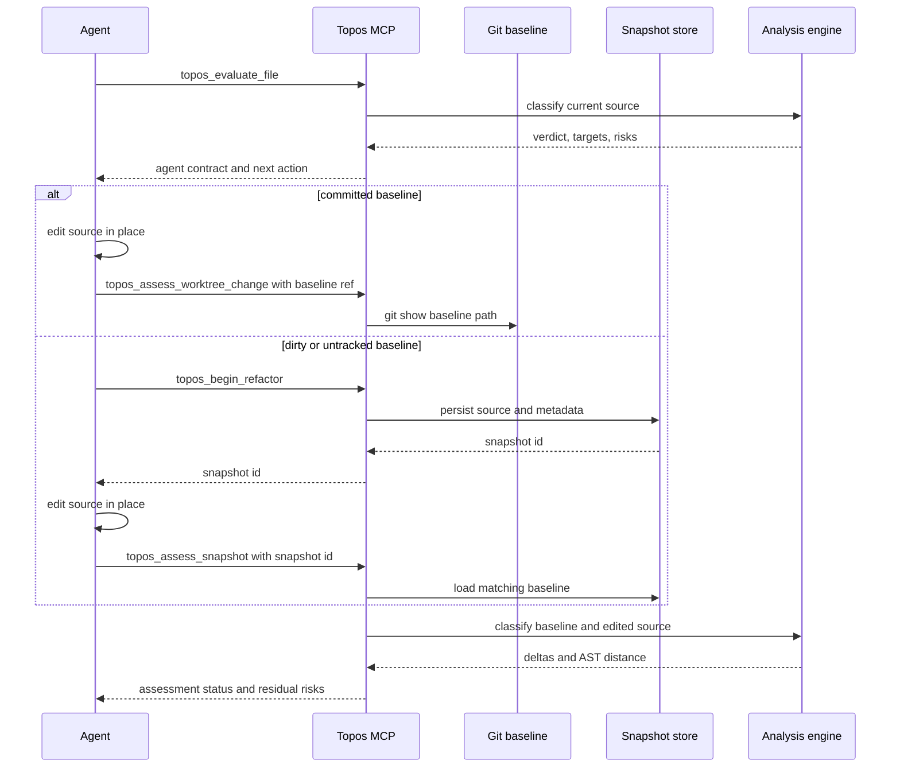

# CLI, MCP, and agent improvement workflows

Topos has two deliberately different interfaces over the shared [analysis engine](../architecture/overview.md). The `topos` CLI is a human-oriented command route with terminal or JSON presentation. The `topos-mcp` server is a stdio Model Context Protocol endpoint whose tools, resources, prompts, annotations, and structured results are agent-facing wire behavior. Both evaluate the four-pillar [quality model](../domain/quality-model.md), but neither makes advisory analysis part of the quality lattice.

## CLI routes and presentation

`Command` in `topos/cli/src/main.rs` is the root dispatch for these public commands:

| Command | Responsibility |
| --- | --- |
| `topos evaluate PATH...` | Evaluate files or directories; `-r` enables recursive discovery, `--language` filters discovery, and `--json` switches presentation to JSON. |
| `topos inspect FILE` | Explain metrics, functions, and guidance for one file. |
| `topos config` | View or edit project priority settings. |
| `topos compare SOURCE TARGET` | Measure AST structural distance between two files. |
| `topos coverage SOURCE... --tests TEST...` | Compare source structure with tests without executing them. |
| `topos depgraph generate [PATH]` | Ensure the GitNexus dependency graph used for COMPOSABLE is current; `--force` regenerates even when current. |
| `topos install [HARNESS...]`, `topos uninstall [HARNESS...]`, `topos status` | Manage Topos-owned agent-harness configuration; see [harness registration](harness-registration.md). |
| `topos mcp` | Run the MCP server over stdio. |

CLI output options are presentation controls rather than different analysis semantics. `evaluate` rejects `--json` combined with either `--info` or `--failures`; `--verbose` exposes per-file/raw detail, while `--info` and `--failures PILLAR` select focused human guidance. A `--priority` value may name one pillar or give a full ranking; it selects remediation ordering and output targets rather than turning a failed quality gate into a pass.

`topos mcp` creates a Tokio runtime and delegates to the same `topos_mcp::server::serve` function used by the standalone `topos-mcp` binary. The standalone binary is protocol-only with no interactive mode: without `--help` or `--version`, it waits for MCP frames on stdio.

## Prepare COMPOSABLE deliberately

SIMPLE, SECURE, and NAVIGABLE are derived from a program morphism. COMPOSABLE additionally needs a GitNexus-backed module dependency graph. `topos evaluate` and MCP file/project evaluation normally try to resolve, refresh, and attach that graph; `--no-composable` (or `no_composable`) disables that work and leaves the other three pillars available.

```bash
# Evaluate without dependency-graph work
topos evaluate src/ -r --no-composable

# Prepare or refresh the graph, then evaluate all reachable pillars
topos depgraph generate
topos evaluate src/ -r --gitnexus-dir .gitnexus
```

The shared ensure policy checks graph state and attempts `gitnexus analyze --skip-agents-md` when the store is missing, stale, not indexed for the current branch, or cannot load. The subprocess is bounded by `TOPOS_DEPGRAPH_TIMEOUT` (300 seconds by default). An unavailable executable, failed generation, or unusable store does **not** fail ordinary evaluation: Topos returns SIMPLE/SECURE/NAVIGABLE results and reports COMPOSABLE as not scored with warnings.

A `gitnexus_dir` override has two important invariants:

- Its parent is the COMPOSABLE project root used for freshness and generation. Resolve a relative override once to an absolute path before handing it to code operating with that derived root; otherwise it can be joined twice.
- MCP rejects an override outside its trusted file root, including a symlink escape. An absent store inside the root is instead a first-run `missing` state and remains eligible for generation.

For agents, use `topos_depgraph_status` before relying on COMPOSABLE. It is read-only and distinguishes `present`, `missing`, `stale`, `load_error`, `schema_mismatch`, `branch_not_indexed`, and invalid-directory states. `topos_generate_depgraph` is the side-effecting route: it no-ops when current unless `force` is requested, but a schema mismatch is not regenerated because a newer store cannot be repaired by rerunning the current generator. Generation output returned to the agent is capped, while the store path is provided separately.

## MCP protocol surface

`ToposServer` combines nine tool routers—evaluate, assess, compare, coverage, depgraph, docs, inspect, preferences, and refactor—into one `tools/list` surface. It advertises tools, resources, and prompts. Documentation is available as `topos://docs/<slug>` resources and `topos_get_doc` is the tool fallback for clients that do not expose resource reads; `topos://build` reports the serving binary identity. The single prompt, `topos_refactor_until_ideal`, scaffolds the standard refactor loop.

The server explicitly supports MCP protocol revisions `2024-11-05`, `2025-03-26`, `2025-06-18`, `2025-11-25`, and `2026-07-28`. The initialize-era lifecycle negotiates a revision followed by `notifications/initialized`; the 2026-07-28 stateless lifecycle begins with `server/discover` and requires protocol version/client capabilities in each request's `_meta`. These are wire-level lifecycle differences, not different tool sets or payload semantics.

The principal tool families are:

- **Evaluate and inspect:** `topos_evaluate_code` evaluates an in-memory snippet (no COMPOSABLE); `topos_evaluate_file` and `topos_evaluate_project` can ensure GitNexus state; `topos_inspect_code` supplies detailed function and entropy information. Project evaluation recursively discovers supported languages, rolls each quality dimension down to its weakest file, and returns ranked/paginated rows plus global failure lists.
- **Assess:** `topos_assess_improvement` compares explicit side-by-side variants; `topos_assess_worktree_change` reads a baseline file from a Git ref (default `HEAD`) and compares it with the working-tree file; `topos_begin_refactor` persists a pre-edit snapshot; `topos_assess_snapshot` uses that snapshot; and `topos_assess_changeset` handles multi-file edits against a Git baseline.
- **Supporting tools:** `topos_compare_code` and `topos_compare_files` expose raw AST distance; `topos_preference_walk` computes a preference-ordered target walk; `topos_depgraph_status` and `topos_generate_depgraph` manage graph readiness; and `topos_refactor` returns advisory hotspots.

Filesystem MCP tools resolve a project from `.git`, `pyproject.toml`, or `Cargo.toml`. When `TOPOS_MCP_FILE_ROOT` is configured, it is a maximum access boundary; without it, the requested path must be absolute and supplies the project context. Calls fail closed on unreadable paths, boundary escapes, or no project marker. This prevents a user-level server from being accidentally tied to its startup directory while retaining an explicit containment boundary.

### Wire-visible behavior versus local presentation

Tool annotations are part of the consumer-visible contract. In particular, code-only evaluation, comparisons, coverage, preference walks, graph status, side-by-side assessment, worktree assessment, snapshot assessment, changeset assessment, and advisory refactor are declared read-only; file/project evaluation, file-based inspection, graph generation, and snapshot creation can have side effects. File/project evaluation and inspection may generate or refresh `.gitnexus`, so they are not safely described as read-only even though they never edit source code.

When changing an MCP tool, add its `#[tool_router]` implementation under `topos/mcp/src/tools/`, combine the router in `ToposServer::new`, and test the actual `tools/list` schema/annotations as well as the handler. The server has context-budget and documentation consistency constraints because tool names, descriptions, schemas, and annotations are sent to clients. Do not confuse a CLI renderer or an internal Rust return value with this shipped protocol surface.

## Baseline-aware evaluate–edit–assess loop

Use the assessment route that matches how the baseline was captured. The assessment status compares lattice positions and score deltas; when both sources parse, it also computes normalized AST edit distance. An apparent improvement with distance below `0.02` and any score delta of at least `3.0` is reported as `SUSPICIOUS_NO_STRUCTURAL_CHANGE`, not accepted as a normal improvement.



This sequence makes baseline selection explicit: Git-ref assessment is stateless, whereas a dirty or untracked pre-edit baseline must be captured before editing.

1. Evaluate the target and read the returned guidance, refactor targets, active findings, and agent contract. For a nontrivial cross-file change, plan a project rollup too.
2. If the baseline exists at a committed ref, edit in place and call `topos_assess_worktree_change` with that ref. It obtains the pre-edit source with `git show`; it cannot represent an uncommitted or new-file baseline.
3. If the starting state is dirty or untracked, call `topos_begin_refactor` **before** editing, then call `topos_assess_snapshot` with its ID. Snapshots are content-addressed by filepath and source, stored outside the working tree (system temp by default, configurable through `TOPOS_SNAPSHOT_DIR`), survive server restarts, and expire after 24 hours. Missing, expired, or filepath-mismatched snapshots are blocked rather than silently applied.
4. Use `topos_assess_improvement` only when the proposed source/file is intentionally supplied side by side. Use `topos_assess_changeset` for a multi-file module split or related change set; all files must belong to one project.
5. Accept an iteration only after an `IMPROVEMENT` or `IMPROVEMENT_SCORE` status, no suspicious-no-structural-change result, an explicit review of active or acknowledged SECURE risks, project rollup where relevant, and behavior/type/lint checks appropriate to the repository. Topos supplies structural evidence; it does not execute those behavior checks.

The SECURE overlay is intentionally independent of response-size preferences. It is considered only for parseable classifications with dangerous-call or taint-flow failures, avoiding an extra parse for SECURE-clean or unparseable code. When an allowlist applies, Topos partitions findings into active findings and acknowledged risks; acknowledgment is disclosure, not silent removal of the risk from routing and verdict handling.

## Advisory boundary and change checks

`topos_calculate_coverage` structurally matches declarations and k-gram paths between program-under-test and tests; it does not run the tests. `topos_compare_*` reports AST distance. `topos_refactor` ranks CFG cycle/branch, dependency, or process hotspots. These are useful evidence for choosing or reviewing an edit, but they do not alter SIMPLE, COMPOSABLE, SECURE, NAVIGABLE, or the lattice verdict.

For focused changes, run `cargo test -p topos` for CLI work and `cargo test -p topos-mcp` for server work. The stdio lifecycle test (`cargo test -p topos-mcp --test lifecycle`) is especially relevant when protocol negotiation, `tools/list`, resources, prompts, or router registration changes: it drives real JSON-RPC frames through both initialize and stateless discovery paths. Run the relevant diagnostics or snapshot tests when modifying overlays or baseline persistence, and use the broader [testing and release guidance](../operations/testing-and-release.md) for shared-engine or shipped-surface changes.
