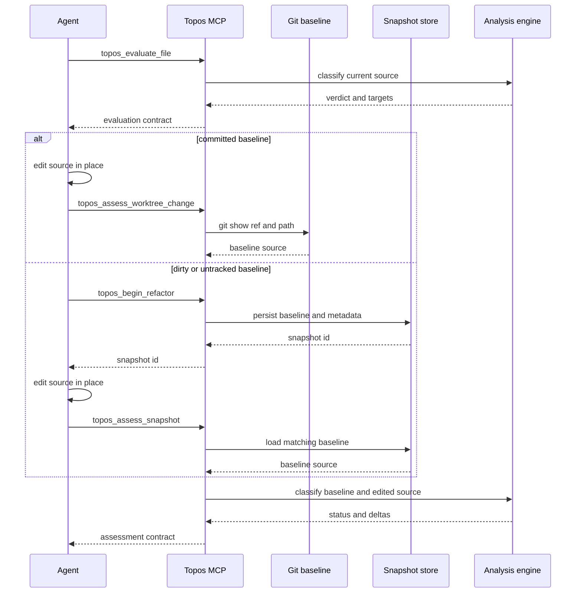

# CLI, MCP, and agent improvement workflows

Topos offers two interfaces over the same structural analysis: the `topos` CLI for local, human-oriented work and `topos-mcp` for Model Context Protocol clients. The CLI renders terminal summaries or JSON; MCP tools expose schemas, annotations, and structured responses that are part of the agent-facing contract. Both evaluate the quality dimensions described in the [quality model](../domain/quality-model.md); coverage, comparison, and hotspot analysis remain supporting signals rather than quality-lattice verdicts.

## Choose an entrypoint

The root `topos` command dispatches `config`, `evaluate`, `inspect`, `compare`, `coverage`, `depgraph`, `install`, `uninstall`, `status`, and `mcp`. A command error is printed as `Error: ...` and exits with status 1. See [harness registration](harness-registration.md) for the harness-management commands.

| Entry point | Use it when |
| --- | --- |
| `topos evaluate PATH...` | You want local file or directory scores and focused terminal/JSON output. |
| `topos inspect FILE` | You need metrics, functions, and guidance for one file. |
| `topos depgraph generate [PATH]` | You want to explicitly prepare the GitNexus graph used by COMPOSABLE. |
| `topos mcp` | An MCP host is configured to launch the unified `topos` executable. |
| `topos-mcp` | An MCP host launches the standalone server executable. With no argument it serves stdio; it is not an interactive shell. |

`topos mcp` builds a Tokio runtime and delegates to the same `topos_mcp::server::serve` implementation as `topos-mcp`. The standalone binary also supports `--help` and `--version`.

## Evaluate paths correctly from the CLI

`topos evaluate` takes one or more files or directories. `-r`/`--recursive` controls directory descent. Crucially, `--language` is an **optional discovery filter**, not the default parser language:

- With no filter, discovery accepts every supported suffix and detects the language of each individual file. The supported language identifiers are `python`, `rust`, `javascript`, `typescript`, `cpp`, and `go`; their suffixes include `.py`, `.rs`, `.js`/`.mjs`/`.cjs`, `.ts`/`.tsx`, C++ suffixes, and `.go`.
- `--language LANGUAGE` limits discovery to that language's suffixes. It validates the language name before walking paths.
- A directly named existing file is never silently discarded. With no filter, an unsupported suffix is an error. With a filter, a supported file outside that filter—and an unsupported explicitly named file—is reported as skipped with the active filter and expected suffixes, so callers can choose the matching `--language` or omit it.
- A nonexistent supplied path reports `path not found`, separately from an empty discovery result. An empty directory is successful: human output explains that no supported source files were found (and suggests `--recursive` where applicable), while `--json` emits an empty result document.

For example, the default command can score a mixed-language directory, while a focused monorepo pass is explicit:

```bash
# Discover Python, Rust, JavaScript, TypeScript, C++, and Go source files.
topos evaluate src/ -r

# Restrict directory discovery to Python inputs.
topos evaluate services/ -r --language python

# Avoid an accidental silent mismatch: this errors if src/main.rs is named.
topos evaluate src/main.rs --language python
```

Presentation and prioritization are separate from input resolution. `--json` cannot be combined with `--info` or `--failures PILLAR`; `--verbose` enables detailed output, `--info` selects actionable detail, and `--failures` focuses a pillar. `--priority` accepts one pillar or a full comma-separated ranking. Its leading priority is used for classification, and the ranking orders remediation targets; it does not convert a failed gate into a pass.

## COMPOSABLE is optional preparation

COMPOSABLE requires a GitNexus-backed module dependency graph (MDG), unlike the representations used for the other dimensions. By default, CLI evaluation tries to find or generate a usable `.gitnexus` store; `--no-composable` skips that work and evaluates the remaining dimensions. The MCP file and project evaluation tools use the same policy through `no_composable`.

```bash
# Fast evaluation that intentionally leaves COMPOSABLE unmeasured.
topos evaluate src/ -r --no-composable

# Explicitly prepare the graph, then evaluate with its default location.
topos depgraph generate
topos evaluate src/ -r
```

Generation may run `gitnexus analyze --skip-agents-md`. A missing executable, generation failure, or an unloadable graph does not abort ordinary evaluation: COMPOSABLE is unavailable and warnings explain the condition, while the other dimensions are returned. Use `topos depgraph generate` when graph setup should be a deliberate operation; it does nothing for a current graph unless forced and does not try to overwrite a schema-mismatched store.

A `--gitnexus-dir`/`gitnexus_dir` override identifies a store under the applicable project/file root. Its parent is the derived COMPOSABLE project root, and relative overrides are resolved once before reuse to avoid double joining. MCP refuses an override that escapes its trusted root, including through a symlink; an absent in-root store is instead a first-run missing state that remains eligible for generation.

## MCP surface and lifecycle

`ToposServer` combines the evaluate, assess, compare, coverage, depgraph, documentation, inspect, preferences, and refactor routers. It advertises tools, resources, and prompts. Documentation is available through `topos://docs/<slug>` resources (with `topos_get_doc` as a tool fallback); `topos://build` reports the serving binary identity. The `topos_refactor_until_ideal` prompt supplies a refactor-loop scaffold.

Tool annotations are public behavior, not implementation hints. In particular:

- `topos_evaluate_code` is read-only and evaluates an in-memory snippet; it cannot supply the MDG needed for COMPOSABLE.
- `topos_evaluate_file` and `topos_evaluate_project` are marked non-read-only/non-idempotent because default COMPOSABLE preparation can create or refresh `.gitnexus`; they do not edit source files.
- `topos_assess_improvement`, `topos_assess_worktree_change`, `topos_assess_snapshot`, and `topos_assess_changeset` are read-only. `topos_begin_refactor` is the snapshot-writing exception.

`topos_evaluate_project` recursively discovers all supported languages with no language parameter, skips unsupported files, produces an overall weakest-file floor per dimension, and returns language rollups plus paginated per-file rows. `limit` defaults to 25 and is clamped to 1–500; pass `next_offset` to continue. Default rows omit raw metrics and security findings unless `verbose` or `include_security_findings` requests them.

The server pins support for MCP revisions `2024-11-05`, `2025-03-26`, `2025-06-18`, `2025-11-25`, and `2026-07-28`. Initialize-era clients negotiate with `initialize` followed by `notifications/initialized`. A 2026-07-28 client can begin with stateless `server/discover`, then must send the protocol version and client capabilities in each request's `_meta`; this lifecycle difference retains the same tool surface.

Filesystem tools resolve a project using `.git`, `pyproject.toml`, or `Cargo.toml`. When `TOPOS_MCP_FILE_ROOT` is set, it is the maximum access boundary; otherwise a requested absolute path establishes context. Unreadable paths, root escapes, and paths with no project marker fail closed.

## Baseline-aware evaluate–edit–assess loop

Use an assessment method that preserves the actual pre-edit baseline. The following sequence distinguishes a committed baseline from a dirty or untracked one.



This sequence shows why the baseline must be chosen before the edit.

1. Call `topos_evaluate_file` for an on-disk target. Its default response includes up to three ranked refactor targets; request `refactor_targets: 0` only when targets are unwanted. For a cross-file change, plan a subsequent project rollup.
2. For a version committed at a Git ref, edit in place and call `topos_assess_worktree_change` with `filepath` and optionally `baseline_ref`; it defaults to `HEAD`. The tool reads `<ref>:<path>` with Git, so it cannot represent a new or uncommitted pre-edit file. Invalid dash-prefixed refs are rejected rather than passed as Git options.
3. For a dirty or untracked starting state, call `topos_begin_refactor` before editing, retain its `snapshot_id`, then call `topos_assess_snapshot` with that ID and the same file. Snapshot metadata binds the baseline to its resolved filepath. Missing, expired, malformed, or filepath-mismatched snapshots return a blocked assessment instead of being silently applied.
4. Use `topos_assess_improvement` only when both baseline and proposed variants are supplied side by side: exactly one of `filepath`/`current_code` and exactly one of `proposed_code`/`proposed_filepath` are required. Use `topos_assess_changeset` for a multi-file edit; all named files must resolve to one project.
5. Accept an iteration only after an `IMPROVEMENT` or `IMPROVEMENT_SCORE` status, no suspicious result, review of residual security findings, a project rollup when relevant, and repository-appropriate behavior tests, type checks, or linters. Topos contributes structural evidence; it does not execute those behavior checks.

Assessments compare lattice position and score/metric deltas. When both inputs parse, they also report normalized AST edit distance. An otherwise improving assessment becomes `SUSPICIOUS_NO_STRUCTURAL_CHANGE` when the distance is below `0.02` and any score delta has magnitude at least `3.0`; treat it as a metric-gaming or scoring-instability warning, not acceptance.

## Change and test the contracts

The server's tool names, descriptions, input schemas, result shapes, and annotations are shipped MCP surface. Add a tool through its `#[tool_router]` implementation and include its router in `ToposServer::new`; test `tools/list` behavior as well as handler logic. The stdio lifecycle test is the focused regression check for protocol negotiation, stateless discovery, and the shared tool surface across lifecycle eras.

For focused changes, run:

```bash
cargo test -p topos
cargo test -p topos-mcp
cargo test -p topos-mcp --test lifecycle
```

The input-resolution tests in `topos/cli/src/commands/evaluate/inputs.rs` cover mixed-language discovery and explicit-path failure behavior. The lifecycle test drives actual JSON-RPC frames into `topos-mcp`. Use the broader [testing and release guidance](../operations/testing-and-release.md) when a shared-engine or released protocol change needs wider validation.
