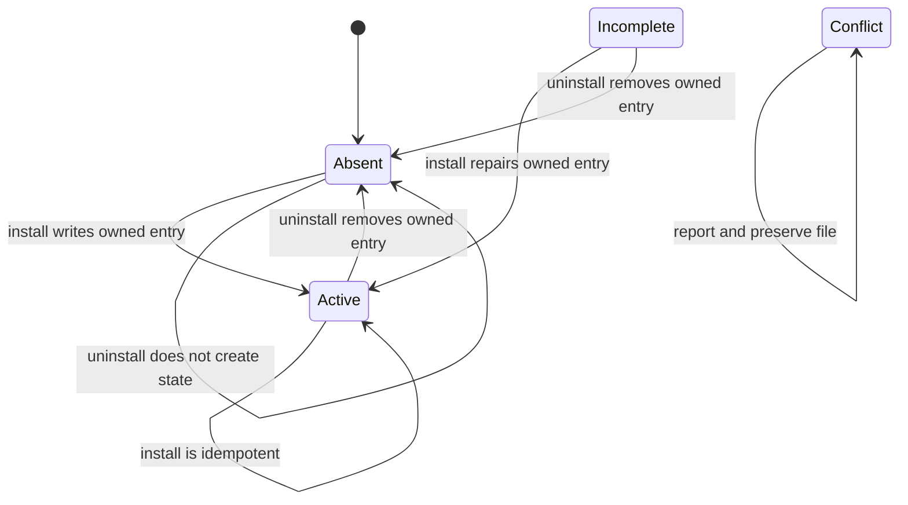

# Agent-harness MCP registration lifecycle

`topos install`, `topos uninstall`, and `topos status` are a narrow ownership boundary around user-home configuration. They register the installed `topos` binary with the `mcp` argument, so consumers start the same server described in [CLI and MCP workflows](agent-and-cli.md). They do not install skills, prose instruction blocks, or `@import` lines: those may be shared with other tools or owned by ClawHub, Hermes, or OpenClaw.

`topos/cli/src/commands/install/harness.rs` is the canonical nine-row `HARNESSES` table: Claude Code, Claude Desktop, Codex CLI, Gemini CLI, GitHub Copilot CLI, Cursor, VS Code, Google Antigravity, and pi. pi uses the ordinary JSON MCP shape at `~/.pi/agent/settings.json` and is detected from `~/.pi`. A harness owns one artifact—the `topos` MCP-server entry in its user-scope config—not a bundle of unrelated files. Add a harness by extending that table and the supported artifact/path behavior rather than creating parallel target lists.

## Registration contract

This is the per-harness registration state handled by `Artifact`; `Conflict` is deliberately non-mutating.

`Artifact` recognizes three config shapes:

- Plain JSON `mcpServers.topos` for Claude Code, Claude Desktop, Gemini, Copilot, Cursor, Antigravity, and pi.
- TOML `[mcp_servers.topos]` for Codex, edited with `toml_edit` to preserve unrelated formatting and comments.
- JSONC `servers.topos` for VS Code; it is the only target that requires `"type": "stdio"`.

Every non-VS-Code entry has `{command, args}` with `args: ["mcp"]`. Entry comparison is field-wise on `command` and `args`, because clients can add their own keys. The command is recorded as an absolute, resolvable binary path, but path identity prevents a stable PATH alias such as a Homebrew symlink from being needlessly rewritten.

## Mutation and removal safeguards

- `State::Active` means a matching owned entry; `Incomplete` is a repairable Topos entry; `Conflict` means invalid/unparseable content, a foreign `topos` key, or a VS Code config with comments that cannot be safely rewritten; `Absent` means no entry.
- Install creates a `.topos.backup` only when adding an entry to previously non-Topos content, preserving the original snapshot across later repairs.
- Uninstall removes only entries recognized as Topos-owned. Hand-made registrations under another key are reported as duplicates, never renamed or removed.
- Directory pruning follows the install-state record, so a full install/uninstall round trip leaves no files **or empty directories** it created. `--purge-backups` additionally removes stored backups.
- Selection is interactive only when stderr is a terminal. In a fully headless run, explicit target selection or `--all` is required for install; uninstall can operate without a prompt. A partially redirected interactive session is rejected unless the caller chooses `--yes` or `--dry-run`, preventing destructive mutation without a visible preview.
- Antigravity reports a migration warning when its config has not moved to `~/.gemini/config/`; pre-migration software can overwrite the registration. The warning is part of status/install output, not a silent success.

## Status contract

`topos status` inspects every `HARNESSES` entry against the resolved binary and scans separately for unmanaged residue. Human output sorts **Active** entries first, then **Incomplete**, **Conflict**, and **Absent**, so an actionable problem is not buried among healthy rows. It retains harness-specific notes (including the Antigravity migration warning) and reports residue without mutating it.

`topos status --json` is the machine-facing form used by the end-to-end suite. Its top-level object contains `binary`, active-count `active`, total `total`, `harnesses`, and `residue`; each harness row contains `id`, `name`, `state`, `config`, `detail`, and `note`. Keep this shape and the four state labels stable for scripts that consume status. `status_json` in `topos/cli/tests/install_e2e.rs` is the test helper; `a_drifted_command_is_reported_incomplete_and_healed_by_install` proves that a repairable owned entry supplies an explanatory detail before install restores it.

## Change recipe and validation

1. Start in `harness.rs` and `paths.rs`: define the ID, config path, artifact format, detection predicate, and any explicit caveat. Keep IDs unique and config paths distinct, and ensure the path remains under the supplied home directory.
2. Change `artifact.rs` and the format-specific `json_entry.rs` or `toml_entry.rs` only when a real client contract differs. Preserve the ownership rule and field-wise comparison.
3. Follow filesystem changes through `fsops.rs`, `state.rs`, and `uninstall.rs`; changes that write a file must retain backup, permission, symlink, and cleanup behavior.
4. Update `status.rs` when the catalog, state presentation, or JSON contract changes; preserve active-first ordering and include the changed harness in the structured row output.
5. Add unit tests beside the affected module and an end-to-end case in `topos/cli/tests/install_e2e.rs` for a CLI-visible lifecycle property.
6. Run `cargo test -p topos --test install_e2e`. This is the consumer-facing test: it drives the real binary against a scratch `$HOME`, checks `status --json`, preserves foreign content, records an absolute command with exactly `mcp` as its argument for all nine harnesses, and snapshots both files and directories before/after the round trip.

Run `cargo test -p topos` after any shared installer change. Use `cargo test --workspace` and packaging/release checks only when the registration command, binary packaging, or cross-crate MCP surface changes; ordinary harness-table edits do not need a wheel or VSIX build.

The registration points to the local MCP binary and therefore depends on the [MCP file-access boundary](../integrations/distribution.md#mcp-file-access-boundary) once an agent launches it. It does not configure GitNexus or alter scoring; those remain the evaluation workflow’s responsibility.
