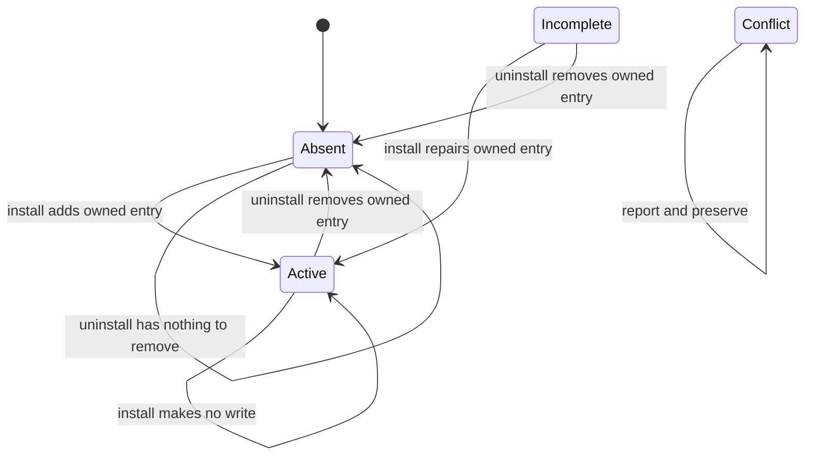

# Agent-harness MCP registration lifecycle

`topos install`, `topos uninstall`, and `topos status` manage a deliberately narrow, user-scope integration boundary. For each supported harness, Topos manages an MCP entry named `topos`, with an absolute executable `command` and exactly `args: ["mcp"]`. `topos install status` is an alias for the status workflow. The ordinary rule is one MCP artifact per harness; **pi is the intentional exception**: it also may receive a *path reference* to an already installed Topos skill directory. Topos never writes skill contents, instruction blocks, or `@import` directives. See [distribution surfaces](../integrations/distribution.md) for the ownership boundary with skill and plugin delivery.

## Supported harnesses and formats

`HARNESSES` is the nine-row extension point. Each row supplies the id, user configuration path, `Artifact` format, detection function, messages, caveat, and whether the pi-only skill reference applies. Command code iterates that table rather than branching on individual harnesses; detection merely preselects interactive choices and never prevents an explicitly selected install.

| Id | Harness | User configuration | Topos-owned MCP location |
| --- | --- | --- | --- |
| `claude` | Claude Code | `~/.claude.json` | `mcpServers.topos` |
| `claude-desktop` | Claude Desktop | platform-specific Claude Desktop configuration | `mcpServers.topos` |
| `codex` | Codex CLI | `~/.codex/config.toml` | `[mcp_servers.topos]` |
| `gemini` | Gemini CLI | `~/.gemini/settings.json` | `mcpServers.topos` |
| `copilot` | GitHub Copilot CLI | `~/.copilot/mcp-config.json` | `mcpServers.topos` |
| `cursor` | Cursor | `~/.cursor/mcp.json` | `mcpServers.topos` |
| `vscode` | VS Code | platform-specific `Code/User/mcp.json` | `servers.topos` |
| `antigravity` | Google Antigravity | `~/.gemini/config/mcp_config.json` | `mcpServers.topos` |
| `pi` | pi | `~/.pi/agent/mcp.json` | `mcpServers.topos` |

Claude Desktop and VS Code use `~/Library/Application Support/...` on macOS, `~/.config/...` on Linux, and `%APPDATA%/...` on Windows. The Linux Claude Desktop path is retained for inspection and cleanup even though the desktop app is not distributed there. All path functions receive the home directory, allowing a real-binary test to run against a scratch home rather than a developer's configuration.

Plain JSON registrations contain `command` and `args`; Codex uses the corresponding TOML table; VS Code is the format exception, using `servers` and requiring `"type": "stdio"`. No portable `type` value is imposed on the other clients. The resolved command is absolute, while binary comparison uses file identity: a stable `$PATH` symlink spelling can be recorded without pinning a versioned canonical path, and equivalent symlink spellings do not cause repair churn.

## State, ownership, and non-mutation

*Per-harness MCP `Artifact` lifecycle. `Conflict` deliberately has no mutation transition; pi's separate skill-reference outcome is reported alongside, not folded into, this state.*

- **Active** — the `topos` entry is owned, has the required format fields, and resolves to the running binary.
- **Incomplete** — the entry is owned but has path drift or, for VS Code, lacks `type: stdio`. Re-running `topos install <id>` repairs it.
- **Conflict** — the file is unparsable, a required container has the wrong shape, the `topos` key is not recognized as Topos-owned, or a necessary VS Code JSONC rewrite would discard comments. Install refuses; uninstall reports and leaves content unchanged.
- **Absent** — no entry exists. Uninstall is idempotent and does not create a ledger merely to record absence.

The ownership test is intentionally field-level rather than whole-object equality. An entry is recognized as owned when its command filename is `topos` or `topos.exe` and its arguments are exactly `["mcp"]`; the path need not still resolve. This permits repairing or removing an old path while treating a hand-authored `topos` entry as a conflict. Writers replace only Topos-owned fields (`command`, `args`, and VS Code's `type`) and preserve client-added entry fields, sibling servers, and unrelated configuration. A non-`topos` key that points to the Topos binary is a report-only duplicate, never renamed or removed.

JSON and TOML are parsed before merging. Codex uses `toml_edit` to retain comments and formatting. VS Code JSONC accepts comments and trailing commas for inspection, but if a write would be required in a commented file, Topos refuses instead of serializing away comments; the diagnostic supplies an entry for manual insertion. Writes use a temporary file then rename, follow an existing configuration symlink to its target, and retain existing Unix permissions.

## Install and pi's second artifact

On an absent entry, install creates a `<config>.topos.backup` only when it is about to modify a pre-existing file. It does not create a backup for a newly created config, and it does not overwrite the pristine backup during a repair of an owned incomplete entry. A successful second install of an active entry writes nothing.

pi has no MCP client of its own: its MCP file is consumed only after the user installs the separate `pi-mcp-adapter` extension, so status and install output include an adapter caveat. pi also has a second, independent integration route through `~/.pi/agent/settings.json`:

| Skill source outcome | `topos install pi` behavior |
| --- | --- |
| Topos skill is already in `~/.pi/agent/skills` | Do not write a reference; pi already discovers it. |
| Skill is in `~/.agents/skills` or `~/.claude/skills` | Append that directory path to the `skills` array. |
| No known installed skill exists | Do not create `settings.json`; report the `openclaw skills install @Krv-Labs/topos` guidance. |

This is a reference to a directory, not skill distribution. The reference is idempotent (including pi's `~/` spelling), appends instead of replacing the user’s `skills` array, and preserves other settings. `status --json` adds a `skillRef` object only on pi, with `active`, `conflict`, `discovered`, or `unavailable` status. Its separate reporting is important: an active MCP entry must not hide a missing skill reference, nor vice versa.

## Status and report-only residue

`topos status` resolves the binary, inspects every row in `HARNESSES`, scans residue, and prints either human-oriented rows or `--json`. JSON contains the binary path, active and total counts, per-harness id/name/state/config/detail/note data, residue, and pi's optional `skillRef` data.

Residue is deliberately read-only. Status identifies draft-era Copilot instruction blocks, Gemini `@import` directives and copied skill text, separately distributed skill files, and foreign-key duplicate MCP registrations. Neither installation nor uninstallation provides a repair or deletion route for these artifacts, because they can be shared files, user content, or owned by the OpenClaw/ClawHub/Hermes distribution channel.

Antigravity has a distinct operational warning. Before its migration, a real legacy data-directory `mcp_config.json` can overwrite the selected `~/.gemini/config/mcp_config.json` on the next launch. A migration marker suppresses the warning, as does a back-compatibility symlink; Topos never writes the legacy locations.

## Ledger-authorized cleanup

The filesystem alone cannot establish whether an empty configuration file or directory is Topos's to remove. The persistent ledger at `~/.local/state/topos/install.json` (or `%APPDATA%\topos\install.json`) records, per harness, files created by install, directories created by writes, and—when applicable—the pi skill reference added by install. It reads the prior flat schema for compatibility and saves the current wrapper schema.

Uninstall removes only a recognized owned MCP entry. It deletes an empty config file only when the ledger says that install created that file; emptiness alone grants no authority. For pi, uninstall removes a skill-array path only when the ledger records that Topos added it, never a pre-existing hand-added reference. It removes the `skills` key if that array becomes empty, but never removes the externally owned skill directory or its content.

After selected removals, cleanup proceeds in an order that preserves its authorization evidence:

1. Optionally purge `.topos.backup` files for the selected harnesses only.
2. Clear the selected harness file records.
3. If every managed MCP registration and ledger-owned pi reference is gone, read the recorded directories and prune them deepest first when effectively empty.
4. Delete the ledger, then prune its own state directory last.

Only ledger-recorded directories are candidates. Effective emptiness tolerates `.DS_Store` and Topos backup or temporary files; protected shared roots—including `$HOME`, `~/.local`, `~/.local/state`, `~/.config`, `~/Library`, `~/Library/Application Support`, and `%APPDATA%`—are never recorded for pruning. This produces leave-no-trace cleanup without deleting pre-existing directories or foreign content.

## Invocation safety and change guidance

Harness ids are case-insensitive and deduplicated; `--all` follows table order. In a non-interactive shell, install requires explicit ids or `--all`. Uninstall without ids in a truly headless run selects non-absent integrations and applies without a prompt. When stderr is redirected but stdin or stdout remains a terminal, destructive uninstall rejects the ambiguous situation unless the caller chooses `--yes` or `--dry-run`; interactive confirmation presents the plan and defaults to No.

When adding a harness or artifact format, keep the table as the integration boundary and preserve these invariants: parse before write, field-level ownership, conflict non-mutation, stable backups, symlink-safe atomic writes, ledger reporting of created paths, and ledger-authorized cleanup. Also add focused format tests and an end-to-end lifecycle test. Related CLI command flow is documented in [Agent and CLI workflows](agent-and-cli.md).

## Safety tests

Run `cargo test -p topos --test install_e2e` for the end-to-end contract. The suite invokes the compiled binary with `HOME`/`USERPROFILE` redirected to isolated scratch homes and snapshots both file bytes and directory trees. It exercises absolute commands and exact MCP arguments for all nine harnesses, second-install idempotency, drift reporting and repair, pristine backup preservation, scoped backup purge, headless uninstall, report-only residue preservation, and byte-identical refusal of a commented VS Code JSONC configuration.

The pi cases verify all three skill-source outcomes, the separate `skillRef` status data, idempotent reference insertion, preservation of foreign settings and manually added paths, removal only when the ledger authorized it, and retention of the external `SKILL.md`. The full-suite release context is in [testing and release](../operations/testing-and-release.md).
