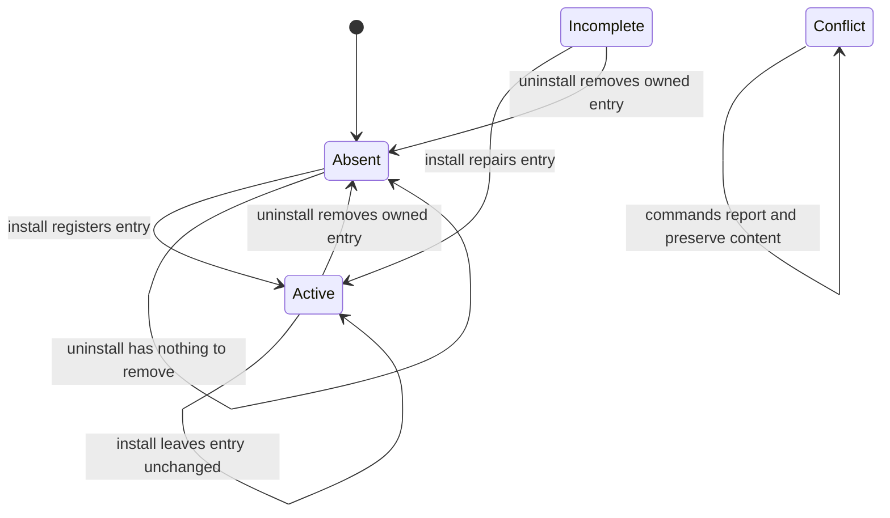

# Agent-harness MCP registration lifecycle

`topos install`, `topos uninstall`, and `topos status` form a deliberately narrow ownership boundary in user configuration. Per supported harness, Topos owns exactly one user-scope MCP server entry named `topos`; it records the installed executable with `args: ["mcp"]`. It does **not** install skills, instruction prose, or `@import` directives. Those artifacts can be shared with other tools or belong to the OpenClaw/ClawHub distribution channel, so Topos only detects and reports them.

The command entrypoints are `topos install`, `topos uninstall`, and top-level `topos status`; `topos install status` is an alias. `harness.rs` is the single data table used by command orchestration: adding a harness means adding its id, user-config path, format, detection predicate, messages, and any caveat there rather than adding per-harness command branches.

## Harnesses and registration shape

| Harness id | Harness | User configuration | Owned location |
| --- | --- | --- | --- |
| `claude` | Claude Code | `~/.claude.json` | `mcpServers.topos` |
| `claude-desktop` | Claude Desktop | platform-specific Claude Desktop config | `mcpServers.topos` |
| `codex` | Codex CLI | `~/.codex/config.toml` | `[mcp_servers.topos]` |
| `gemini` | Gemini CLI | `~/.gemini/settings.json` | `mcpServers.topos` |
| `copilot` | GitHub Copilot CLI | `~/.copilot/mcp-config.json` | `mcpServers.topos` |
| `cursor` | Cursor | `~/.cursor/mcp.json` | `mcpServers.topos` |
| `vscode` | VS Code | platform-specific `Code/User/mcp.json` | `servers.topos` |
| `antigravity` | Google Antigravity | `~/.gemini/config/mcp_config.json` | `mcpServers.topos` |

Claude Desktop and VS Code use `~/Library/Application Support/...` on macOS, `~/.config/...` on Linux, and `%APPDATA%/...` on Windows. The Linux Claude Desktop path remains useful for reporting and cleanup even though Claude Desktop is not distributed there. Config-path functions accept an explicit home directory, which isolates tests from a developer's real home.

All ordinary JSON and TOML registrations use an absolute `command` plus `args: ["mcp"]`; a bare `topos` would not start the MCP server. VS Code is the one exception in shape: its JSONC entry is under `servers` and requires `"type": "stdio"`. Codex is edited with `toml_edit`; JSON writes preserve map order. Both writers change only fields Topos owns, so client-added fields and unrelated servers survive.

## Registration states

This diagram shows the per-harness `Artifact` lifecycle; `Conflict` is intentionally non-mutating.

- **Active**: an owned entry points to the currently running Topos executable and has the required format fields.
- **Incomplete**: the entry is still owned, but its executable path has drifted, is unusable, or VS Code lacks `type: stdio`. Install repairs it; status gives a reason and a targeted `topos install <id>` action.
- **Conflict**: the config cannot be parsed, its relevant container has an unsafe shape, the `topos` key is foreign, or a VS Code rewrite would discard JSONC comments. Install refuses to overwrite it and uninstall leaves it untouched.
- **Absent**: there is no `topos` entry. Uninstall is idempotent and does not create bookkeeping merely to record absence.

Ownership is deliberately narrower than state validity: the `topos` key is owned only when its command filename is `topos` or `topos.exe` and its arguments are exactly `["mcp"]`. That lets Topos repair or remove a drifted old path without mistaking a hand-authored entry for its own. A registration under any other key that points at Topos is reported as a possible duplicate, never renamed or deleted.

## Install, inspect, and status control flow

Install resolves `current_exe()` to an absolute path and prefers the first absolute `$PATH` spelling that names the same physical executable. It never records a canonicalized path: retaining a stable symlink spelling prevents a Homebrew Cellar path from being pinned across upgrades. Drift detection compares file identity rather than strings, accepting equivalent symlink spellings but identifying a missing, non-executable, or different binary.

Before mutation, the artifact reader parses the file and classifies the state. Plain JSON is merged at `mcpServers.topos`; TOML is updated structurally; VS Code JSONC is read with comments and trailing commas tolerated. A commented JSONC file is Active if no rewrite is needed, but is Conflict when adding or repairing the entry would erase comments; the reported diagnostic includes the entry to paste manually.

On a first addition to a pre-existing configuration, Topos creates `<config>.topos.backup` before changing it. It does not replace that pristine snapshot while repairing an owned incomplete entry, and it does not create a backup when it creates a new config file. Writes use a temporary file and rename while following an existing configuration symlink to its target; existing Unix permissions are retained.

`topos status` inspects every harness and emits human output or `--json` with the binary path, counts, harness rows (id, state, config, detail, and note), and report-only residue. It surfaces state drift and conflicts rather than treating registration as unconditional success. The Antigravity row also warns when an unmigrated real config in a legacy Antigravity data directory can overwrite `~/.gemini/config/mcp_config.json`; migration marker and back-compat symlink handling prevent a false warning.

## Safe removal and leave-no-trace

Uninstall removes only an entry recognized as owned, then removes an empty config file **only** if the install ledger records that Topos created that file. It never infers ownership from the fact that a file is empty. The ledger at `~/.local/state/topos/install.json` (or `%APPDATA%\topos\install.json`) records created files per harness and created directories; it also tolerates the prior flat on-disk schema when reading.

Once no harness retains a Topos registration, cleanup follows an ordering that preserves the data needed to decide what may be removed:

1. Remove selected owned registrations.
2. With `--purge-backups`, delete backup files only for the selected harnesses.
3. Clear the selected file records; if any harness still has an entry, retain shared state and directory records.
4. Read recorded directories, prune only recorded directories that are effectively empty, then delete the ledger and prune its state directory last.

Directories are removed deepest first. Topos treats `.DS_Store`, its own backup files, and temporary files as ignorable for emptiness, but it never prunes shared roots such as `$HOME`, `~/.local`, `~/.local/state`, `~/.config`, `~/Library`, `~/Library/Application Support`, or `%APPDATA%`. This is the leave-no-trace invariant: a complete installed-and-removed set should leave neither installer-created files nor empty installer-created directories, while pre-existing directories and foreign content remain.

## Selection and operational safety

Harness ids are case-insensitive, deduplicated, and validated against the table; `--all` follows table order. Detection only preselects an interactive install choice—it never prevents explicitly requested installation.

Interactivity is based on all three standard streams but prompts only when stderr is a terminal, matching the stream the menu reads. A run with no terminals is headless: install requires explicit ids or `--all`, while uninstall without ids selects non-absent harnesses and applies without a prompt. If stderr is redirected while stdin or stdout is still a terminal, destructive uninstall refuses unless `--yes` or `--dry-run` is supplied, avoiding an unseen confirmation/preview. `--dry-run` reports install or removal plans without filesystem mutation; interactive uninstall shows the plan and defaults confirmation to No.

## Report-only residue and extension guidance

Status reports, but neither install nor uninstall changes, draft-era Copilot instruction blocks, Gemini `@import` directives for `topos-skill.md`, old Gemini skill copies, separately installed skills, and foreign-key duplicate MCP registrations. This reporting makes ownership boundaries visible without risking user-authored or another tool's files.

When extending the lifecycle:

1. Add a unique row to `HARNESSES`, including the config path and format; do not create a parallel target list.
2. Use an existing artifact format where possible. A new format must preserve parse-before-write, field-wise ownership, conflict refusal, backups, symlink behavior, and removal semantics.
3. Ensure writes report created files/directories to the ledger and that cleanup does not broaden the never-prune boundary.
4. Add focused unit coverage for format-specific ownership or path behavior, and an end-to-end case for observable CLI lifecycle behavior.

Run `cargo test -p topos --test install_e2e` for the real-binary scratch-home lifecycle, including status JSON, foreign-content preservation, conflicts, backup stability, headless uninstall, and full file-and-directory snapshots. Run `cargo test -p topos` after shared installer changes.
